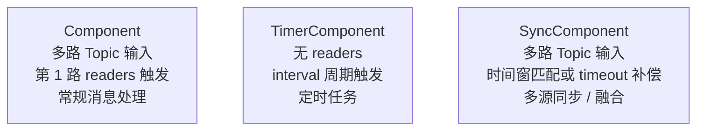
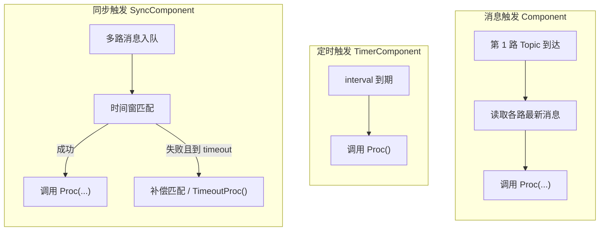

# Segar Component

> **说明**：（可选配置）或（可选阅读）内容都不常用，请酌情了解。
>
> Component 是 Segar 系统的基本执行单元，依赖 DAG 文件配置启动，分为**消息触发**和**定时器触发**两种模型。
>
> **快速流程**：编写 DAG 配置文件 → 编写 Component 业务代码 → 编译 → mainboard 启动组件 → CLI 验证运行状态

---

## 1. 核心概念速览

- **Component**：业务功能载体，包含 Init（初始化）和 Proc（数据处理）核心逻辑，分消息触发和定时器触发两类
- **.idl | .msg | .proto**：定义通信数据结构的协议文件，需通过工具生成 C++ 代码
- **DAG 文件**：组件启动配置文件（Proto 文本格式），定义组件依赖、输入 Topic 等
- **mainboard**：Segar 框架启动器，通过加载 DAG 文件启动组件，支持进程调度、插件加载等扩展参数


---

## 2. 消息触发模型

在 DAG 文件中定义需要接收的 topic 列表，当 DAG 文件中定义的第一个 Topic 有新消息到达时，取所有 topic 的最新消息作为入参，触发 Proc 函数。

### 2.1 DAG 配置

- 文件位置：建议放在项目 `config/` 目录下
- 使用 `components` 节点，配置 `readers` 指定订阅的 Topic

示例 `common.dag`（`src/component_example/common_component/config/`）：

```yaml
# 定义 DAG 流中的所有组件（Proto 文本格式）
module_config {
  # 必需：组件动态库路径（相对路径“相对于当前执行命令的路径”/绝对路径均可）
  module_library: "lib/libcommon_component.so"

  # 组件列表：一个模块可包含多个组件
  components {
    # 必需：组件类名（与代码中自定义组件类名完全一致）
    component_class_name: "CommonComponentExample"

    # 组件专属配置
    config {
      # 必需：组件内部节点名（自定义唯一标识，绑定资源用）
      inner_node_name: "common_component_example"

      # 可选：输入 Topic 配置（多个输入按顺序对应 Proc 函数参数）
      # 第一个 readers 的 Topic 有新消息到达时，触发 Proc
      readers {
        topic: "/topic/chatter"
        pending_queue_size: 5
      }
      readers {
        topic: "/topic/image_front"
        pending_queue_size: 5
      }
      readers {
        topic: "/topic/image_rear"
        pending_queue_size: 5
      }
    }
  }
}
```

参数文件规则和 `Node` 一致：

- 只要配置了 `inner_node_name`，框架就会按 `${RTI_PARAM_PATH}/<inner_node_name>.yaml -> ${SEGAR_PATH}/config/<inner_node_name>.yaml` 查找参数文件
- 因此上例的参数文件默认应命名为 `config/common_component_example.yaml`

### 2.2 C++ 实现

- **（必需）** 继承 `Component<InputType1, InputType2, ...>` 基类，模板参数为输入数据类型
- **（必需）** 重写 `Init()` 方法（组件启动时执行一次）
- **（必需）** 重写 `Proc()` 方法（第一个 Topic 有新消息到达时触发，核心业务逻辑）
- 多输入 `Component<M0, M...>` 中，`M0` 是触发输入，按队列顺序消费且不可重复；后续 `M...` 是最新上下文输入，可被多个 `M0` 触发周期复用
- **（必需）** 末尾添加 `SEGAR_REGISTER_COMPONENT(组件类名)` 注册宏

**头文件**（`src/component_example/common_component/src/common_component_example.h`）：

```cpp
/**
 * 消息触发组件：模板参数顺序/类型 必须与 DAG 文件中 readers 配置完全一致
 * 触发时机：DAG 中第一个 readers 的 Topic 有新消息到达时，调用 Proc
 */
#include "example/msg/Image.hpp"
#include "example/msg/String.hpp"

#include "segar/component/component.h"
using example::msg::Image;
using example::msg::String;

class CommonComponentExample : public rti::segar::Component<String, Image, Image> {
 public:
  bool Init() final;
  bool Proc(const std::shared_ptr<String>& msg0,
            const std::shared_ptr<Image>& msg1,
            const std::shared_ptr<Image>& msg2) final;
};
SEGAR_REGISTER_COMPONENT(CommonComponentExample)
```

**实现文件**（`src/component_example/common_component/src/common_component_example.cc`）：

```cpp
#include "common_component_example.h"

bool CommonComponentExample::Init() {
  AINFO << "CommonComponentExample init";
  return true;
}

bool CommonComponentExample::Proc(const std::shared_ptr<String>& msg0,
                                  const std::shared_ptr<Image>& msg1,
                                  const std::shared_ptr<Image>& msg2) {
  uint32_t w1 = 0, w2 = 0;
  if (msg1) w1 = msg1->width();
  if (msg2) w2 = msg2->width();
  AINFO << "CommonComponentExample Proc [chatter:" << (msg0 ? msg0->data() : "")
        << "] [image_front->width:" << w1 << "] [image_rear->width:" << w2 << "]";
  return true;
}
```

---

## 3. 定时器触发模型

按 DAG 中配置的 `interval`（毫秒）周期性触发 Proc 函数。

### 3.1 DAG 配置

- 使用 `timer_components` 节点（区别于普通组件的 `components`）
- 必须配置 `interval` 指定执行间隔（单位：毫秒）

示例 `timer.dag`（`src/component_example/timer_component/config/`）：

```yaml
# 定义 DAG 流中的定时器组件（Proto 文本格式）
module_config {
  module_library: "lib/libtimer_component.so"

  # 定时器组件专属配置节点
  timer_components {
    component_class_name: "TimerComponentExample"

    config {
      inner_node_name: "timer_component_example"
      # 必需：执行间隔（单位：毫秒），每 100ms 调用一次 Proc 函数
      interval: 100
    }
  }
}
```

### 3.2 C++ 实现

- **（必需）** 继承 `TimerComponent` 基类（无需模板参数）
- **（必需）** 重写 `Init()` 方法（初始化 Writer/参数等）
- **（必需）** 重写 `Proc()` 方法（按 interval 定时执行的业务逻辑）
- **（必需）** 末尾添加 `SEGAR_REGISTER_COMPONENT(组件类名)` 注册宏

**头文件**（`src/component_example/timer_component/src/timer_component_example.h`）：

```cpp
/**
 * 定时器触发组件：按 DAG 中 interval 周期性执行 Proc
 */
#include "example/msg/Image.hpp"

#include "segar/class_loader/class_loader.h"
#include "segar/component/component.h"
#include "segar/component/timer_component.h"

class TimerComponentExample : public rti::segar::TimerComponent {
 public:
  bool Init() final;
  bool Proc() final;

 private:
  using ImageWriter = rti::segar::Writer<example::msg::Image>;
  std::shared_ptr<ImageWriter> image_writer_ = nullptr;
  uint32_t proc_count_ = 0;
};
SEGAR_REGISTER_COMPONENT(TimerComponentExample)
```

**实现文件**（`src/component_example/timer_component/src/timer_component_example.cc`）：

```cpp
#include "timer_component_example.h"

bool TimerComponentExample::Init() {
  image_writer_ = node_->CreateWriter<example::msg::Image>("/topic/image");
  RETURN_VAL_IF(!image_writer_, false);
  return true;
}

bool TimerComponentExample::Proc() {
  auto out_msg = std::make_shared<example::msg::Image>();
  out_msg->width(proc_count_++);
  AINFO_IF(!image_writer_->Write(out_msg))
      << "Failed to write msg:" << out_msg->width();
  AINFO << "timer_component_example: Write image msg->width:"
        << out_msg->width();
  return true;
}
```

**调度配置**：组件可通过调度配置文件指定 CPU 亲和性、调度策略等。当前版本通常通过 `process_group` 对应的 `config/<process_group>.conf` 加载。详见 [Segar Scheduler](Segar_Scheduler.md)。

---

## 4. 事件触发消息同步模型（SyncComponent）

- SyncComponent和其余两种Component的差异


多路消息按时间窗对齐后触发一次 Proc，适用于多传感器/多源数据融合等场景。与普通 Component 的“首路到达即触发”不同，SyncComponent 在**时间窗匹配**或**超时补偿匹配**成功后才调用 Proc。

### 4.1 代码接口

- **（必需）** 继承 `SyncComponent<M0, M1, ...>`，模板参数顺序与 DAG 中 `readers` 顺序一致
- **（必需）** 重写 `Proc(const std::shared_ptr<M0>&, const std::shared_ptr<M1>&, ...)`：同步成功时调用，入参为各路人马对齐后的消息
- **（必需）** 重写 `GetTimeStamp(size_t index, const std::shared_ptr<M0>&, ...)`：返回第 `index` 路消息的时间戳（用于窗内匹配）；返回 0 会导致该次匹配失败
- **（可选）** 重写 `TimeoutProc()`：本周期内未匹配成功时触发，用于告警或补偿逻辑；默认空实现。注意不宜在内部做耗时操作，否则会推迟下一周期 timeout
- **（可选）** 重写 `Fusionable(...)`：增加额外同步限制；默认返回 `true`

### 4.2 消息同步类型（readers 的 type）

| type       | 含义     | 实时匹配     | 超时补偿匹配   |
|-----------|----------|--------------|----------------|
| REQUIRED  | 硬约束   | 必须匹配     | 必须匹配       |
| WAITABLE  | 等待型   | 按必需参与   | 可缺失         |
| OPTIONAL  | 可选     | 不触发匹配   | 可缺失         |

- **REQUIRED**：在实时匹配与超时补偿中都必须满足时间窗，否则本帧不下发
- **WAITABLE**：实时匹配时与 REQUIRED 一样参与；超时补偿时允许缺失。仅当配置中存在 WAITABLE 时，timeout 回调内才会做补偿匹配（FlushKeyFrames）
- **OPTIONAL**：消息到达只入队、不主动触发匹配；缺失不阻塞下发

### 4.3 DAG 配置

使用 `sync_components` 节点（区别于 `components` / `timer_components`），配置 `SyncComponentConfig`：

- **inner_node_name**：组件内部节点名（必填）
- **accept_diff**：同一批帧消息的时间判定窗口，单位毫秒。实时匹配时，同步器以当前到达并触发匹配的 REQUIRED/WAITABLE 消息作为 base，从其它路缓存中查找时间戳接近的消息；若 `|t_msg - t_base| <= accept_diff`，就认为两条消息可归为同一批帧。该值越大越容易匹配成功，但可能把时间差较大的消息配在一起；该值越小同步更严格，但更容易匹配失败。
- **main_msg_cycle**：第 0 路主帧消息的期望周期（也是每批消息的期望同步成功周期），单位毫秒。建议把最稳定的 REQUIRED 消息配置为第 0 路，并按它的帧率设置，例如第 0 路为 20 FPS，则 `main_msg_cycle` 约为 50 ms。它不是匹配窗口，而是用于 timeout 周期计算。
- **accept_latency**：`main_msg_cycle` 之后的额外等待时间，单位毫秒。用于等待可能晚到的 WAITABLE 消息：值越大，WAITABLE 消息越有机会参与同步，但端到端延迟也会增加；值越小输出更及时，但更容易走超时或缺失 WAITABLE。
- **readers**：每路一个 `topic`、`type`（REQUIRED/WAITABLE/OPTIONAL）、`pending_queue_size`。按消息的周期稳定性/重要性/配置readers，原则上按REQUIRED/WAITABLE/OPTIONAL 顺序排列（注意保持顺序和`SyncComponent<M0, M1, ...>` 模板参数以及 `GetTimeStamp(index, ...)` 中的 index 语义一致）。

#### 4.3.1 三个时间参数（accept_diff/main_msg_cycle/accept_latency）的两层理解
- 实时匹配时，以当前到达的 REQUIRED/WAITABLE 消息作为 base，用 `accept_diff` 判断其它路消息是否属于同一批帧；
- timeout 计算时，以第 0 路主帧时间戳 `t0` 作为周期参考，超时点大致为 `t0 + main_msg_cycle + accept_latency`。

#### 4.3.2 示例（`src/component_example/sync_component/config/sync.dag`）：

```yaml
module_config {
  module_library: "lib/libsync_component.so"
  sync_components {
    component_class_name: "SyncComponentExample"
    config {
      inner_node_name: "sync_component_example"
      accept_diff: 2250
      main_msg_cycle: 5000
      accept_latency: 2450
      readers { topic: "/topic/image_front" type: REQUIRED pending_queue_size: 5 }
      readers { topic: "/topic/image_rear"  type: WAITABLE pending_queue_size: 5 }
      readers { topic: "/topic/chatter"     type: OPTIONAL pending_queue_size: 5 }
    }
  }
}
```

实践中建议把最稳定的一路配成第一个 reader（REQUIRED）作为主路。

### 4.4 触发与匹配行为简述

1. 任意 reader 收到消息后先入队；若该路为 OPTIONAL，本次不触发匹配
2. REQUIRED/WAITABLE 消息到达时触发一次**实时匹配**：以当前路为 base，在 `accept_diff` 时间窗内匹配其它路；OPTIONAL 缺失可放行，REQUIRED/WAITABLE 缺失则本次匹配失败
3. 初始化即启动周期定时器；**仅当配置中存在 WAITABLE** 时，超时回调内会做**补偿匹配**（以最新消息为 base 从新到旧尝试），补偿路径下 REQUIRED 仍为硬约束，WAITABLE/OPTIONAL 可缺
4. 若本周期没有任何成功匹配，会先调用 `TimeoutProc()`，再重启定时器
5. 若配置中没有 WAITABLE，只要满足实时匹配条件即可直接成功，不需要等待 timeout

消息复用语义：

- `SyncComponent<M0>` 单输入场景按队列顺序消费，每条消息处理后从缓存释放，不会被后续回调重复消费
- `SyncComponent<M0, M...>` 多输入场景中，所有参与一次成功匹配的消息都会被消费释放，不会被后续匹配重复消费
- `OPTIONAL` 和 `WAITABLE` 在部分匹配路径中可以缺失，但一旦参与成功匹配，仍按消费后释放处理

### 4.5 参数调优建议

- **main_msg_cycle**：按主路帧率估算，如 T = 1000/fps（ms），初值可取 round(T)
- **accept_diff**：时间戳质量好时 0.2T～0.4T，跨进程/跨机抖动大时 0.4T～0.7T
- **accept_latency**：无 WAITABLE 时 0.2T～0.4T，有 WAITABLE 时 0.5T～1.0T

常见帧率推荐初值（单位：毫秒）：

| 主路帧率 | main_msg_cycle | accept_diff | accept_latency（无 wait） | accept_latency（有 wait） |
|----------|----------------|-------------|----------------------------|----------------------------|
| 10 FPS   | 100            | 20～40      | 20～40                     | 50～100                    |
| 20 FPS   | 50             | 10～20      | 10～20                     | 25～50                     |
| 30 FPS   | 33             | 7～13       | 7～13                      | 16～33                     |
| 60 FPS   | 17             | 3～7        | 3～7                       | 8～17                      |

调参时建议每次只改一个参数，先固定 `main_msg_cycle`；若 TimeoutProc 频繁且下游可接受更晚输出，可优先增大 `accept_latency`；若匹配到的帧时间差过大，可减小 `accept_diff`。

### 4.6 注意事项

- `SyncComponent<M0>`（单输入）不走多输入同步补偿逻辑
- `SyncComponent` 遵循单条消息只消费一次的语义；不要依赖已消费消息再次进入 `Proc()`
- `TimeoutProc()` 内不建议执行耗时操作，否则会影响下一周期 timeout 时机
- `GetTimeStamp()` 返回 0 会导致该次匹配失败并输出日志

---

## 5. 使用`flag_file_path`和`config_file_path`完成进程级/dag级个性化运行上下文配置
```yaml
module_config {
  module_library : "lib/libmy_component.so"
  components {
    component_class_name : "MyComponent"
    config {
      inner_node_name : "my_node"
      config_file_path : "conf/my_component.pb.txt"
      flag_file_path : "flag/my_component.flag"
    }
  }
}
```

路径解析规则：

- `flag_file_path` 可以直接写绝对路径；若写相对路径，框架会优先使用当前可直接访问的相对路径，否则再按 `RTI_FLAG_PATH` 查找
- `config_file_path` 可以直接写绝对路径；若写相对路径，框架会优先使用当前可直接访问的相对路径，否则再按 `RTI_CONF_PATH` 查找

### 5.1 `flag_file_path` 的具体使用示例

`flag/my_component.flag`：

```bash
--my_enable_feature=true
--my_timeout_ms=300
```

组件代码（只展示关键部分）：

```cpp
#include "gflags/gflags.h"

DEFINE_bool(my_enable_feature, false, "enable feature");
DEFINE_int32(my_timeout_ms, 100, "timeout ms");

bool MyComponent::Init() {
  AINFO << "enable_feature=" << FLAGS_my_enable_feature
        << ", timeout_ms=" << FLAGS_my_timeout_ms;
  return true;
}
```

说明：

- `gflags` 适合承载进程级全局运行开关，例如日志级别、实验功能开关、通用超时阈值；同一个 `mainboard` 进程内的组件共享这组 flags
- `DEFINE_bool`、`DEFINE_int32` 定义的是可在运行时读取和修改的 flag，不是编译期常量
- 运行时若要修改，优先使用 `google::SetCommandLineOption("my_enable_feature", "true")`、`google::SetCommandLineOption("my_timeout_ms", "300")`
- gflags 的程序化读写接口是线程安全的
- `gflags` 不提供跨进程直接读取或修改能力；若需要跨 node / 跨进程查询和设置运行参数，应使用 `Parameter`

### 5.2 `config_file_path` 的具体读取示例

假设你有配置消息 `MyComponentConfig`（`my_component.pb.txt` 对应它）：

- 将 `.proto` 放在 `src/type_src/segar/proto/`

```proto
message MyComponentConfig {
  optional string input_topic = 1;
  optional uint32 queue_size = 2;
}
```

`conf/my_component.pb.txt`：

```yaml
input_topic: "NodeA"
queue_size: 128
```

组件代码读取：

```cpp
bool MyComponent::Init() {
  MyComponentConfig cfg;
  if (!GetProtoConfig(&cfg)) {
    AERROR << "load my_component config failed, path=" << ConfigFilePath();
    return false;
  }
  AINFO << "input_topic=" << cfg.input_topic()
        << ", queue_size=" << cfg.queue_size();
  return true;
}
```
---

## 6. 运行

mainboard 是 Component 的启动入口，通过以下方式启动：

- **--dag_conf=CONFIG_FILE**（`-d`）：加载 DAG 配置文件（**必需**），可重复指定多个，如 `-d dag1.dag -d dag2.dag`

```bash
# 基础启动（单个 DAG）
mainboard -d config/common.dag

# 多 DAG 启动
mainboard -d config/common.dag -d config/timer.dag

# 指定进程命名空间与调度策略
mainboard -d config/car_component.dag -p car_component_proc
```

---

## 7. （可选阅读）进阶说明

### 7.1 参数使用注意事项

- 多 DAG 优先级：多个 `-d` 指定的 DAG 文件按顺序加载，同名组件以最后加载的 DAG 配置为准

### 7.2 日志与问题排查

- **日志级别**：`export SEGAR_LOG_LEVEL=DEBUG && mainboard -d config/common.dag`
- **常见错误**：
  - DAG 文件路径错误：日志提示 `Cannot find dag_conf_file`，检查 `-d` 参数路径
  - 组件类名不匹配：日志提示 `Component [XXX] not found`，核对 DAG 中 `component_class_name` 与代码类名一致
