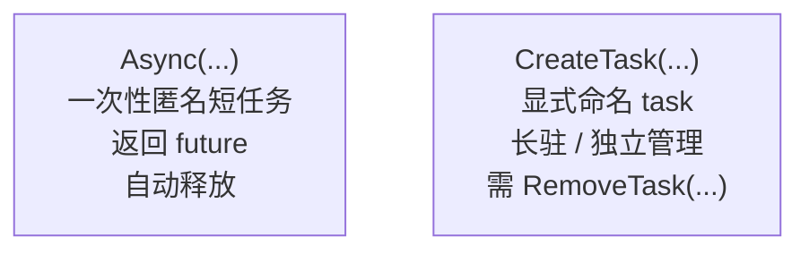
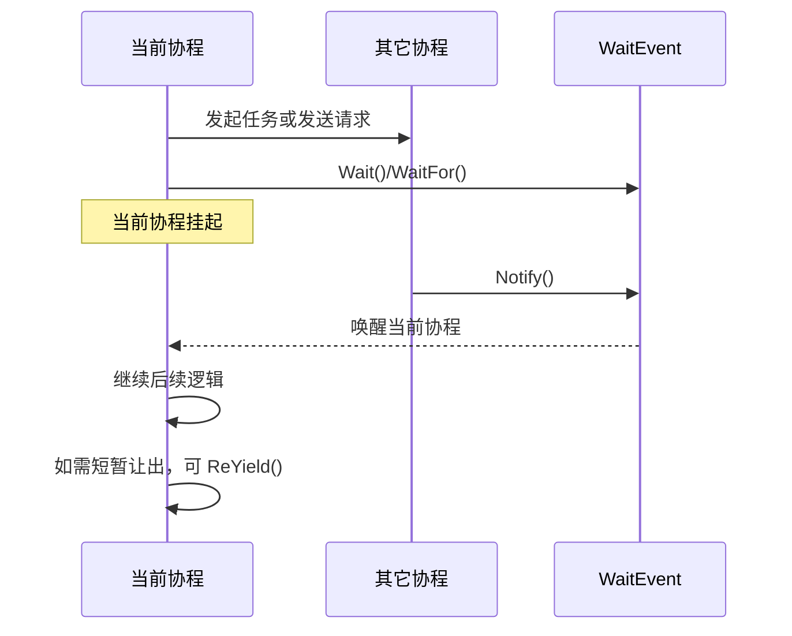

# Segar Concurrent And User-Defined Tasks

> 本文介绍 Segar 中几类常用的协程兼容 API，包括 `Async`、`scheduler::Instance()->CreateTask(...)`、`WaitEvent`、`LockGuard`、`ReYield()`，以及少量和并发直接相关的时间 API 使用边界。

这里所说的“协程安全”，主要是指：

- 在协程上下文里，只挂起当前协程，而不是阻塞整个线程
- 在普通线程上下文里，退化为线程级等待或让出

---

## 1. 何时优先使用这些 API

下面这些场景，优先考虑使用 Segar 自带的并发 API，而不是直接使用裸线程阻塞：

- 需要等待另一个长耗时的锁/异步IO/回调或消息到达，再被唤醒继续当前流程
- 需要等待一个短耗时异步API调用返回结果，希望原地等待，不想使用复杂的通知机制
- 需要在循环中短暂让出执行权，避免长时间占用协程
- 需要持续运行一个低优task，根据状态变化偶尔继续推进，但不希望在协程里长时间阻塞整条线程

---

## 2. 常用 API 一览

| API | 主要用途 | 协程上下文行为 | 典型场景 |
|---|---|---|---|
| `Async(...)` | 创建一次性匿名任务 | 任务进入框架调度执行 | 后台握手、异步处理、并发等待 |
| `scheduler::Instance()->CreateTask(...)` | 创建显式命名 task | 创建独立 CRoutine task | 长驻任务、IO 协程、需要独立命名和管理的任务 |
| `WaitEvent` | 通知/等待 | 只挂起当前协程；普通线程下退化为条件变量等待 | 等待 ack、等待状态就绪 |
| `LockGuard` | 协程兼容加锁 | 协程中优先 `try_lock + yield/backoff`，避免长阻塞整线程 | 保护共享状态 |
| `ReYield()` | 推荐的主动让出方式 | 当前协程以 `READY` 状态重新排队 | 短轮询、分步推进任务 |
| `Time/Timer` | 时间等待 API | 在协程里只挂起当前协程 | 具体时间语义见 `Segar Time And Timer` |

---

## 3. `Async(...)`



- `Async(...)` 用于把一个临时匿名短任务提交到segar协程执行，并返回 `std::future`
- `Async` 创建的 task 运行结束后会自动释放资源，无需额外管理
- `Async`使用的是“通用后台任务队列”，不是“可单独命名、可单独调度的显式 CRoutine”

- 返回值类型会自动推导成 `std::future<T>` 中的 `T`。

### 3.1 典型写法：

```cpp
auto future = rti::segar::Async([]() -> int {
  return 42;
});

if (future.valid()) {
  auto result = future.get();
  AINFO << "result: " << result;
}
```

### 3.2 callback 没有返回值：

```cpp
void FlushState() {
  DoFlush();
}

rti::segar::Async(&FlushState);
```

### 3.3 callback 带参数：

```cpp
uint32_t Task(const uint32_t& input) {
  return input;
}

auto future1 = rti::segar::Async(&Task, 10u);
auto v1 = future1.get();
```

### 3.4 使用建议：

- 适合短任务、异步握手、并发预处理
- 如果后续还要等待另一个回调或事件，再继续当前流程，通常和 `WaitEvent` 组合使用
- 长时间运行的任务不应无限占用 `Async` worker，应自行检查停止条件并及时退出

---

## 4. `scheduler::Instance()->CreateTask(...)`

`CreateTask(...)` 用于创建一个显式命名的独立管理长驻运行的 task。

### 4.1 和 `Async(...)` 相比，它的特点是：

- 每个 task 都有独立名字，可以被 `chechduler` 统一进行调度策略配置管理
- 更适合长驻任务、IO 协程、需要单独配置调度策略的任务
- 运行完毕后不会自动删除，需要使用 `RemoveTask(...)` 进行显式删除

### 4.2 最常见的调用方式是：

```cpp
rti::segar::scheduler::Instance()->CreateTask(
    []() {
      //运行用户自定义的callback函数，比如RunTaskCallbackLoop();
    },
    "echo_server");
```

### 4.3 常驻 task 如何等待和再次被调度

`CreateTask(...)` 创建的是独立命名 task，但 task 函数体本身仍然要主动“让出”和“等待”。

用户通过这些 API 控制 task 的切换和唤醒：

- `WaitEvent::Wait()` / `WaitFor(...)`
- `Time::SleepUntil(...)`
- `USleep(...)`
- `SleepFor(...)`
- `ReYield()`

一个典型的常驻 task 可以写成：

```cpp
auto event = std::make_shared<rti::segar::WaitEvent>();

rti::segar::scheduler::Instance()->CreateTask(
    [event]() {
      while (true) {
        if (!event->WaitFor(std::chrono::seconds(5))) {
          continue;
        }
        HandleOneRound();
      }
    },
    "worker_task");
```

上面这个 task 会反复：

- 进入等待态
- 被 `event->Notify()` 唤醒
- 执行一轮逻辑
- 再次进入等待

### 4.4 `RemoveTask(...)` 什么时候用
- 如果这个命名 task 已执行完任务，且不再需要，应调用 scheduler::Instance()->RemoveTask(sync_task_name_); 主动移除

### 4.5 注意事项：

- 需要给 task 明确命名时，使用 `CreateTask(...)`
- 需要后续按名字移除 task 时，使用 `CreateTask(...)`
- 需要单独的长驻协程，而不是一次性短任务时，优先使用 `CreateTask(...)`
- 如果只是提交一个临时短任务并拿 `future` 结果，仍优先使用 `Async(...)`

---

## 5. `WaitEvent`：协程等待模型



`WaitEvent` 是进程内、协程兼容的通知事件。`Notify()` 会增加一个可消费的通知 token；`Wait()` / `WaitFor()` 会消费一个 token。

其特性如下：

- 在协程中调用 `Wait()` / `WaitFor()` 时，只挂起当前协程而不是线程
- 在普通线程中调用时，会退化为 `condition_variable` 等待
- `Notify()` 即使先发生，后续 `Wait()` 也可以消费之前缓冲的 token而不会丢失

### 5.1 典型用法示例

发起端 `等待` 响应端完成指定任务：

```cpp
auto ready_event = std::make_shared<rti::segar::WaitEvent>();

//发起端
auto worker = rti::segar::Async([request_writer, ready_event]() {
  //发送 `prepare` request
  request_writer->Write(MakeMessage("prepare"));

  //协程方式等待对端ready ack
  if (!ready_event->WaitFor(std::chrono::seconds(5)/*, matched() == true*/)) {
    AWARN << "Timed out waiting for ready ack";
    return;
  }

  //收到 `ready`后，开始下一步go
  request_writer->Write(MakeMessage("go"));
});

//响应端
auto ack_reader = node->CreateReader<example::msg::String>(
    MakeTransientLocalAttr("/topic/wait_event/ack"),
    [ready_event](const std::shared_ptr<example::msg::String>& msg) {
      if (msg && msg->data() == "ready") {
        //通知 发起端 自己已ready
        ready_event->Notify();
      }
    });
```

### 5.2 使用建议

- 等待外部事件时，优先用 `WaitEvent`，不要自己写忙等循环
- 需要超时保护时，优先用 `WaitFor(...)`
- 需要在“收到通知”之外再检查一个额外条件时，可给 `WaitFor(...)` 传入 `predicate` 回调；只有该回调返回 `true`，等待才算完成
- 需要强制中断当前这一轮等待时，可调用 `Reset()`

---

## 6. `ReYield()`

`ReYield()` 会主动让出当前执行权（保留执行上下文）并在下一轮调度中重新被执行。

| API | 语义 | 适合场景 |
|---|---|---|
| `ReYield()` | 当前协程让出后，重新进入调度队列 | 短轮询、分步推进、等待很快就会完成的条件 |

### 6.1 典型使用方法

“条件很快会满足，但当前这一步先别占着 CPU和线程，而是让出执行权”：

```cpp
while (!TryAdvanceState()) {
  rti::segar::ReYield();
}
```

### 6.2 注意事项：
- 如果等待时间可能较长，应使用 `WaitEvent` 而不是 `ReYield()`
- `ReYield()` 只在 CRoutine 模式下才会执行协程切换
- 在非协程模式下，当前实现会打印 warning，并退化为 `std::this_thread::yield()`进行线程切换

---

## 7. `LockGuard`

`LockGuard` 是协程兼容的 RAII 锁。

和直接使用 `std::lock_guard` 相比，它在协程上下文里不会一上来就长时间阻塞线程，而是按当前实现采用：

- 先做少量 `try_lock()`
- 失败后短暂让出执行权
- 再失败时进入带退避的短睡眠

这对“同一线程上跑多个协程”的场景更友好。

### 7.1 典型使用方法：

```cpp
//std::mutex mutex_; is defined somewhere
void UpdateSharedState() {
  rti::segar::LockGuard<std::mutex> lock(mutex_);
  shared_state.count++;
  shared_state.last_update = rti::segar::Time::MonoTime();
}
```

### 7.2 使用建议：
- 临界区里仍然不应做特别长耗时操作，否则应切换为`WaitEvent`
- 持有锁确定特别短时，也可以考虑使用 `ReYield`
- 协程里不应使用`std::recursive_mutex`（和`LockGuard`机制无关），因为同一线程可能加载多个本应互斥的协程

---

## 8. 时间 API 的并发边界

`Time`和`Timer` API，比如`Time::SleepUntil()`， `Segar::USleep`， 在协程上下文里不会阻塞整个线程，只会挂起当前协程

---

## 9. 选型建议

| 需求 | 推荐 API |
|---|---|
| 后台启动一个临时任务 | `Async(...)` |
| 创建一个可命名、可独立管理的协程 task | `scheduler::Instance()->CreateTask(...)` |
| 等待另一个回调通知当前流程继续 | `WaitEvent` |
| 保护互斥状态且不想在协程里长时间阻塞线程 | `LockGuard` |
| 长任务切片，或短轮询里让出后尽快继续调度 | `ReYield()` |

如需查看这些接口的签名和参数表，可继续阅读 [Segar API Reference](Segar_Api_Reference.md)。时间与定时器的完整用法见 [Segar Time And Timer](Segar_Time_And_Timer.md)。
