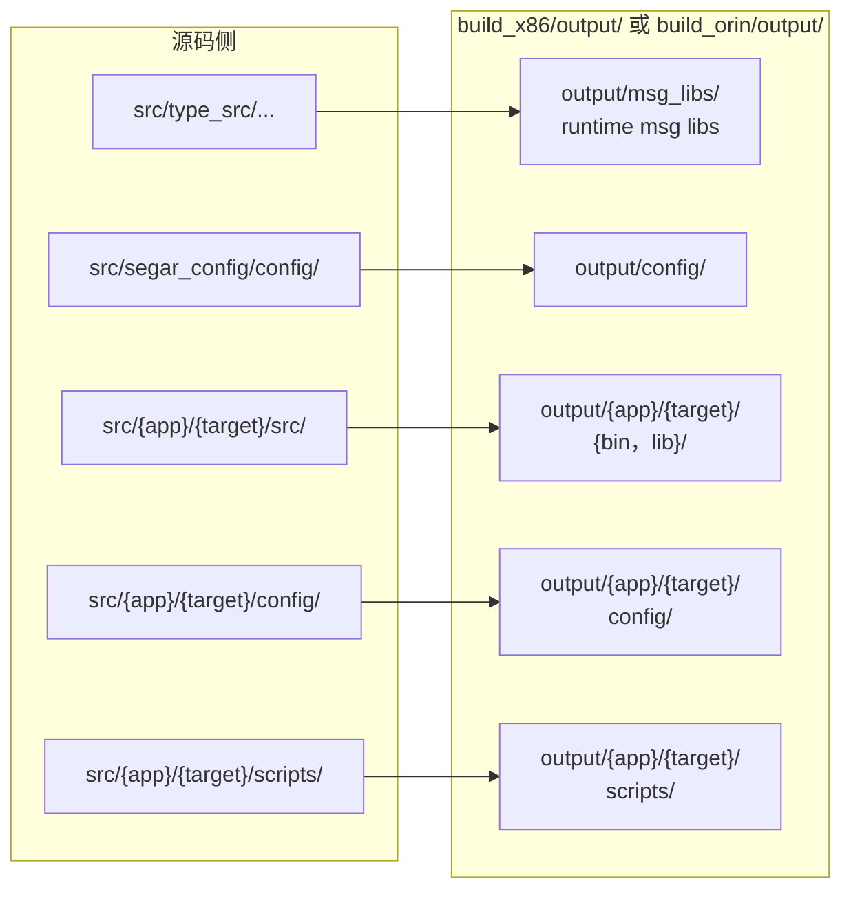
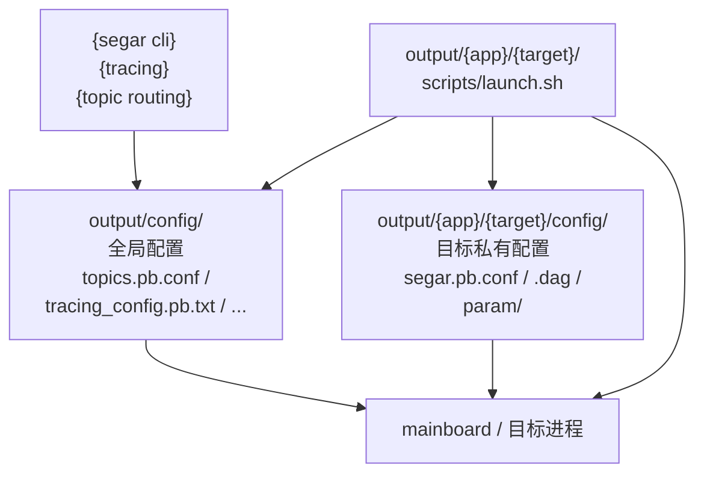

# Segar Engineering

本文档面向需要组织 `segar-workspace` 源码目录、部署目录和运行配置的用户。

重点说明 4 件事：

- 源码侧各类文件应该定义在哪里
- 构建后的 `output/` 目录里每个目录有什么作用
- 运行时依赖哪些配置和启动脚本
- 哪些内容属于少数用户才需要关心的进阶项

`Docker` 相关的 runtime / CI/CD 部署方式见 [Segar_Docker.md](Segar_Docker.md)。

## 1. Overview

一个典型的 Segar 工程通常按下面顺序组织：

1. 在 `src/type_src/` 定义 `msg / srv / action`，或在 `src/type_src/segar/proto/` 定义 `.proto`
2. 在 `src/<app>/<target>/src` 编写业务代码
3. 在 `src/<app>/<target>/config` 放运行配置
4. 在 `src/<app>/<target>/scripts` 放启动脚本
5. 通过构建脚本生成 `build_x86/output/` 或 `build_orin/output/`
6. 在 `output/` 中完成部署、环境加载和运行，其中 `build_x86/output/config/`、`build_orin/output/config/` 是最重要的全局配置目录

---

## 2. Workspace Layout

### 2.1 源码目录和文件放置

仓库根目录下与用户最相关的目录通常有：

| 路径 | 建议放置内容 | 作用 |
|------|---------------|------|
| `src/type_src/<pkg>/{msg,srv,action}/` | `.msg / .srv / .action` | 统一放业务类型定义 |
| `src/type_src/transport_messages` | `transport_messages` 清单文件 | 记录哪些一级传输消息需要自动注入 `segar_header` |
| `src/type_src/segar/proto/` | `.proto` | 统一放 workspace 自定义 protobuf 定义 |
| `src/segar_config/config/` | 全局配置，如 `topics.pb.conf`、`tracing_config.pb.txt` | 构建后会进入 `output/config/` |
| `src/<app>/<target>/src/` | 业务 `.cc / .h` | 业务源码 |
| `src/<app>/<target>/config/` | `.dag`、`segar.pb.conf` | 目标私有配置 |
| `src/<app>/<target>/config/<node_name>.yaml` | 参数文件 | 目标私有参数 |
| `src/<app>/<target>/scripts/` | `launch.sh` 等启动脚本 | 启动入口 |
| `scripts/` | 构建、打包、批量启动等公共脚本 | workspace 公共脚本 |
| `depend_libs.txt` | 依赖版本清单 | 工程依赖管理 |

典型源码结构如下：

```text
src/
├── type_src/
│   ├── example/msg
│   ├── example/srv
│   ├── example/action
│   ├── segar/proto
│   └── transport_messages
├── segar_config/
│   └── config/
├── topic_example/
│   └── topic_talker/
│       ├── src/
│       ├── config/
│       └── scripts/
└── component_example/
    └── common_component/
        ├── src/
        ├── config/
        └── scripts/
```



### 2.2 补充说明
- `src/<app>/<target>/config/` 放的是该目标私有配置；`src/segar_config/config/` 放的是全局配置，构建后对应 `build_x86/output/config/` 或 `build_orin/output/config/`

---

## 3. Output Layout

### 3.1 部署产物目录的核心结构

构建完成后，用户主要使用的是 `build_x86/output/` 或 `build_orin/output/`。其中 `build_x86/output/config/`、`build_orin/output/config/` 是 Segar 全局配置入口，`segar cli`、topic 路由、tracing 等都会依赖这里的文件。

典型结构如下：

```text
output/
├── .segar/                 # 运行期目录，如日志
├── config/                 # 全局配置目录，尤其重要；segar cli 和部分运行时组件会使用
├── lib/                    # workspace 级公共库
├── msg_libs/               # workspace 本地消息库运行时加载入口
├── third_party/            # 三方库与公共可执行文件
├── src_python/             # Python 示例产物（如启用）
├── LICENSE
├── segar_setup.bash        # 环境变量脚本
├── start_all.sh            # 批量启动脚本
├── stop_all.sh             # 批量停止脚本
├── check_all.sh            # 批量检查脚本
├── run_segar_cli_test.sh   # CLI 测试脚本
├── <app>/
│   └── <target>/
│       ├── bin/            # 可执行文件（node 类 target）
│       ├── lib/            # 组件动态库（component 类 target）
│       ├── config/         # 该目标私有配置，可能包含 .dag / segar.pb.conf / param/
│       └── scripts/        # 启动脚本
```

### 3.2 各目录的用途

| 路径 | 作用 |
|------|------|
| `output/.segar/` | 运行期目录，如日志输出 |
| `output/config/` | Segar 全局配置目录，对应 `build_x86/output/config/` 或 `build_orin/output/config/`，如 `topics.pb.conf`、`tracing_config.pb.txt` |
| `output/lib/` | workspace 级公共动态库 |
| `output/msg_libs/` | workspace 本地消息库的运行时加载入口 |
| `output/third_party/` | 三方库，以及部分 Segar 公共 `bin/lib/scripts` |
| `output/src_python/` | Python 示例产物 |
| `output/start_all.sh` 等顶层脚本 | 批量启动、停止、检查或测试入口 |
| `output/<app>/<target>/bin/` | 该目标的可执行文件，常见于 node 类 target |
| `output/<app>/<target>/lib/` | 该目标的组件动态库，常见于 component 类 target |
| `output/<app>/<target>/config/` | 该目标私有配置，可能包含 `.dag`、`segar.pb.conf`、`param/` |
| `output/<app>/<target>/scripts/` | 启动脚本 |
| `output/segar_setup.bash` | 统一环境变量入口 |

### 3.3 部署时怎么理解“全局配置”和“私有配置”



- `output/config/` 下的是**全局配置**
  - 对应实际部署目录通常就是 `build_x86/output/config/` 或 `build_orin/output/config/`
  - 例如 `topics.pb.conf`、`tracing_config.pb.txt`
  - 多个应用/示例可以共享
- `output/<app>/<target>/config/` 下的是**目标私有配置**
  - 例如该目标自己的 `segar.pb.conf`、`.dag`、参数文件
- 启动脚本通常位于 `output/<app>/<target>/scripts/launch.sh`
  - 由它负责设置 `SEGAR_PATH`、`SEGAR_GLOBAL_PATH`、日志目录等运行环境

---

## 4. Type Definition

### 4.1 类型系统概述

Segar 支持两类消息：
- **ROS 2 风格自定义消息**：使用 `msg_tool` 处理，兼容 ROS 2 类型定义，并自动扩展
- **Protobuf 消息**：使用 `.proto` 定义

以下仅针对 `msg_tool` 相关内容展开说明。

### 4.2 类型定义规范

workspace 统一使用本地/Communication库的 `src/type_src/` 作为 schema 根目录：

- `src/type_src/<pkg>/msg`：消息定义
- `src/type_src/<pkg>/srv`：服务定义
- `src/type_src/<pkg>/action`：动作定义
- `src/type_src/segar/proto`：workspace 自定义 protobuf 定义

文件命名遵循 ROS 2 规范，分为 `msg`、`srv`、`action` 三种。以命名空间 `example` 下的 `String` 消息为例：

```text
src/type_src/example/msg/String.msg
```

- 文件名使用 CamelCase（如 `String.msg`）
- `.msg` 文件 basename 即为 Segar Message 类型名
- 目录路径即为 namespace，如 `example/msg/String.msg` → `example::msg::String`

`srv`、`action` 定义语法同 ROS 2，不再赘述。

如需给 workspace 增加 protobuf 类型，应将 `.proto` 文件放到 `src/type_src/segar/proto/`，例如：

```text
src/type_src/segar/proto/param_example.proto
```

### 4.3 类型处理（选读，msg_tool）

`msg_tool` 提供 CMake 接口进行类型编译：

```cmake
include(msg_tool_generate_code.cmake)
MsgToolCompile(${CMAKE_CURRENT_LIST_DIR}/type_src ${CMAKE_BINARY_DIR}/generate example_msg)
```

| 参数 | 说明 |
|------|------|
| 第 1 个参数 | 类型文件所在目录（如 `type_src`） |
| 第 2 个参数 | 生成代码输出目录（如 `generate`） |
| 第 3 个参数 | 类型代码编译生成的库名（如 `example_msg`） |

---

## 5. Python Message Runtime

### 5.1 用户自定义消息库怎么接入和运行

规则：
- 消息库使用 `MsgToolCompile(...)` 生成 C++ 消息库和 Python 消息包。
- 消息库不依赖 `segar`，也不生成 `segar_py_action_plugin_<package>.so`。
- 应用 C++ 目标按需链接消息库。
- Python 代码直接导入消息库安装的 Python 包。
- 需要被 Python/CLI 按类型名加载的消息库，写入 workspace 根目录的 `runtime_msg_libs.txt`，每行一个 `.so` 文件名。

以当前依赖的消息库 `usr_msg` 为例：

```text
runtime_msg_libs.txt
libusr_msg.so
```

C++ 示例目标链接方式如下：

```cmake
find_package(usr_msg REQUIRED)

target_link_libraries(type_coverage_talker PRIVATE rti::segar usr_msg::usr_msg)
target_include_directories(type_coverage_talker PRIVATE
    "${THIRD_PARTY_PREFIX}/include/usr_msg")
```

Python 代码直接导入消息类型：

```python
from test_msgs.msg import TypeCoverage
```

相关产物位置：

```text
third_party/lib/libusr_msg.so                                      # usr_msg 消息库
third_party/msg_libs/libusr_msg.so                                 # workspace 生成的运行时加载入口
third_party/lib/pythonX.Y/site-packages/test_msgs/...              # usr_msg Python 消息包示例
```

- `launch.sh`只 source 公共环境，再设置当前目标的 `SEGAR_PATH`：

```bash
source "$OUTPUT_DIR/segar_setup.bash"
export SEGAR_PATH="$APP_DIR"
exec python3 "$APP_DIR/src/my_node.py"
```

正常使用安装后的 `launch.sh` 即可，不需要手工拼 `PYTHONPATH`：

```bash
cd build_x86/output/src_python/topic_example/topic_listener
./scripts/launch.sh
```

`segar_setup.bash` 会统一加入 Python 路径：

| 变量/路径 | 用途 |
|------|------|
| `PYTHONPATH=output/lib/pythonX.Y/site-packages` | 应用自己的 Python 包和本地消息包 |
| `PYTHONPATH=output/third_party/lib/pythonX.Y/site-packages` | Segar SDK、`usr_msg` 等依赖库的 Python 包 |

- `usr_msg` 的 TypeCoverage Topic 示例运行方式：

```bash
cd build_x86/output
./src_python/usr_msg_topic_example/type_coverage_listener/scripts/launch.sh
./src_python/usr_msg_topic_example/type_coverage_talker/scripts/launch.sh
```

---

## 6. Configuration And Launch

### 6.1 `segar.pb.conf` 放在哪里

`segar.pb.conf` 一般放在每个目标自己的 `config/` 目录下，例如：

```text
src/topic_example/topic_talker/config/segar.pb.conf
```

部署后对应位置通常为：

```text
output/topic_example/topic_talker/config/segar.pb.conf
```

这类配置属于目标私有配置。

示例：

```protobuf
transport_conf {
  participant_attr {
    lease_duration: 12
    announcement_period: 3
    domain_id_gain: 250
    port_base: 7400
  }
  communication_mode {
    same_proc: INTRA
    diff_proc: SHM
    diff_host: RTPS
  }
  resource_limit {
    max_history_depth: 100
    async_log_flush_interval_ms: 500
    task_manager_limit {
      task_queue_max_num: 1024
      warning_running_task_num: 64
    }
  }
}

run_mode_conf {
  run_mode: MODE_REALITY
  clock_mode: MODE_SEGAR
}

scheduler_conf {
  routine_num: 96
  default_proc_num: 5
  threads: [
    { name: "shm_disp", policy: "SCHED_OTHER", prio: -2 },
    { name: "timer", policy: "SCHED_OTHER", prio: -2 }
  ]
}
```

常见字段说明：

| 配置项 | 作用 |
|------|------|
| `transport_conf` | 通信与资源限制相关总配置 |
| `participant_attr` | participant 的租期、公告周期、端口基线等底层通信参数 |
| `lease_duration` | participant 租期，超时后对端会认为本端失活 |
| `announcement_period` | participant 周期性公告间隔 |
| `domain_id_gain` / `port_base` | 通信端口计算相关参数 |
| `communication_mode` | 指定同进程、跨进程、跨主机分别使用哪种通信方式 |
| `same_proc` | 同进程通信方式 |
| `diff_proc` | 跨进程通信方式 |
| `diff_host` | 跨主机通信方式 |
| `resource_limit` | 运行时资源限制 |
| `max_history_depth` | 消息历史深度上限 |
| `async_log_flush_interval_ms` | 异步日志刷盘间隔 |
| `task_manager_limit` | `Async`/后台任务管理相关限制 |
| `task_queue_max_num` | 后台任务队列最大长度 |
| `warning_running_task_num` | 后台运行任务数的告警阈值 |
| `run_mode_conf` | 运行模式与时钟模式 |
| `run_mode` | 运行模式，例如真实运行环境 |
| `clock_mode` | 时钟来源模式 |
| `scheduler_conf` | 调度器公共配置 |
| `routine_num` | 协程数量 |
| `default_proc_num` | 默认处理线程数 |
| `threads` | 部分内部线程的线程属性配置 |
| `threads[].name` | 内部线程名 |
| `threads[].policy` / `threads[].prio` | 内部线程的调度策略与优先级 |

### 6.2 `launch.sh` 的使用方式

启动脚本一般放在：

```text
src/<app>/<target>/scripts/launch.sh
```

部署后对应位置通常为：

```text
output/<app>/<target>/scripts/launch.sh
```

运行方式通常两种都支持：

- 在模块根目录执行 `./scripts/launch.sh`
- 进入 `scripts/` 目录后执行 `bash launch.sh`

详细启动脚本结构与环境变量说明请阅读 [Segar Launch](Segar_Launch.md)。

---

## 7. Build And Package

### 7.1 x86 编译

- **编译器**：GCC 9.5.0（`x86_64-linux-gnu`）
- **构建命令**：

```bash
./scripts/build_x86.sh
```
- **help**：
```bash
~/segar/segar-workspace$ ./scripts/build_x86.sh -h
Usage: ./scripts/build_x86.sh [-d] [-r] [-ra] [-it] [-ut] [-h]
  -d:  Build Debug variant (default: Release)
  -r:  Remove build_x86 directory
  -ra: Remove build_x86 and install/x86_64 directories
  -it: Enable integration_test module
  -ut: Run workspace example smoke tests after successful build/install
  -h:  Show this help message
```

- **产物目录**：`build_x86/output/`
- **打包命令**：

```bash
./scripts/pkg_x86.sh
```

### 7.2 Orin 交叉编译

- **编译器**：GCC 11.4.0（`aarch64-linux-gnu`，用于 Orin / ARM64）
- **工具链**：使用 Ubuntu 22.04 系统包提供的交叉编译工具链
- **安装命令**：

```bash
sudo apt install gcc-11-aarch64-linux-gnu g++-11-aarch64-linux-gnu
```

- **构建命令**：

```bash
./scripts/build_orin.sh
```

- **help**：
```bash
~/segar/segar-workspace$ ./scripts/build_orin.sh -h
Usage: ./scripts/build_orin.sh [-d] [-r] [-ra] [-it] [-h]
  -d:  Build Debug variant (default: Release)
  -r:  Remove build_orin directory
  -ra: Remove build_orin and install/orin directories
  -it: Enable integration_test module
  -h:  Show this help message
```

- **产物目录**：`build_orin/output/`
- **打包命令**：

```bash
./scripts/pkg_orin.sh
```

### 7.3 aarch64 说明

目前 Orin 交叉编译使用的就是通用 ARM 平台交叉编译工具，因此可直接复用 Orin 相关的编译和打包命令。

---

## 8. Advanced Notes(选读)

本节内容大多数用户不需要频繁修改；只有在自定义依赖管理、改造 CMake 或排查三方库问题时再看即可。

### 8.1 依赖清单

在 `depend_libs.txt` 中指定：

```text
third_party 2.0.0
msg_tool 2.0.0
segar 2.0.0
```

### 8.2 third_party 所含三方库

| 库名 | 分支/版本 |
|------|-----------|
| nlohmann_json | v3.11.3 |
| tinyxml2 | 8.0.0 |
| gflags | v2.2.0 |
| glog | v0.4.0 |
| googletest | release-1.10.0 |
| protobuf | v3.14.0 |
| asio | asio-1-18-1 |
| websocketpp | 0.8.2 |
| foonathan_memory_vendor | v1.3.1 |
| Fast-CDR | v2.2.2 |
| Fast-DDS | v2.14.3 |
| yaml-cpp | 0.8.0 |
| Fast-DDS-Gen | v3.3.1 |

### 8.3 依赖引入

在 `CMakeLists.txt` 中：

```cmake
include(${CMAKE_SOURCE_DIR}/cmake/GetThirdParty.cmake)
load_dependencies("${PLATFORM_NAME}" "depend_libs.txt")
```

- `PLATFORM_NAME`：平台标识（如 `x86_64`、`orin`）
- `depend_libs.txt`：依赖版本配置文件路径

依赖会从 Gitee 自动拉取。用户可按项目实际需求选择沿用或改造该依赖管理方式。

### 8.4 链接 Segar

在 `CMakeLists.txt` 中：

```cmake
list(APPEND CMAKE_MODULE_PATH "${THIRD_PARTY_PREFIX}/share/cmake/segar")
find_package(RtiSegar REQUIRED)
target_link_libraries(${TARGET_NAME} PRIVATE rti::segar)
```

其中 `THIRD_PARTY_PREFIX` 通常为 `install/${PLATFORM_NAME}/third_party`。

### 8.5 工程化依赖部署

若需将 Segar 及其三方依赖部署到统一系统目录（例如 `/opt/robot_lab/segar-workspace`），以在多个工程之间复用依赖，可使用 `scripts/deploy/` 下的部署脚本。

这一组脚本更适合企业 CI/CD 或统一依赖前缀场景；如果工程需要自行裁剪或替换依赖，通常仍建议按本地工程方式维护。

说明：

- 默认安装目录是 `/opt/robot_lab/segar-workspace`
- 脚本第 1 个参数可覆盖安装目录，即 `scripts/deploy/*.sh [install_dir]`
- 脚本内部会使用 `sudo`，并清理目标安装目录，执行前应确认路径正确
- 依赖来源仍由 `cmake/GetThirdParty.cmake` 和 `depend_libs.txt` 驱动

脚本入口：

- `scripts/deploy/deploy_x86.sh [install_dir]`：部署 x86_64 依赖
- `scripts/deploy/deploy_orin_in_x86.sh [install_dir]`：在 x86 主机上准备一份 Orin 交叉编译依赖
- `scripts/deploy/deploy_native_orin.sh [install_dir]`：在原生 Orin 环境部署依赖

卸载方式通常就是删除安装目录，例如：

```bash
sudo rm -rf /opt/robot_lab/segar-workspace
```
