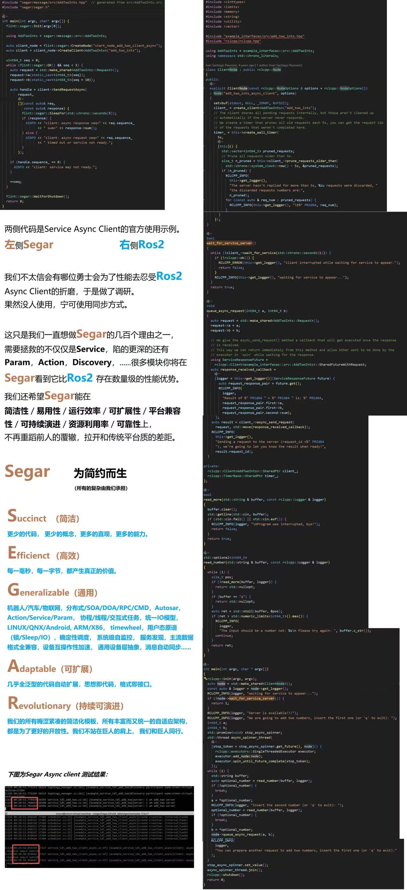
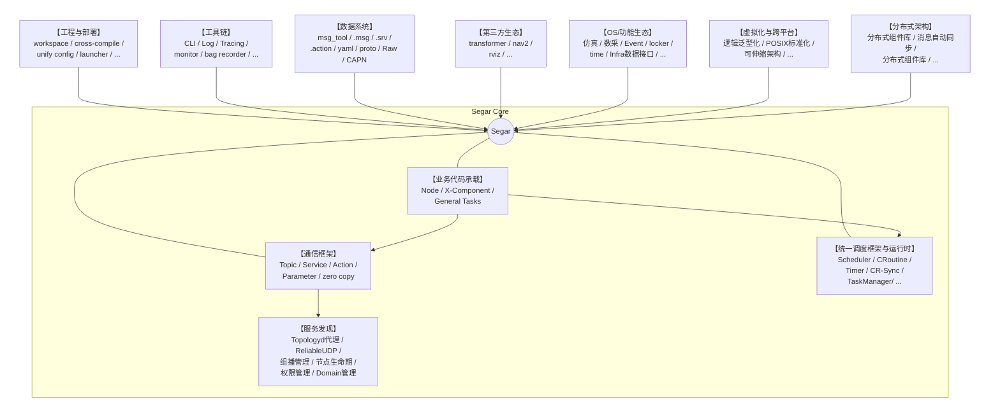
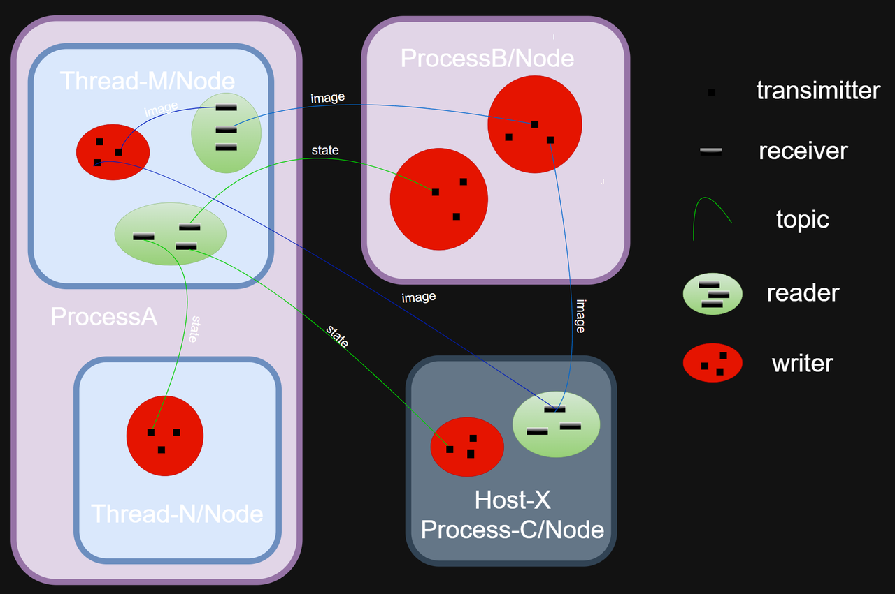
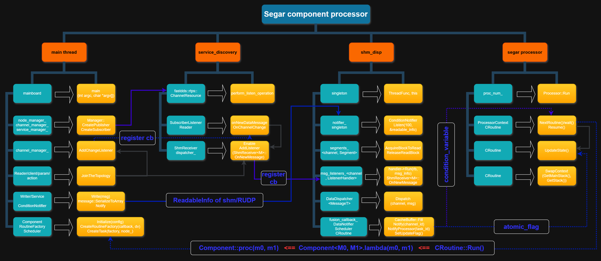
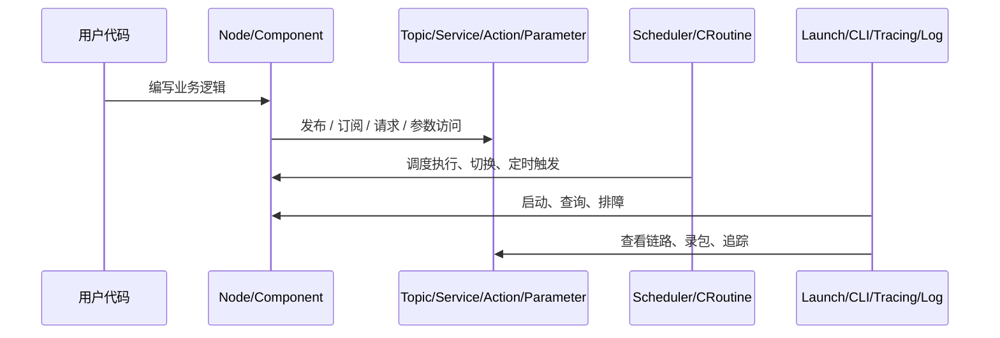
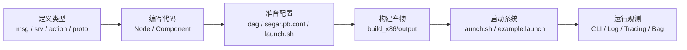

# Segar History And Current State

> 本文用几张图快速说明 Segar 的由来，演进，提供什么能力、各部分如何配合，以及用户应如何理解整套系统。

## 1. Segar 的由来
- 2023年，苦于Ros2框架的复杂低效与演进停滞，我希望有一款更简洁高效高性能的中间件来同时承载自动驾驶与智能机器人业务，于是按找自己的想法写了第一个版本的中间件，并给它取名叫Segar。
- 保存下来的这张图片介绍了Segar名称的由来，也是Segar一直以来坚持的理念：
  - Segar = Succinct + Efficienct + Generalizable + Adaptable + Revolutionary
  - 从设计之初，它就以替代Ros2为目标，因此兼容/替代Ros2的生态一直都是设计迭代的原则
  - 为了避免Ros2固有的那些缺陷，尽管使用风格接近，但Segar从底层源码实现到顶层设计思想都和Ros2基本没有关联
- 历史图片：

## 1. What Is Segar

- 从用户视角看，Segar 不只是通信库，而是一整套“写业务 + 跑系统 + 做观测”的运行框架。
- 中间的 `Segar Core` 代表整套系统的核心：业务代码承载、通信框架和统一调度框架。
- 业务代码通常写在 `Node` 或 `Component` 中，数据通过 `Topic / Service / Action / Parameter` 流动。
- `通信框架` 下面的 `服务发现` 负责 Topologyd、ReliableUDP、组播管理、节点生命期、权限管理和 Domain 管理。
- 外围各块表示 Segar 不是单一通信库，而是一整套和数据、部署、工具、生态、分布式能力协同工作的系统。
- `msg_tool` 负责数据定义与解析，分布式架构补齐了服务发现、跨节点同步和分布式组件协作能力。
- 内部生态和第三方生态分别承载业务自有能力接入，以及导航、可视化等现成生态复用。

## 2.Segar初始的的底层原理（底层行为主体与行为模式）
- Segar 的统一任务调度是三级模式（进程/线程/协程），用户感知协程，系统工程师感知线程和协程
- Segar 的内部行为主体示意图

- Segar既支持DOA（数据驱动）的数据流，也支基于SOA（服务驱动）和BTREE（行为树驱动）的数据流。
- DOA内部数据流示意图：

## 3. How Things Work Together

- 轻度理解原理时，可以只记住一件事：Segar 把“业务逻辑、数据流、执行调度、观测工具”放进了同一套系统。
- 业务代码本身不需要直接管理大部分底层执行细节，更多是声明输入、处理逻辑和启动配置。
- 当系统运行出现问题时，优先使用 `CLI / Log / Tracing / Bag` 看状态，而不是先猜内部实现。

## 4. Typical User Workflow

- 大多数用户的日常路径就是“写代码 -> 配配置 -> 构建 -> 启动 -> 观测”。
- 如果你先想知道一个典型 `Component` 如何工作，直接继续看 `Quick Start`。
- 如果你先想知道文件该放哪里、`output/` 长什么样，继续看 `Segar Engineering`。

## 5. Recommended Reading Order

- [Segar User Guide](Segar_User_Guide.md)：预览整套文档的范围和阅读主题入口
- [Quick Start](Segar_Quick_Start.md)：先跑通一个真实 `Component`
- [Segar Engineering](Segar_Engineering.md)：理解 workspace、output、配置和部署目录
- [Segar Terms](Segar_Terms.md)：补齐高频概念
- [Segar Component](Segar_Component.md)：系统学习 `Component / TimerComponent / SyncComponent`
- [Segar Concurrent And User-Defined Tasks](Segar_Concurrent_And_User_Defined_Tasks.md)：理解并发能力与用户自定义 task
