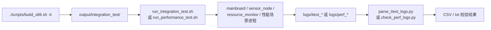
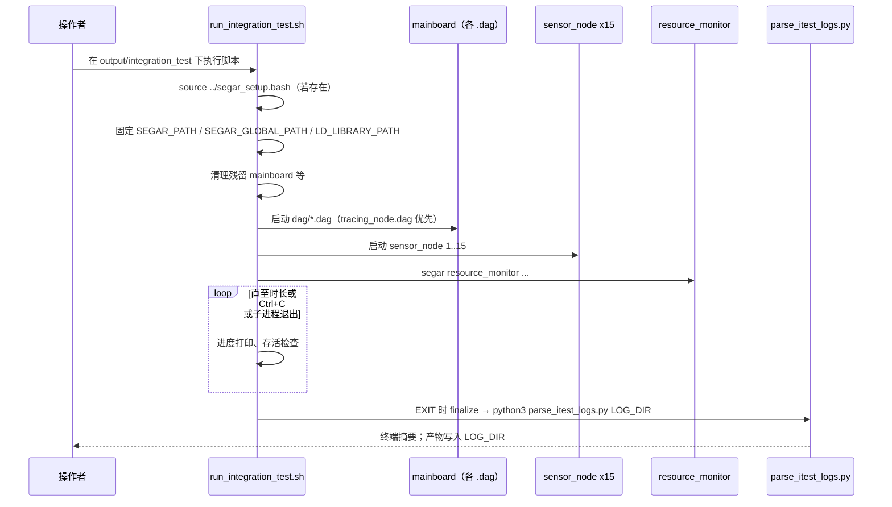

# Segar Integration Test

本文说明 `integration_test` 模块在 `segar-workspace` 中的构建、运行与日志结果。

## 1. Overview

### 1.1 从构建到报告的总览



### 1.2 基础集成测试脚本时序（`run_integration_test.sh`）



### 1.3 性能测试流程（`run_performance_test.sh`）

脚本为**顺序执行**的多段场景：每段先起「对端 / server / publisher」，再起「client / subscriber」，在监控循环中等待 **client 侧正常退出** 后，再 **TERM→INT** 停止本段残留进程；全程受 `TIMEOUT_DURATION`（默认 600s）约束，超时则 `kill_all` 并以失败退出。EXIT trap 也会在异常路径上清理已跟踪子进程。

```mermaid
flowchart TB
  subgraph init["初始化"]
    A1["source ../segar_setup.bash（若存在）"]
    A2["固定 SEGAR_PATH / SEGAR_GLOBAL_PATH / LD_LIBRARY_PATH"]
    A3["LOG_DIR：参数2 或 logs/perf_<时间戳>"]
    A1 --> A2 --> A3
  end
  subgraph preclean["跑前清理"]
    B1["pkill 性能相关进程名<br/>segar_node_a/b、segar_service、<br/>segar_client*、segar_action_*"]
    B2["pkill -f tracing_node.dag"]
    B1 --> B2
  end
  subgraph verify["校验"]
    C1["bin/ 下 topic、service、action<br/>各可执行文件必须存在"]
  end
  subgraph trace["Tracing（可选）"]
    D1{"dag/tracing_node.dag 存在?"}
    D1 -- 是 --> D2["mainboard -d tracing_node.dag<br/>→ tracing_node.log"]
    D1 -- 否 --> T1
    D2 --> T1
  end
  subgraph topic["Topic 性能段"]
    T1["segar_node_b → segar_node_a"]
    T2["monitor：client 退出后<br/>stop segar_node_b"]
    T1 --> T2
  end
  subgraph svc["Service 同步段"]
    F1["segar_service + segar_client<br/>SERVICE_NAME / SERVICE_TIMEOUT_MS"]
    F2["client 退出 → stop segar_service"]
    F1 --> F2
  end
  subgraph svcasync["Service 异步段"]
    G1["segar_service + segar_client_async"]
    G2["client 退出 → stop segar_service"]
    G1 --> G2
  end
  subgraph act["Action 段"]
    H1["segar_action_server +<br/>segar_action_client_sync"]
    H2["client 退出 → stop server"]
    H1 --> H2
  end
  subgraph tail["收尾与校验"]
    I1{"曾启动 tracing_node?"}
    I1 -- 是 --> I2["stop mainboard tracing"]
    I1 -- 否 --> J1
    I2 --> J1["python3 check_perf_logs.py LOG_DIR"]
    J1 --> J2["可选：从环境变量组装阈值参数<br/>TOPIC_* / SERVICE_* / ACTION_*"]
  end
  A3 --> B1
  B2 --> C1
  C1 --> D1
  T2 --> F1
  F2 --> G1
  G2 --> H1
  H2 --> I1
```



各段写入 `LOG_DIR` 的典型日志文件名（与脚本内变量一致）：

| 段 | 日志文件（节选） |
|----|------------------|
| Tracing | `tracing_node.log` |
| Topic | `topic_node_b.log`、`topic_node_a.log` |
| Service 同步 | `service_server.log`、`service_client.log` |
| Service 异步 | `service_server_async.log`、`service_client_async.log` |
| Action | `action_server.log`、`action_client_sync.log` |

---

## 2. 构建

在仓库根目录执行：

```bash
./scripts/build_x86.sh -it
```

或 Orin 交叉编译：

```bash
./scripts/build_orin.sh -it
```

构建完成后，产物位于：

- `build_x86/output/integration_test/`
- `build_orin/output/integration_test/`

---

## 3. 运行基础集成测试

```bash
cd build_x86/output/integration_test
./run_integration_test.sh
```

说明：

- 脚本会自动尝试加载上级目录中的 `segar_setup.bash`。
- 脚本随后会显式导出：
  - `SEGAR_PATH=build_x86/output`（即 `integration_test` 的父目录）
  - `SEGAR_GLOBAL_PATH=build_x86/output`
  也就是 `integration_test` 运行时统一使用 `output/config/` 下的配置，而不是依赖外部 shell 里残留的环境变量。
- 默认会启动 DAG、传感器节点和资源监控，并在测试结束后执行日志解析。

### 3.1 脚本参数示例

`run_integration_test.sh` 支持三个位置参数：`BASE_DIR`、`LOG_DIR`、`DURATION_SEC`（秒；`0` 表示不按时长退出，依赖 Ctrl+C 或进程自然结束）。

| 场景 | 命令示例 |
|------|-----------|
| 默认（当前目录为安装根、日志带时间戳、跑 60s） | `./run_integration_test.sh` |
| 指定日志目录 | `./run_integration_test.sh "$(pwd)" /tmp/itest_manual` |
| 短时冒烟（10s） | `./run_integration_test.sh "$(pwd)" "" 10` |

自定义 `LOG_DIR` 时请确保目录可写；解析脚本会在 `finalize` 阶段对同一目录执行 `parse_itest_logs.py`。

### 3.2 与环境变量、日志排查的配合

集成测试各进程日志默认写入本次运行的 `LOG_DIR` 下的 `*.log`；框架与模块的 glog 行为（目录、`GLOG_*` 等）与日常运行一致，需要对照说明时请阅读 [Segar_Log.md](Segar_Log.md)。

示例：在运行集成测试前打开调试日志（按需）：

```bash
export GLOG_minloglevel=0
export GLOG_v=4
cd build_x86/output/integration_test
./run_integration_test.sh
```

---

## 4. 运行性能测试

```bash
cd build_x86/output/integration_test
./run_performance_test.sh
```

该脚本覆盖 Topic/Service/Action 的性能场景，并调用 `check_perf_logs.py` 输出阈值校验结果。整体执行顺序、各段日志文件名见 **§1.3**。

### 4.1 参数与输出位置（摘要）

与基础脚本类似，性能脚本会固定 `SEGAR_PATH` / `SEGAR_GLOBAL_PATH` 到 `output` 根目录；默认日志目录为 `logs/perf_<时间戳>/`。第二个参数可显式传入 `LOG_DIR`。

位置参数：`BASE_DIR`（默认脚本所在目录，即安装后的 `integration_test/`）、`LOG_DIR`（可选）。脚本内全局超时为 `TIMEOUT_DURATION=600`（秒），用于 `check_timeout` 与对 `check_perf_logs.py` 调用时的 `timeout` 剩余时间包装。

---

## 5. 常见输出

- `logs/itest_*/loss_report.csv`：丢包率、重复率
- `logs/itest_*/latency_report.csv`：平均值、P50、P90、P99、最小值、最大值
- `logs/itest_*/param_timer_check.txt`：参数定时器检查
- `logs/itest_*/service_check.txt`：服务调用检查
- `logs/perf_*/`：性能测试各场景日志与校验结果

---

## 6. 注意事项

- 运行前确保当前终端已加载输出目录环境（`segar_setup.bash`），脚本也会再次尝试 source 上级目录中的同名文件。
- 若需要验证 tracing，请确认 `build_x86/output/config/segar.pb.conf` 与 `build_x86/output/config/tracing_config.pb.txt` 已包含你期望的配置；`integration_test` 脚本会固定使用这两份输出目录配置。
- 若有历史残留进程，脚本会尝试优雅清理；清理失败时请按提示手动结束对应进程后重试。
