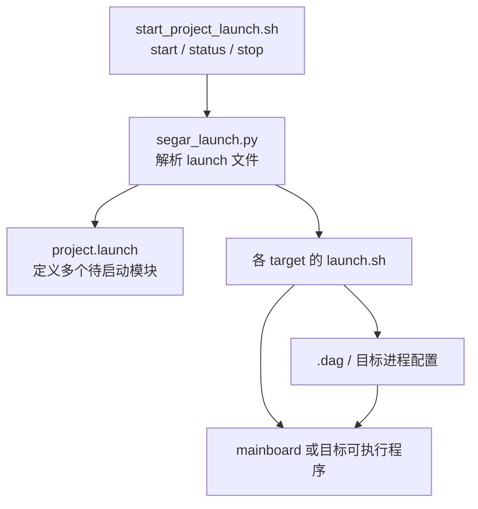
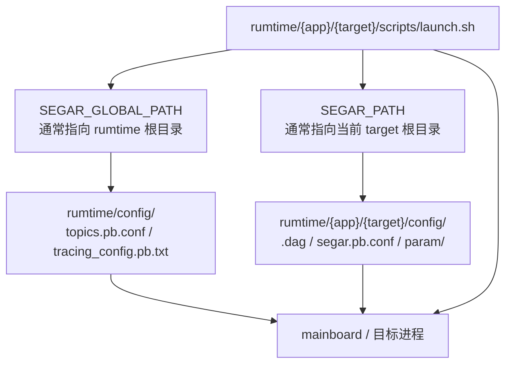

# Segar Launch

## 0. 本地集成多个 Segar 进程时，通常需要准备两部分文件：

1. 一个 `project.launch`，用于同时拉起多个 Segar component 或本地应用程序。
2. 一个本地 `start_project_launch.sh` 脚本，用于启动、停止 `project.launch` 或更多 launch 文件。



## 1. `example.launch` 示例

源码中的 `src/launch_example/example.launch.in` 在 CMake 配置阶段通过 `configure_file` 生成 `example.launch`，其中的安装根路径由 `@CMAKE_INSTALL_PREFIX@` 替换。生成文件位于构建目录的 `gen/launch_example/example.launch`，并随 `install` 安装到 `${CMAKE_INSTALL_PREFIX}/launch_example/example.launch`。该示例管理多个 DAG 进程和普通进程，并支持基本的 EM（执行管理）策略，例如失效自动重启。

注意：

- `library` 模块用 `dag_conf` + `process_name`。
- `binary` 模块必须写可执行命令行。
- `binary` 的 `<process_name>` 不做 shell 变量展开。

## 2. `start_example_launch.sh` 示例

`src/launch_example/start_example_launch.sh` 是一个可直接参考的启动脚本：根据脚本所在目录解析安装根目录（与 `launch_example` 同级的 `segar_setup.bash`），并调用同目录下的 `segar_launch.py` 与安装时生成的 `example.launch`。

运行示例时，请使用安装产物目录 `build_x86/output/launch_example` 中的脚本：

```bash
cd build_x86/output/launch_example
chmod +x start_example_launch.sh
./start_example_launch.sh start
./start_example_launch.sh status
./start_example_launch.sh stop
```

## 3. `launch.sh` 的放置位置和使用方式

单个 target 的启动脚本通常放在：

```text
src/<app>/<target>/scripts/launch.sh
```

部署后通常对应：

```text
output/<app>/<target>/scripts/launch.sh
```

运行方式通常两种都支持：

- 在模块根目录执行 `./scripts/launch.sh`
- 进入 `scripts/` 目录后执行 `bash launch.sh`

## 4. `launch.sh` 里通常要做什么

以 `topic_talker` 为例，其 `scripts/launch.sh` 如下。部署后路径为 `topic_example/topic_talker/scripts/launch.sh`：

```shell
SCRIPT_DIR="$(cd "$(dirname "${BASH_SOURCE[0]}")" && pwd)"
PROJ_DIR="$SCRIPT_DIR/../../../"
cd "$SCRIPT_DIR/.."

LD_LIBRARY_PATH=$PROJ_DIR/third_party/lib:$PROJ_DIR/lib:$LD_LIBRARY_PATH
PATH=$SCRIPT_DIR/../bin:$PATH
SEGAR_PATH=$SCRIPT_DIR/..
SEGAR_GLOBAL_PATH=$SCRIPT_DIR/../../..
export LD_LIBRARY_PATH PATH SEGAR_PATH SEGAR_GLOBAL_PATH

SEGAR_LOG_DIR_PREFIX="$PROJ_DIR/.segar/log"
echo $SEGAR_LOG_DIR_PREFIX
if [ ! -d "$SEGAR_LOG_DIR_PREFIX" ]; then
    mkdir -p "$SEGAR_LOG_DIR_PREFIX"
fi
export GLOG_log_dir="$SEGAR_LOG_DIR_PREFIX"
export GLOG_alsologtostderr=1
export GLOG_colorlogtostderr=1
export GLOG_minloglevel=0
export sysmo_start=0

export SEGAR_DOMAIN_ID=0
export SEGAR_IP=127.0.0.1

topic_talker
```

通常它会做 4 件事：

- 解析脚本路径，定位当前 target 根目录和 `output/` 根目录
- 设置 `LD_LIBRARY_PATH`、`PATH`、`SEGAR_PATH`、`SEGAR_GLOBAL_PATH`
- 创建日志目录并设置 GLOG 环境变量
- 最后启动目标程序，或执行 `mainboard -d xxx.dag`

## 5. `SEGAR_PATH` 和 `SEGAR_GLOBAL_PATH`



- `SEGAR_PATH`
  - 指向当前目标根目录
  - 用于加载该目标自己的本地配置、参数文件等
- `SEGAR_GLOBAL_PATH`
  - 指向 `output/` 或 `镜像runtime` 全局根目录
  - 用于加载全局配置，如 `config/topics.pb.conf`、`config/tracing_config.pb.txt`

## 6. 运行前准备

运行前通常先执行：

```bash
source build_x86/output/segar_setup.bash
```

或在对应平台产物目录下执行：

```bash
source segar_setup.bash
```

这一步用于加载运行所需环境变量。更多示例与运行说明见 [Segar Examples](Segar_Examples.md)。

## 7. `segar.pb.conf`

`segar.pb.conf` 的放置位置、示例和字段说明请阅读 [Segar Engineering](Segar_Engineering.md)。
