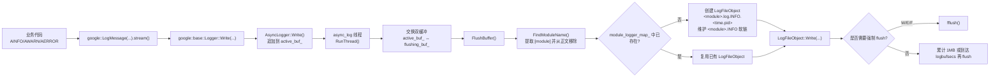
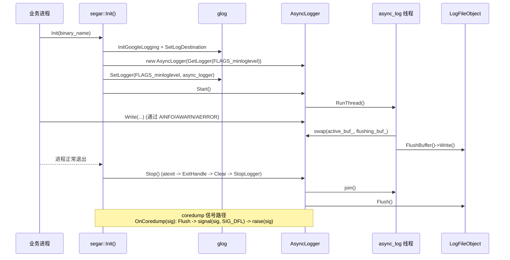

# Segar Log

> 本文只介绍日志的常用写法、日志目录、常见环境变量和排查方法，不展开实现原理。

## 1. Overview

当前日志实现基于 `glog + Segar 宏封装 + AsyncLogger`：

1. 业务侧通过 `AINFO`、`AWARN`、`AERROR` 等宏写日志
2. `segar::Init()` 初始化 glog，并挂接异步日志实现
3. 异步线程按模块名拆分日志文件并写盘

### 1.1 运行时写盘流程图



### 1.2 初始化 / 退出 / 异常时序图



## 2. 常用日志宏

| 宏 | 用途 |
|---|---|
| `AINFO` | 输出普通信息日志 |
| `AWARN` | 输出告警日志 |
| `AERROR` | 输出错误日志 |
| `AFATAL` | 输出致命日志，进程会退出 |
| `ADEBUG` | 输出调试日志，需要额外开启 `GLOG_v` |
| `AINFO_IF(cond)` / `AWARN_IF(cond)` / `AERROR_IF(cond)` | 条件成立时输出日志 |
| `AINFO_EVERY(n)` / `AWARN_EVERY(n)` / `AERROR_EVERY(n)` | 每 `n` 次输出一次 |
| `ACHECK(cond)` | 条件检查失败时终止程序 |

补充：

- `ADEBUG` 实际依赖 `VLOG(4)`，通常需要 `GLOG_minloglevel=0` 且 `GLOG_v>=4`
- 如需显式指定模块名，可使用 `ALOG_MODULE("custom_module", INFO)`

示例：

```cpp
#include "segar/common/log.h"

void Foo(int* p) {
  RETURN_IF_NULL(p);
  AINFO << "start foo";
  ADEBUG << "value=" << *p;
  AWARN_IF(*p < 0) << "value is negative";
}
```

---

## 3. 日志写到哪里

### 3.1 使用 `segar_setup.bash` 时

当前 workspace 的 [src/segar_config/segar_setup.bash](/home/simon/segar/segar-workspace/src/segar_config/segar_setup.bash) 默认会设置：

```bash
export GLOG_log_dir="$HOME/.segar/log"
export GLOG_alsologtostderr=1
export GLOG_colorlogtostderr=1
export GLOG_minloglevel=0
```

因此，直接执行：

```bash
source build_x86/output/segar_setup.bash
```

后，日志默认写到：

```text
~/.segar/log
```

### 3.2 使用示例 `launch.sh` 时

当前 workspace 大多数示例的 `scripts/launch.sh` 会覆盖日志目录，将日志写到 output 目录下：

```text
build_x86/output/.segar/log
```

因此：

- 直接 `source segar_setup.bash` 运行程序时，优先看 `~/.segar/log`
- 通过示例目录下的 `./scripts/launch.sh` 启动时，优先看对应 output 下的 `.segar/log`

---

## 4. 日志文件规则

- 日志按模块名拆分写盘
- 常见文件名格式：

```text
<module>.log.INFO.<YYYYMMDD-HHMMSS.pid>
```

- 同时会维护一个软链接：

```text
<module>.INFO
```

对 `mainboard -d xxx.dag` 场景，模块名通常会使用 DAG 文件名，例如 `common.dag`、`timer.dag`。

---

## 5. 常用环境变量

| 环境变量 | 说明 | 常见值 |
|---|---|---|
| `GLOG_log_dir` | 日志目录 | `~/.segar/log` |
| `GLOG_alsologtostderr` | 是否同时打印到终端 | `1` / `0` |
| `GLOG_colorlogtostderr` | 终端日志是否彩色 | `1` / `0` |
| `GLOG_minloglevel` | 最低输出级别 | `0` / `1` / `2` / `3` |
| `GLOG_v` | `VLOG` 级别控制，用于 `ADEBUG` | `4` |
| `GLOG_max_log_size` | 单个日志文件最大大小，单位 MB | `256` |

级别含义：

- `0`：INFO 及以上
- `1`：WARNING 及以上
- `2`：ERROR 及以上
- `3`：FATAL

常见用法：

```bash
export GLOG_log_dir=/tmp/segar_log
export GLOG_minloglevel=0
export GLOG_v=4
export GLOG_max_log_size=256
```

---

## 6. 刷盘与刷新

普通用户最常用的日志刷新配置项是：

```text
transport_conf.resource_limit.async_log_flush_interval_ms
```

它位于各应用的 `config/segar.pb.conf` 中，用于控制异步日志线程的常规消费节拍。当前 workspace 示例通常配置为：

```text
500 ms
```

补充：

- `WARNING`、`ERROR`、`FATAL` 日志会更积极地触发 flush
- 进程正常退出时会自动 flush

---

## 7. 常见排查

| 现象 | 先检查什么 |
|---|---|
| 终端没有日志输出 | 检查 `GLOG_alsologtostderr` 是否为 `1` |
| 找不到日志文件 | 检查当前是通过 `segar_setup.bash` 运行，还是通过示例 `launch.sh` 运行 |
| `ADEBUG` 没有输出 | 检查 `GLOG_v` 是否至少为 `4` |
| 日志文件过大 | 调整 `GLOG_max_log_size` |
| 日志落盘不够及时 | 检查 `async_log_flush_interval_ms` 配置 |

如需查看组件或示例运行方式，可继续阅读 [Segar_Quick_Start.md](Segar_Quick_Start.md) 和 [Segar_Component.md](Segar_Component.md)。
