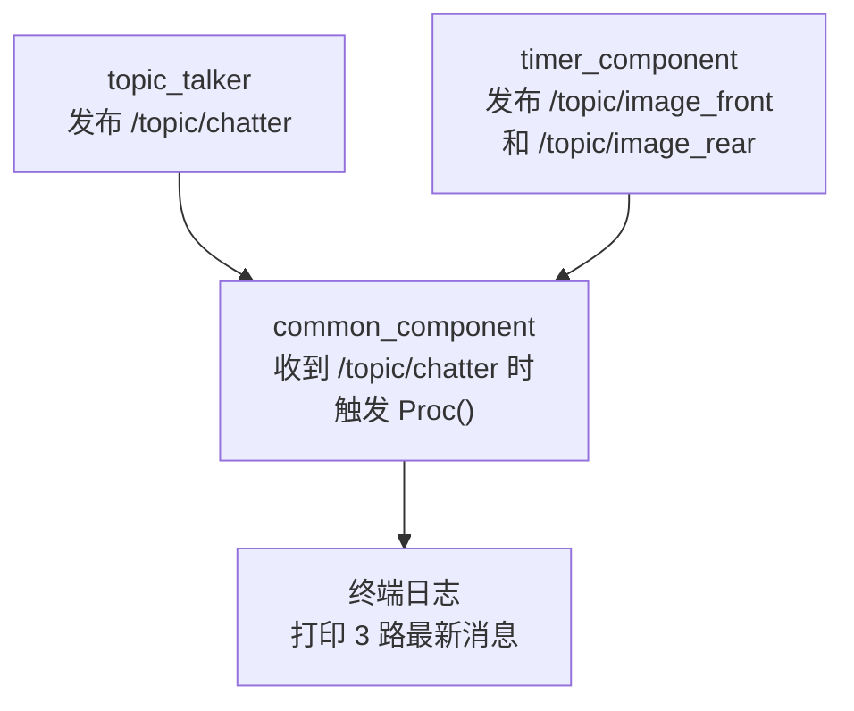
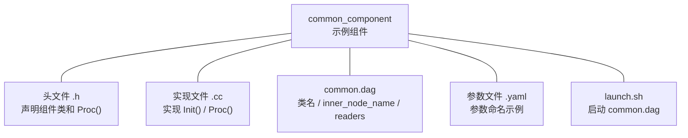

# Segar Quick Start

> 本文通过 `src/component_example` 中的一个真实示例，先认识 Segar 最典型的 `Component` 用法。工程目录、部署目录和全局配置请阅读 [Segar_Engineering.md](Segar_Engineering.md)。

## 1. 你将完成什么

完成本文后，你应该可以：

- 跑通一个真实的消息触发 `Component`
- 看懂一个典型 `Component` 至少由哪些文件组成
- 看懂 `Proc()`、`.dag` 和参数文件之间的对应关系
- 基于 `common_component` 改出自己的第一个 `Component`

---

## 2. 前置条件

在仓库根目录执行以下命令：

```bash
./scripts/build_x86.sh
source build_x86/output/segar_setup.bash
```

如果你还不熟悉 `workspace` 目录结构、`output/` 目录、`segar_setup.bash` 或配置文件放置位置，请先阅读 [Segar_Engineering.md](Segar_Engineering.md)。

---

## 3. 通过 `common_component` 认识典型 Component

本文使用当前仓库中的 `common_component` 示例：

| 路径 | 必需 | 作用 |
|---|---|---|
| `src/component_example/common_component/src/common_component_example.h` | 是 | Component 类声明 |
| `src/component_example/common_component/src/common_component_example.cc` | 是 | `Init()` / `Proc()` 实现 |
| `src/component_example/common_component/config/common.dag` | 是 | Component 启动配置 |
| `src/component_example/common_component/config/common_component_example.yaml` | 否 | 参数文件命名规则示例 |
| `src/component_example/common_component/scripts/launch.sh` | 否 | 示例启动脚本 |

这个 Component 订阅 3 个 Topic：

| Topic | 来源 |
|---|---|
| `/topic/chatter` | `topic_talker` |
| `/topic/image_front` | `timer_component` |
| `/topic/image_rear` | `timer_component` |



注意：消息触发 `Component` 以 `common.dag` 中第一个 `readers` 为触发条件。当前示例里，第一个 Topic 是 `/topic/chatter`，因此只有它收到新消息时才会触发 `Proc()`。

### 3.1 启动 Component

终端 1：

```bash
cd build_x86/output/component_example/common_component
./scripts/launch.sh
```

当前 `launch.sh` 会自行完成这几件事：

- 设置 `SEGAR_PATH` 为当前 target 根目录
- 设置 `SEGAR_GLOBAL_PATH` 为 `output/` 根目录
- 最终执行 `mainboard -d config/common.dag`

因此这里推荐直接使用 `scripts/launch.sh`，而不是手工拼装 `mainboard` 启动命令。

### 3.2 启动图片消息源（选读）

终端 2：

```bash
cd build_x86/output/component_example/timer_component
./scripts/launch.sh
```

`timer_component` 会持续发布：

- `/topic/image_front`
- `/topic/image_rear`

### 3.3 启动触发消息源（选读）

终端 3：

```bash
cd build_x86/output/topic_example/topic_talker
./scripts/launch.sh
```

`topic_talker` 会持续发布 `/topic/chatter`。

### 3.4 观察结果

当三个进程都启动后，终端 1 会持续看到类似输出：

```text
CommonComponentExample Proc [chatter:0] [image_front->width:9] [image_rear->width:9]
CommonComponentExample Proc [chatter:1] [image_front->width:19] [image_rear->width:19]
```

这表示：

- `common_component` 已经被成功加载
- `/topic/chatter` 到达时触发了 `Proc()`
- 组件同时取到了另外两路 Topic 的最新消息

---

## 4. 示例里最关键的 5 个文件



### 4.1 组件类

```cpp
#include "example/msg/Image.hpp"
#include "example/msg/String.hpp"
#include "segar/component/component.h"

class CommonComponentExample
    : public rti::segar::Component<example::msg::String,
                                   example::msg::Image,
                                   example::msg::Image> {
 public:
  bool Init() final;
  bool Proc(const std::shared_ptr<example::msg::String>& msg0,
            const std::shared_ptr<example::msg::Image>& msg1,
            const std::shared_ptr<example::msg::Image>& msg2) final;
};
SEGAR_REGISTER_COMPONENT(CommonComponentExample)
```

先只记住 3 点：

- 继承 `Component<输入类型1, 输入类型2, ...>`
- 重写 `Init()` 和 `Proc()`
- 用 `SEGAR_REGISTER_COMPONENT(...)` 注册类

### 4.2 处理逻辑

```cpp
bool CommonComponentExample::Proc(const std::shared_ptr<String>& msg0,
                                  const std::shared_ptr<Image>& msg1,
                                  const std::shared_ptr<Image>& msg2) {
  uint32_t w1 = 0, w2 = 0;
  if (msg1) w1 = msg1->width();
  if (msg2) w2 = msg2->width();
  AINFO << "CommonComponentExample Proc [chatter:" << (msg0 ? msg0->data() : "")
        << "] [image_front->width:" << w1 << "] [image_rear->width:" << w2 << "]";
  return true;
}
```

这里的 `Proc()` 只做了一件事：读取 3 路输入并打印日志。你自己的业务逻辑通常也从这里开始写。

### 4.3 DAG 配置

```yaml
module_config {
    module_library : "lib/libcommon_component.so"
    components {
        component_class_name : "CommonComponentExample"
        config {
            inner_node_name: "common_component_example"
            readers {
                topic: "/topic/chatter"
                pending_queue_size: 5
            }
            readers {
                topic: "/topic/image_front"
                pending_queue_size: 5
            }
            readers {
                topic: "/topic/image_rear"
                pending_queue_size: 5
            }
        }
      }
    }
```

其中最重要的字段是：

| 字段 | 说明 |
|---|---|
| `module_library` | 组件动态库路径 |
| `component_class_name` | 代码中的组件类名，必须与注册类一致 |
| `inner_node_name` | 组件内部节点名，也决定参数文件命名 |
| `readers` | 输入 Topic 列表，顺序必须与 `Proc()` 参数顺序一致 |

### 4.4 启动脚本（选读）

```bash
mainboard -d $SCRIPT_DIR/../config/common.dag
```

对这个示例来说，`launch.sh` 的作用很直接：

- 设置运行所需环境变量
- 指向 `config/common.dag`
- 启动 `mainboard`

如果你复制 `common_component` 做自己的组件，通常也会一起复制并修改这里的 DAG 路径和目标目录。

### 4.5 参数文件说明（选读）

示例目录里还有一个参数文件：

```text
src/component_example/common_component/config/common_component_example.yaml
```

它当前主要用于展示参数文件命名规则：

- 文件名要与 `inner_node_name` 对应
- 当前示例里 `inner_node_name` 是 `common_component_example`
- 因此参数文件名是 `common_component_example.yaml`

但按当前代码实现，`CommonComponentExample::Init()` 并没有读取这些参数；这个 YAML 在本示例里更像“参数目录结构示例”，不是运行 `common_component` 必需的一部分。

---

## 5. 如何从示例改出自己的第一个 Component

推荐直接复制 `src/component_example/common_component`，再修改下表中的内容：

| 需要修改的内容 | 可选 | 说明 |
|---|---|---|
| `src/*.h` / `src/*.cc` | 否 | 文件名改成你的组件名，修改 `Proc()` 的输入类型 |
| 替换类名 | 否 | 例如 `CommonComponentExample` 改成你的类名 |
| `CMakeLists.txt` | 否 | 修改库名和源文件名 |
| `config/*.dag` | 否 | 修改 `module_library`、`component_class_name`、`inner_node_name`、`readers` |
| `scripts/launch.sh` | 是 | 确认启动脚本指向正确的 DAG |
| `config/<inner_node_name>.yaml` | 是 | 如果你的组件要读取参数，文件名必须与 `inner_node_name` 对应 |

修改后重新编译：
1. 重新执行 `./scripts/build_x86.sh`
2. 在 `build_x86/output/<your_example>/<your_component>/` 下运行 `./scripts/launch.sh`

---

## 6. 常见问题

| 现象 | 排查方式 |
|---|---|
| `build_x86/output` 不存在 | 先执行 `./scripts/build_x86.sh` |
| 启动时报 `module library` 找不到 | 检查 DAG 中的 `module_library` 是否与安装产物一致；建议优先使用 output 目录中的 `launch.sh` 启动 |
| 组件已启动，但 `Proc()` 没有打印日志 | 检查第一个 `readers` 对应的 Topic 是否真的在发消息 |
| 参数文件没有生效 | 先确认组件代码里是否真的读取了参数；如果会读取，再检查参数文件名是否与 `inner_node_name` 一致 |

下一步建议：

- 想系统了解工程目录、部署目录和配置放置位置：阅读 [Segar_Engineering.md](Segar_Engineering.md)
- 想继续学习 `Component`、`TimerComponent`、`SyncComponent` 的完整写法：阅读 [Segar_Component.md](Segar_Component.md)
