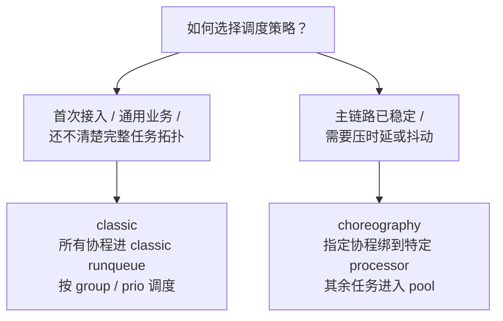
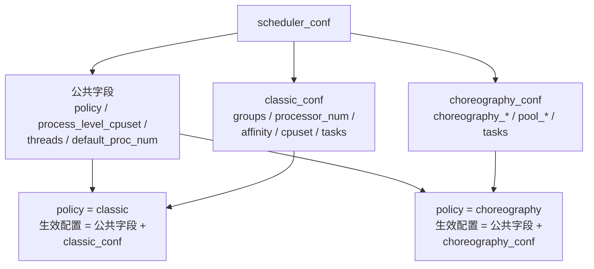

# Segar Scheduler

> **说明**：调度配置用于定义进程、线程和业务任务的 CPU 亲和性、调度策略与优先级，用于实现 CPU 资源隔离和实时性保障。

---

## 1. 核心作用 / 文件规范

- **核心作用**：控制未显式绑核线程的默认 CPU 范围、框架内部线程优先级，以及业务任务在线程池中的分配方式
- **文件格式**：Proto 文本格式
- **推荐命名**：`<process_group>.conf`
- **推荐位置**：`config/`

按当前代码实现，调度器会优先读取：

```text
${WorkRoot}/config/<process_group>.conf
```

例如：

- `-p compute_sched` 对应 `config/compute_sched.conf`
- `-p control_sched` 对应 `config/control_sched.conf`

---

## 2. 先选策略

Segar 当前常用两类调度策略：

| 策略 | 适用场景 | 特点 |
|---|---|---|
| `classic` | 大多数普通场景；还不清楚完整任务拓扑时 | 所有协程统一进入 classic runqueue，按 group/prio 调度，通用、稳妥 |
| `choreography` | 已明确主链路任务依赖关系、耗时和频率时 | 可将指定协程固定到某个 choreography processor，其余任务进入 pool |



补充说明：

- `scheduler_conf.policy` 决定当前实际使用哪一套调度策略
- `classic_conf` 和 `choreography_conf` 是两套互斥的策略专属配置，使用时应二选一
- 配置文件语法上允许两段同时出现，但运行时只会读取与 `policy` 对应的那一段；另一段不会生效
- `process_level_cpuset`、`threads`、`default_proc_num` 属于 `scheduler_conf` 公共字段，不区分 `classic` / `choreography`
- `classic` 和 `choreography` 都会配置线程 affinity / cpuset；两者真正差异不在这里，而在于是否支持把具体协程固定到指定 processor

---

## 3. `classic` 配置

### 3.1 配置示例

```text
scheduler_conf {
    policy: "classic"
    process_level_cpuset: "0-7,16-23"
    threads: [
        {
            name: "async_log"
            cpuset: "1"
            policy: "SCHED_OTHER"
            prio: 0
        }, {
            name: "shm"
            cpuset: "2"
            policy: "SCHED_FIFO"
            prio: 10
        }
    ]
    classic_conf {
        groups: [
            {
                name: "group1"
                processor_num: 16
                affinity: "range"
                cpuset: "0-7,16-23"
                processor_policy: "SCHED_OTHER"
                processor_prio: 0
                tasks: [
                    {
                        name: "E"
                        prio: 0
                    }
                ]
            }, {
                name: "group2"
                processor_num: 16
                affinity: "1to1"
                cpuset: "8-15,24-31"
                processor_policy: "SCHED_OTHER"
                processor_prio: 0
                tasks: [
                    {
                        name: "A"
                        prio: 0
                    }, {
                        name: "B"
                        prio: 1
                    }, {
                        name: "C"
                        prio: 2
                    }, {
                        name: "D"
                        prio: 3
                    }
                ]
            }
        ]
    }
}
```

### 3.2 常用字段

| 字段 | 说明 |
|---|---|
| `process_level_cpuset` | 设置未显式绑核线程能使用的默认 CPU 范围；若线程后续又单独设置了 affinity，则以后者为准 |
| `threads` | 配置框架内部线程，如 `async_log`、`shm` |
| `groups` | 将业务任务划分到不同 group，用于资源隔离 |
| `processor_num` | 该 group 使用的处理线程数 |
| `affinity` | `range` 表示线程在 cpuset 范围内浮动，`1to1` 表示线程与 CPU 一一绑定 |
| `cpuset` | CPU 集合 |
| `processor_policy` / `processor_prio` | group 内线程的调度策略与优先级 |
| `tasks` | 为指定任务单独配置优先级 |

使用建议：

- `process_level_cpuset` 不应理解为“全进程最终 CPU 上限”
- `policy: "classic"` 时，只会读取 `classic_conf`
- 需要通用线程池时，使用 `affinity: "range"`
- 需要减少线程在 CPU 间切换时，使用 `affinity: "1to1"`，并保证 `processor_num` 与 CPU 数量匹配
- 未出现在 `tasks` 中的任务，会进入默认 group



---

## 4. `choreography` 配置

### 4.1 配置示例

```text
scheduler_conf {
    policy: "choreography"
    process_level_cpuset: "0-7,16-23"
    threads: [
        {
            name: "lidar"
            cpuset: "1"
            policy: "SCHED_RR"
            prio: 10
        }, {
            name: "shm"
            cpuset: "2"
            policy: "SCHED_FIFO"
            prio: 10
        }
    ]
    choreography_conf {
        choreography_processor_num: 8
        choreography_affinity: "range"
        choreography_cpuset: "0-7"
        choreography_processor_policy: "SCHED_FIFO"
        choreography_processor_prio: 10

        pool_processor_num: 8
        pool_affinity: "range"
        pool_cpuset: "16-23"
        pool_processor_policy: "SCHED_OTHER"
        pool_processor_prio: 0

        tasks: [
            {
                name: "A"
                processor: 0
                prio: 1
            },
            {
                name: "B"
                processor: 0
                prio: 2
            },
            {
                name: "C"
                processor: 1
                prio: 1
            },
            {
                name: "D"
                processor: 1
                prio: 2
            },
            {
                name: "E"
            }
        ]
    }
}
```

### 4.2 常用字段

| 字段 | 说明 |
|---|---|
| `choreography_processor_num` | 主编排 processor 数量 |
| `choreography_cpuset` | 主编排 processor 使用的 CPU 集合 |
| `choreography_processor_policy` / `choreography_processor_prio` | 主编排 processor 的调度策略和优先级 |
| `pool_processor_num` | 线程池 processor 数量 |
| `pool_cpuset` | 线程池使用的 CPU 集合 |
| `tasks.processor` | 指定某个任务固定落到哪个编排 processor |
| `tasks.prio` | 该任务在对应 processor 内的优先级 |

使用建议：

- `policy: "choreography"` 时，只会读取 `choreography_conf`
- 主链路任务放到 `choreography_conf.tasks`
- 未指定 `processor` 的任务会进入 pool 线程池
- 同一条主链路上的任务，通常尽量放在同一个 processor，必要时再拆分
- 同一路径中越靠后的任务，通常优先级可适当更高

---

## 5. 加载方式与默认行为

### 5.1 启动参数

示例：

```bash
mainboard -d config/car_component.dag -p compute_sched
```

按当前代码实现：

- `-p/--process_group` 决定加载哪个调度文件
- 调度文件实际查找路径为 `config/<process_group>.conf`

### 5.2 配置缺失时的回退行为

如果没有找到对应的 `config/<process_group>.conf`：

- 调度策略会回退为 `classic`
- 处理线程数会回退到 `config/segar.pb.conf` 中的 `scheduler_conf.default_proc_num`
- 当前 workspace 示例配置中该值通常为 `5`

---

## 6. 简单实践建议

- 先用 `classic` 跑通业务，再决定是否需要 `choreography`
- 优先保证 `cpuset`、线程数和业务实际核数匹配
- 只给关键线程和关键任务设置更高优先级，避免全局都升优先级
- 如果只是想做进程级资源隔离，通常只需要 `process_level_cpuset + classic_conf`

如需了解 Component 与调度配置如何配合使用，可继续阅读 [Segar_Component.md](Segar_Component.md)。
