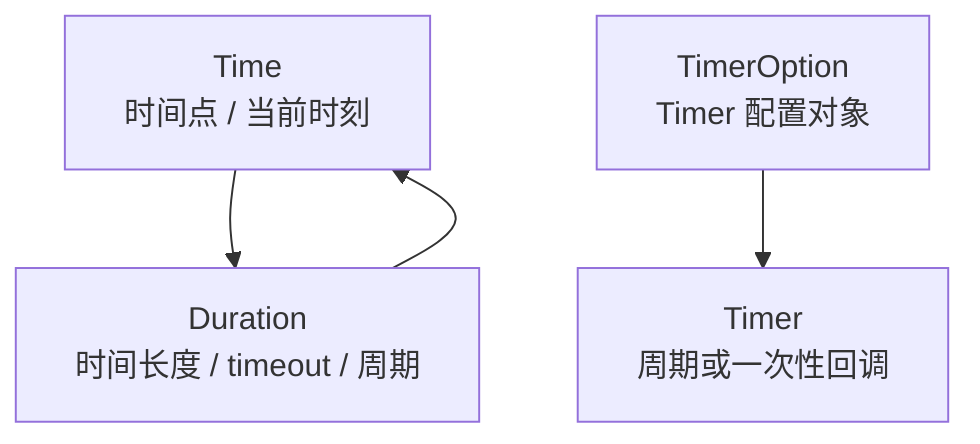
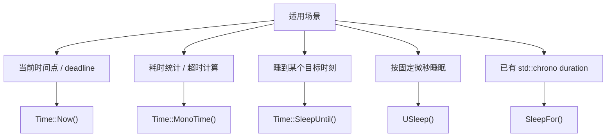

# Segar Time And Timer

> 本文介绍 `time.h`、`timer.h`、`rate.h` 以及少量时间等待辅助接口里用户最常用的时间与定时器能力。

---

## 1. 什么时候看这篇

- 获取当前时间或统计耗时
- 把“睡一段时间”改成“睡到某个时间点”
- 周期性执行一个回调
- 用固定频率/周期做循环节拍（`Rate`）
- 一次性延时执行某个任务

---

## 2. `Time`

`Time` 是 Segar 内置时间类型，支持当前时间获取、时间运算、格式化输出和绝对时间睡眠。



### 2.1 最常用的几个接口

| 接口 | 用途 | 说明 |
|---|---|---|
| `Time::Now()` | 获取当前时间 | 更适合做当前时刻、绝对时间点 |
| `Time::MonoTime()` | 获取单调时钟 | 更适合做耗时统计、超时计算 |
| `Time::SleepUntil(t)` | 睡到指定时间点 | 协程中只挂起当前协程 |
| `USleep(usec)` | 睡固定时长 | 参数单位为微秒 |
| `SleepFor(duration)` | 睡固定时长 | 适合已在使用 `std::chrono` 时长类型的代码 |
| `ToSecond/ToMillisecond/ToMicrosecond/ToNanosecond` | 单位转换 | 便于打印和计算 |
| `ToString()` | 转字符串 | 便于日志输出 |



### 2.2 `Time::Now()`

适合“当前时间点”相关场景，例如：

- 生成截止时间
- 打印时间
- 配合 `SleepUntil()` 对齐下一次执行时刻

```cpp
const auto deadline = rti::segar::Time::Now() + rti::segar::Duration(0.05);
rti::segar::Time::SleepUntil(deadline);
```

### 2.3 `Time::MonoTime()`

适合“相对时间”相关场景，例如：

- 统计一段代码耗时
- 计算超时
- 评估周期误差

```cpp
const auto start = rti::segar::Time::MonoTime();
DoWork();
const auto cost = rti::segar::Time::MonoTime() - start;
AINFO << "cost(us): " << cost.ToMicrosecond();
```

注意：

- `MonoTime()` 更适合做相对时间计算
- 不建议把 `MonoTime()` 直接当作用户可读日期时间

### 2.4 `Time::SleepUntil()`

`SleepUntil()` 表达的是“睡到目标时间点”，而不是“固定 sleep 多久”。

```cpp
const auto next_tick = rti::segar::Time::Now() + rti::segar::Duration(0.02);
rti::segar::Time::SleepUntil(next_tick);
```

适合场景：

- 周期任务补齐剩余周期
- 节拍对齐
- 按 deadline 控制流程推进

按当前实现：

- 在协程上下文里，只挂起当前协程
- 在普通线程上下文里，退化为线程睡眠

使用建议：

- 目标时间建议基于 `Time::Now()` 计算
- 如果只是单纯 sleep 一段固定时长，也可以直接使用 `SleepFor(...)`

### 2.5 `USleep()`

`USleep(usec)` 表达的是“按固定时长睡眠若干微秒”。

```cpp
rti::segar::USleep(5000);   // 5000 us = 5 ms
```

参数说明：

- `usec` 的单位是微秒（us）
- `rti::segar::USleep(1000000)` 就是睡 `1 s`

按当前实现：

- 在协程上下文里，只挂起当前协程
- 在普通线程上下文里，退化为 `std::this_thread::sleep_for(std::chrono::microseconds{usec})`

适合场景：

- 需要按固定微秒时长等待
- 等待时间较短，直接写成微秒数比先构造 `Duration` 更直接

使用建议：

- 如果你要表达“睡到某个目标时刻”，优先使用 `Time::SleepUntil()`
- 如果你要表达“固定 sleep 多久”，`USleep()` 比 `SleepUntil()` 更直接
- 如果你已经在用 `std::chrono` 时长类型，继续使用 `SleepFor(...)` 也可以

### 2.6 `SleepFor()`

`SleepFor(duration)` 表达的是“按 `std::chrono` 时长类型睡固定时长”。

```cpp
rti::segar::SleepFor(std::chrono::milliseconds(5));
rti::segar::SleepFor(std::chrono::microseconds(500));
```

按当前实现：

- 头文件在 `segar/task/lock_guard.h`
- 在协程上下文里，只挂起当前协程
- 在普通线程上下文里，退化为 `std::this_thread::sleep_for(duration)`

适合场景：

- 代码里已经统一使用 `std::chrono::milliseconds`、`std::chrono::microseconds` 等时长类型
- 希望避免手工换算成微秒整数

使用建议：

- 已经有 `std::chrono` 时长对象时，优先用 `SleepFor(...)`
- 只想直接写一个微秒整数时，`USleep()` 更短
- 需要按目标时间点对齐时，仍应使用 `Time::SleepUntil()`

---

## 3. `Duration`

`Duration` 表示一段时间长度，最常见的用途是：

- 给 `Time` 做加减
- 表示 timeout
- 表示周期或等待时长

### 3.1 构造方式和单位

`Duration` 最常见有 4 种构造方式：

| 写法 | 含义 | 单位 |
|---|---|---|
| `rti::segar::Duration(50000000)` | 5 千万纳秒 | ns |
| `rti::segar::Duration(0.05)` | 0.05 秒 | s |
| `rti::segar::Duration(1, 500000000)` | 1.5 秒 | `秒 + 纳秒` |
| `rti::segar::Duration(other)` | 拷贝已有 Duration | 与原值一致 |

这里最容易让人误解的是：

- `rti::segar::Duration(0.05)` 的单位是**秒**
- 也就是 **0.05 秒 = 50 ms = 50000000 ns**

如果你想显式表达 50 ms，可以写成下面任意一种：

```cpp
rti::segar::Duration(0.05);          // 0.05 秒
rti::segar::Duration(50000000);      // 50000000 纳秒
rti::segar::Duration(0, 50000000);   // 0 秒 + 50000000 纳秒
```

### 3.2 常用接口

| 接口 | 用途 |
|---|---|
| `ToSecond()` | 转成秒 |
| `ToNanosecond()` | 转成纳秒 |
| `IsZero()` | 判断是否为 0 |
| `Sleep()` | 按该时长睡眠 |

示例：

```cpp
const auto timeout = rti::segar::Duration(0.05);
AINFO << timeout.ToSecond();       // 0.05
AINFO << timeout.ToNanosecond();   // 50000000
```

### 3.3 和 `Time` 的组合

```cpp
const auto start = rti::segar::Time::Now();
const auto timeout = rti::segar::Duration(0.5);
const auto deadline = start + timeout;

if (rti::segar::Time::Now() > deadline) {
  AWARN << "timeout";
}
```

这里的规则是：

- `Time + Duration = Time`
- `Time - Duration = Time`
- `Time - Time = Duration`

---

## 4. 时间运算

`Time` 支持和 `Duration` 做加减运算：

```cpp
const auto start = rti::segar::Time::Now();
const auto timeout = rti::segar::Duration(0.5);
const auto deadline = start + timeout;

if (rti::segar::Time::Now() > deadline) {
  AWARN << "timeout";
}
```

这类写法通常比自己维护裸 `uint64_t` 纳秒值更清晰。

---

## 5. `Timer`

`Timer` 用于执行一次性或周期性定时任务。

### 5.1 最常见的创建方式

```cpp
auto timer = std::make_shared<rti::segar::Timer>(
    1000,
    []() { AINFO << "tick"; },
    false);
timer->Start();
```

这里的第三个参数是：

- `true`：oneshot，只执行一次
- `false`：周期执行

### 5.2 通过`TimerOption` 使用Timer

`TimerOption` 是 `Timer` 的配置对象，用于集中描述 3 个核心参数：

| 字段 | 说明 |
|---|---|
| `period` | 定时间隔，单位毫秒 |
| `callback` | 到期后执行的回调 |
| `oneshot` | `true` 表示只执行一次；`false` 表示周期执行 |

示例：

```cpp
rti::segar::TimerOption opt;
opt.period = 1000;
opt.callback = []() { AINFO << "tick"; };
opt.oneshot = false;

auto timer = std::make_shared<rti::segar::Timer>(opt);
timer->Start();
```

之所以 `Timer` 在已有便捷构造函数的情况下还保留 `TimerOption`，主要是因为两种写法适合的场景不同：

- `Timer(period, callback, oneshot)` 适合参数很简单、就地一眼能写清楚的场景
- `TimerOption` 适合先组装配置、后创建对象，或者需要复用/修改配置再调用 `SetTimerOption(...)` 的场景

也就是说：

- **简单场景**：直接用构造函数更简洁
- **配置型场景**：用 `TimerOption` 更清楚，也更方便后续调整

### 5.3 周期定时器

```cpp
auto timer = std::make_shared<rti::segar::Timer>(
    100,
    [writer]() {
      auto msg = std::make_shared<example::msg::String>();
      msg->data("hello");
      writer->Write(msg);
    },
    false);
timer->Start();
```

适合场景：

- Topic 周期发布
- 周期性请求
- 心跳
- 后台巡检任务

### 5.4 一次性定时器

```cpp
auto timer = std::make_shared<rti::segar::Timer>(
    500,
    []() { AINFO << "fire once"; },
    true);
timer->Start();
```

适合场景：

- 延时启动
- 超时后执行一次补偿逻辑
- 单次异步提醒

### 5.5 常用操作

| 接口 | 作用 |
|---|---|
| `Start()` | 启动定时器 |
| `Stop()` | 停止定时器 |
| `SetTimerOption(opt)` | 更新配置 |
| `RestartTimer(period)` | 以新周期重启 |

---

## 6. `Rate`

`Rate` 在头文件 `segar/time/rate.h` 中，用于在**自旋循环**里按固定**频率（Hz）**或固定**周期**对齐节拍。典型模式是“干活 → `Sleep()` → 再干活”，`Sleep()` 会尽量把总周期拉到期望值，以补偿每次循环中业务代码的耗时。

### 6.1 三种构造方式

| 构造 | 含义 | 注意 |
|---|---|---|
| `Rate(double frequency)` | 以 **Hz** 为单位的频率 | 例如 `10.0` 表示每秒约 10 次；周期为 `1.0 / frequency` |
| `Rate(uint64_t nanoseconds)` | 以**纳秒**为单位的周期 | 与 `Duration` 的纳秒构造一致 |
| `Rate(const Duration& period)` | 以 `Duration` 表示的周期 | 可配合已有 `Duration` 变量 |

头文件还提供了周期查询接口：

- `Duration ExpectedCycleTime() const`：与构造时期望一致的周期
- `Duration CycleTime() const`：最近一次完整循环里，**相邻两次 `Sleep()` 之间**实际经历的时间（通常包含本圈业务耗时 + `Sleep()` 补齐到节拍的睡眠，用于观察真实节拍是否贴近期望）

### 6.2 常用接口

| 接口 | 作用 |
|---|---|
| `void Sleep()` | 睡到下一个节拍点，用于补齐循环中业务耗时，使**平均**周期接近期望值 |
| `void Reset()` | 重置内部计时起点，常用于切换阶段或长耗时后从「当前」重新对齐周期 |

使用建议（与 `Timer` 的取舍）：

- **`Timer`**：由库侧按周期**调度回调**，你主要写“做什么”
- **`Rate`**：你控制循环，用 `Sleep()` 把“循环一圈”的时间尽量对齐到固定周期，适合**手写循环、while/for** 的样板代码，或和现有同步循环体配合

简单示例（示意）：

```cpp
#include "segar/time/rate.h"

// 10 Hz，每圈约 100ms
rti::segar::Rate rate(10.0);
while (running) {
  DoOneStep();   // 本步工作可能耗时
  rate.Sleep();  // 补齐到下一拍
}
```

---

## 7. 使用建议

- `Timer` 创建后不会自动启动，通常还需要显式调用 `Start()`
- 周期回调里不要做过重的阻塞操作，否则会影响下一轮触发节拍
- 需要统计回调耗时时，优先配合 `Time::MonoTime()` 使用
- 需要严格按“目标时刻”对齐的任务，更适合自己维护 `deadline + SleepUntil()` 逻辑
- 在 `while` 循环里需要固定循环频率时，可考虑用 `Rate` 替代手写 `USleep(固定值)`，避免每圈工作耗时把实际周期拉长

---

## 8. 常见搭配

### 8.1 `Timer + Writer`

最常见于 Topic talker、定时服务请求、周期动作下发。

### 8.2 `Time::MonoTime() + 日志`

最常见于性能统计、超时排查、抖动分析。

### 8.3 `Time::Now() + SleepUntil()`

最常见于固定节拍循环。

### 8.4 `Rate` + 手写循环

最常见于显式 `while` 里控制循环频率、并用 `Reset()` 在阶段切换时重新对齐起点。

---

## 9. 相关阅读

- 协程兼容等待、让出、锁与用户自定义 task： [Segar Concurrent And User-Defined Tasks](Segar_Concurrent_And_User_Defined_Tasks.md)
- 接口签名速查： [Segar API Reference](Segar_Api_Reference.md)
