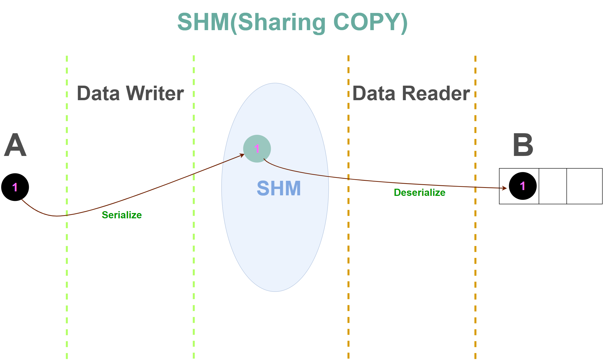
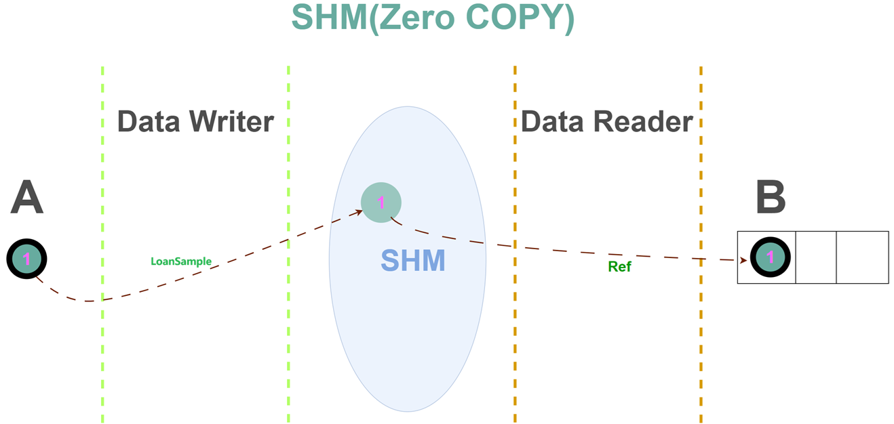

# Segar Topic

> **说明**：（可选配置）或（可选阅读）内容都不常用，请酌情了解。
>
> Topic 消息采用 ROS 2 风格的 `.msg` 文件定义。
>
> **快速流程**：编写 `.msg` → 编写业务代码 → 编译 → 运行 Writer/Reader 两端示例 → CLI 验证。

---

## 1. .msg 文件怎么写

### 1.1 文件位置 / 命名规范 / 类型 / Namespace

文件命名规范遵循 ROS 2 定义。例如定义一个命名空间为 `example` 的 `String` 消息：

```text
src/type_src/example/msg/String.msg
```

- 文件名使用 CamelCase（例如 `String.msg`）
- `.msg` 文件的名字部分即为 Segar Message 类型名
- `.msg` 文件的目录即为 namespace，例如 `String` 对应 `namespace example::msg;`
- 语法及后续使用方式同 ROS 2，不再展开介绍

---

## 2. C++ 基本使用示例（非 Component 用法）

`src/topic_example/topic_talker/src/topic_talker.cc` 与 `src/topic_example/topic_listener/src/topic_listener.cc` 演示了如何发布/订阅 `src/type_src/example/msg/String.msg` 定义的 `String` 消息。

### 2.1 代码说明

- **（必需）** 包含自动生成的 hpp 头文件
- **（必需）** 收发双方的 `topic_name` 必须完全一致（例：`/topic/chatter`）
- **（必需）** `rti::segar::Init(argv[0]);` 用于初始化 Segar 系统功能
- **（必需）** `CreateNode` 创建一个承载用户业务的节点（node），node 可创建 Writer/Reader/Service/Client/ActionServer/ActionClient/ParameterServer/ParameterClient
- **（可选）** `rti::segar::WaitForShutdown();` 用于防止系统主线程退出，使用 Ctrl+C 可退出；如果退出前需要执行用户清理逻辑，可以传入 callback

### 2.2 发送方（Writer，纯异步）

#### CreateWriter 函数说明

- **模板参数**：`.msg` 文件定义的 Message 类型
- **参数**：Topic name
- **返回值**：用于发送消息的 Writer

#### 发送方示例

```cpp
#include <memory>
#include <string>

#include "example/msg/String.hpp"

#include "segar/segar.h"

int main(int argc, char* argv[]) {
  RETURN_VAL_IF(!rti::segar::Init(argv[0]), EXIT_FAILURE);
  auto node = rti::segar::CreateNode("topic_talker");
  RETURN_VAL_IF(!node, EXIT_FAILURE);
  auto writer = node->CreateWriter<example::msg::String>("/topic/chatter");
  RETURN_VAL_IF(!writer, EXIT_FAILURE);
  uint32_t seq = 0;
  auto callback = [&writer, &seq]() {
    auto msg = std::make_shared<example::msg::String>();
    msg->data(std::to_string(seq++));
    AINFO_IF(!writer->Write(msg)) << "Failed to write msg:" << msg->data();
    AINFO << "Sent message: " << msg->data();
  };
  // 1hz
  auto timer = std::make_shared<rti::segar::Timer>(1000, callback, false);
  timer->Start();
  rti::segar::WaitForShutdown();
  return EXIT_SUCCESS;
}
```

如需在 Ctrl+C 后停止用户线程或释放用户持有的资源，可以使用 callback 版本：

```cpp
rti::segar::WaitForShutdown([&]() {
  exit.store(true);
  if (worker.joinable()) {
    worker.join();
  }
  reader.reset();
  writer.reset();
  node.reset();
});
```

### 2.3 接收方（Reader，纯异步）

#### CreateReader 函数说明

- **模板参数**：`.msg` 文件定义的 Message 类型
- **参数 1**：Reader 属性（topic name、`pending_queue_size` 给 callback 缓存的消息个数默认 5，实时性要求高的媒体数据请填 1、qos 详见 `config/segar.pb.conf`）
- **参数 2**：处理从 Writer 端收到的消息的 callback
- **返回值**：Reader 对象

普通 `Node::CreateReader` callback Reader 创建后，也可以通过 CLI 在运行期查询或调整
`pending_queue_size`，用于临时调试或避免忘记配置导致队列过小：

```bash
# 查询当前 pending_queue_size
segar topic qs <TopicName> [--node <NodeName>]

# 设置新的 pending_queue_size，Size 必须大于 0
segar topic qs <TopicName> <Size> [--node <NodeName>]
```

查询时如果不指定 `--node`，会输出匹配该 Topic 的 Reader。设置时如果同一 Topic
存在多个 Reader，需要用 `--node <NodeName>` 指定目标 Node。

示例：

```bash
segar topic qs /topic/chatter
segar topic qs /topic/chatter --node listener
segar topic qs /topic/chatter 32 --node listener
```

该命令仅用于普通单消息 callback Reader 的运行期队列调整；多消息 Reader 和 DAG
Component 仍建议通过各自配置完成队列大小管理。

#### 接收方示例

```cpp
#include <memory>
#include <string>

#include "example/msg/String.hpp"

#include "segar/segar.h"

int main(int argc, char* argv[]) {
  RETURN_VAL_IF(!rti::segar::Init(argv[0]), EXIT_FAILURE);

  auto node = rti::segar::CreateNode("topic_listener");
  RETURN_VAL_IF(!node, EXIT_FAILURE);
  auto reader = node->CreateReader<example::msg::String>(
      "/topic/chatter",
      [](const auto& msg) { AINFO << "Received message: " << msg->data(); });
  RETURN_VAL_IF(!reader, EXIT_FAILURE);
  AINFO << "Waiting for messages...";
  rti::segar::WaitForShutdown();

  return EXIT_SUCCESS;
}
```

---

## 3. Topic Zero Copy 用法

- zero copy和全copy 的区别：




`LoanSample()` 可以作为 Topic 的统一消息创建接口使用。
- 当消息满足 zero-copy 条件时，它会以 zero-copy 方式发送，来避免额外的数据 copy 和序列化/反序列化，提高收发性能；
- 当消息不满足 zero-copy 条件时，它会静默降级为普通消息分配。

workspace 中对应示例位于：

- `src/zero_copy_example/zero_copy_talker/src/zero_copy_talker.cc`
- `src/zero_copy_example/zero_copy_listener/src/zero_copy_listener.cc`

当前示例直接复用已有的 `src/type_src/example/msg/Image.msg`，这表示 zero-copy 是 Topic 的一种**发送/接收方式**，不是要求用户额外定义一种专用消息类型。

### 3.1 发送方（Zero Copy Writer）

与普通 Topic Writer 的主要区别是：

- Writer 模板参数仍然是原始消息类型
- 对满足 zero-copy 条件的消息，不再 `std::make_shared<Message>()`
- 改为先调用 `LoanSample()`，再填充消息内容，最后 `Write(sample)`

典型写法如下：

```cpp
auto writer = node->CreateWriter<example::msg::Image>("/topic/zero_copy");
auto msg = writer->LoanSample();
if (!msg) {
  return;
}
msg->width(1);
writer->Write(msg);
```

说明：

- 当消息满足 zero-copy 条件时，`LoanSample()` 返回的是 zero-copy sample
- 当消息不满足 zero-copy 条件时，`LoanSample()` 会静默降级为普通 `std::shared_ptr<Message>`
- 因此用户可以统一使用 `LoanSample()` 这套创建与发送写法

### 3.2 接收方（Zero Copy Reader）

接收方模板参数同样使用原始消息类型。  
回调收到的是 `std::shared_ptr<原始消息类型>`，读取方式和普通 Topic Reader 一致。

```cpp
auto reader = node->CreateReader<example::msg::Image>(
    "/topic/zero_copy",
    [](const std::shared_ptr<example::msg::Image>& msg) {
      if (msg == nullptr) {
        return;
      }
      AINFO << msg->width();
    });
```

---

## 4. CLI 调试

`segar topic` 命令可用于查询 Topic（详细功能请参见 Segar CLI 文档）：

```bash
$ segar topic
usage: segar topic [-h] {list,info,bw,hz,type,echo,pub,qs} ...

Various topic related utilities

commands:
  list                        List all topics
  info <TopicName>            Print information about a topic
  bw <TopicName>              Display bandwidth of a topic
  hz <TopicName>              Display publishing rate of topic
  type <TopicName>            Display type of topic
  echo <TopicName>            Echo messages from a topic
  pub <TopicName> <MessageType> [values]
  qs <TopicName> [<Size>] [--node <NodeName>]
```

---

## 5. Topic 定制 shm 分配策略
### 5.1 支持为具体的topic定制shm分配策略
- 本配置文件用于对 shm 资源占用或性能要求特殊的 topic 做定制配置
- 未进行本配置的 topic，默认自适应策略继续生效
### 5.2 全局conf/topics.pb.conf文件
运行期读取路径：`$SEGAR_GLOBAL_PATH/config/topics.pb.conf`

说明：
- `topics.pb.conf` 为全局配置，不能放在各个 example 自身的 `config/` 目录下。
- 对于 `segar-workspace` 示例，`SEGAR_PATH` 仍指向示例本地目录，`SEGAR_GLOBAL_PATH` 指向 output 根目录。
```yaml
topics: [
    {
        topic: "topic/discovery_0"
        block_num: 2
    }, {
        topic: "topic/discovery_1"
    }, {
        topic: "topic/discovery_2"
        block_num: 8
    }, {
        topic: "channel/discovery_3"
        enable: false
        block_num: 8
    }
]
```
### 5.3 配置项说明
- topic: topic 名称
- enable: 针对该Channel的定制配置是否生效. 
  - 默认值(不配置时的值): true
  - 可选值: true, false
- block_num: 当前Channel的block个数. 设置该值后, 该channel将不再使用系统默认的计算策略;
  - 默认值(不配置时的值): 1
  - 可选值: 大于1的任意整数, 如果设置为0将被自动修改为1
