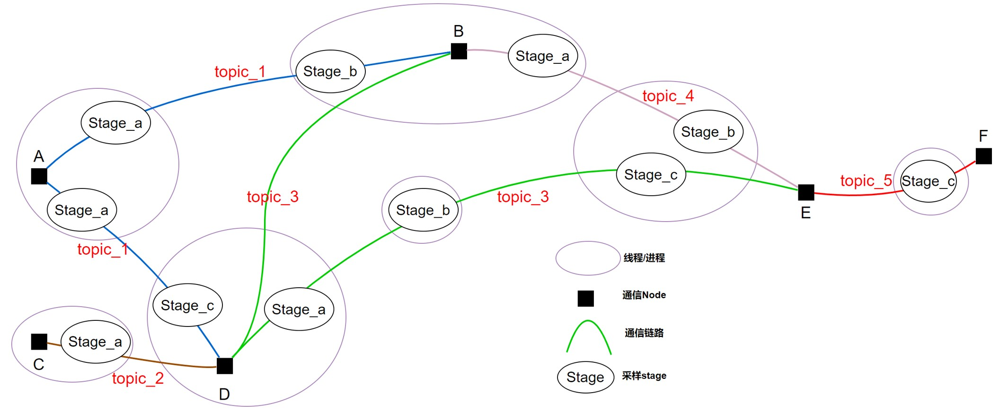
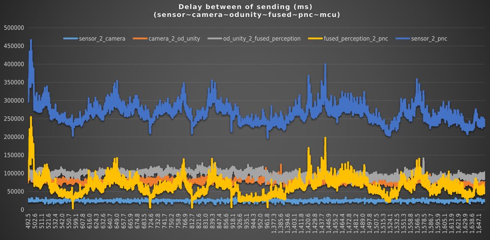

# Segar Tracing

本文面向用户，覆盖 tracing 的启用、数据生成、导入与查询。

## 0. 概念速览

- **node**：打点来源进程/组件
- **session_type**：会话类型，枚举为 TOPIC/SERVICE/ACTION/PARAM
- **session**：会话名称（如 topic/service/action/parameter 的名字），用于指示相关 session_type 的具体业务
- **session_idx**：一次会话实例的唯一关联 key，用于指示该 session 的「第几次会话」
- **stage**：链路中的阶段点（如 PUBLISH、MESSAGE_RESTORED、START_CALLBACK）
- **event**：`session_timeline` 里的专有字段，表示该时刻的事件点位名称；当 session_type 为 topic 时，等同于 topic 名
- **delay**：相邻点耗时与起点累计耗时
- **join/leave**：node 在拓扑中的上线/离线状态变化
- **drop**：相邻阶段匹配失败导致的丢失统计



## 1. 适用范围与生效条件

- **Parameter**：默认支持
- **Msg/Service/Action**：按 `type_src/transport_messages` 清单匹配后生效
- **未命中清单规则的消息不会被记录**

配置示例（`type_src/transport_messages`）：

```text
example/msg/*
example/srv/*
example/action/Test*
```

## 2. 配置文件

配置文件路径（运行期读取）：

- `config/white_lists.pb.txt`，tracing topic 白名单配置，运行期会加载 `WhiteLists` 配置并在写 tracing record 前判断当前 topic 是否允许记录。
  - 非必要别配置该文件；
  - 默认从当前进程的 `$SEGAR_PATH/config/white_lists.pb.txt` 读取
  - 也可通过更高优先级的全局环境变量 `TRACING_WHITELISTS_FILE_PATH` 指定，使用全局环境变量意味着所有进程共享同一个white_lists.pb.txt；
  - 当 `enable: true` 时，只有命中白名单的 topic 会被记录；
  - 当 `enable: false` 或未加载到该配置时，按不过滤 topic 处理；
  - `white_lists.pb.txt` 示例：
```text
enable: true
topics: "/example_topic"
topics: "/another_topic"
```
- `$SEGAR_GLOBAL_PATH/config/tracing_config.pb.txt`，用于 tracing 的全局运行配置。


关键字段：

| 字段 | 说明 |
|------|------|
| enable_tracing | 全局运行期开关，默认值为 `true`；`true` 时允许 tracing 基础设施生效，`false` 时 tracing 整体关闭 |
| enable_tracing_record | 普通应用进程的本地开关，配置在各自 `config/segar.pb.conf` 的 `transport_conf` 中；例如 `build_x86/output/<app>/config/segar.pb.conf`；普通应用只有在全局 `enable_tracing=true` 且本地 `enable_tracing_record=true` 时才会真正写 tracing record |
| trace_data_path | 数据根目录（支持绝对路径或 `~/`；相对路径会拼到 `$SEGAR_PATH`） |
| max_trace_data_folder_size | 最大目录大小（单位 MB） |
| auto_clear_old_trace_data | 是否在每次运行前清理旧目录（默认 `false`） |

## 3. 启动 tracing 获取 trace 数据

启动前建议先确认以下 4 项：

1. `$SEGAR_GLOBAL_PATH/config/tracing_config.pb.txt` 中 `enable_tracing: true`
2. 当前应用 `config/segar.pb.conf` 中 `transport_conf.enable_tracing_record: true`
3. （过渡阶段）目标消息/服务/Action 已命中 `type_src/transport_messages`
4. （过渡阶段）`TracingNodeComponent` 已启动，且系统中没有重复实例

在 output 目录下执行 `source segar_setup.bash` 后，运行：

```bash
mainboard -d config/tracing_node.dag
```

即可启动 TracingNodeComponent；当 `enable_tracing: true` 时开始采集 trace 数据。若 `enable_tracing: false`，`TracingNodeComponent` 会直接退出。`TracingNode` / `TracingNodeComponent` 使用系统级单实例锁；若重复启动，后启动者会直接退出。

tracing_node.dag 配置示例：

```yaml
module_config {
    module_library : "third_party/lib/libtracing_node_component.so"
    components {
        component_class_name : "rti::segar::TracingNodeComponent"
        config {
            inner_node_name : "tracing_node"
        }
    }
}
```

**生成的数据目录与格式**：在 `tracing_config.pb.txt` 中 `trace_data_path` 指定的目录下，创建时间戳子目录 `YYYYMMDDHHMMSS`，子目录内包含：

- 一个 `topo.txt`
- 若干 `<node_id>_<YYYYMMDDHHMMSS>.tra` 文件

## 4. 导入数据库

### 4.1 首次使用：初始化环境（需 root/sudo）

```bash
tracing -i
```

会安装 MySQL、python3-pymysql，并修复 root 认证以便普通用户连接。

### 4.2 导入 tracing 数据

```bash
tracing -d /path/to/trace_data/20240206123000
```

追加导入（不常用，不清空数据库）：

```bash
tracing -d /path/to/trace_data/20240206123000 -a
```

以上命令需在 `source segar_setup.bash` 后的 output 目录下执行。

## 5. tracing 查询使用方法

### 5.1 使用 help

```bash
tracing -c "help"
```

示例输出：

```bash
$ tracing -c "help"
+----------------------------------------------------------------------------------------------+----------------------------------------------------------------------------------------------------------+
| command                                                                                      | description                                                                                              |
+----------------------------------------------------------------------------------------------+----------------------------------------------------------------------------------------------------------+
| nodes                                                                                        | Query all nodes. Returns: node_name, node_id, status, first_join_time, last_leave_time.                  |
| sessions                                                                                     | Query all sessions. Returns: session_type, session, topic_pattern.                                       |
| stages                                                                                       | Query stage definitions. Use this to confirm valid stage values.                                         |
| sessions_of_node(node_name)                                                                  | Query sessions of the specified node. Returns: session_type, session.                                    |
| nodes_of_session(session_type, session)                                                      | Query nodes of the specified session. Params: session_type, session.                                     |
| records(node, session_type, session, stage, filter_sql, limit_num)                           | Raw trace records for one node/session/stage, ordered by timestamp.                                      |
| session_summary_by_start_node(session_type, start_node, session_name, filter_sql, limit_num) | Summary list filtered by start_node/session_name and optional SQL predicate.                             |
| session_summary_all(session_type, filter_sql, limit_num)                                     | Summary list with optional SQL predicate; session_type supports TOPIC/SERVICE/ACTION/PARAM (or 0/1/2/3). |
| session_timeline(session_type, session_idx, filter_sql)                                      | Full timeline for one session with optional SQL predicate; session_type supports TOPIC/SERVICE/ACTION/PARAM (or 0/1/2/3). |
| session_timeline_by_seq(session_type, seq, filter_sql)                                       | Find session_idx by seq, then query timelines for matching sessions.                                     |
| query_delay_same_topic(node_1st, topic, node_2nd, filter_sql, limit_num)                     | Same-topic timeline with optional SQL predicate.                                                         |
| query_delay_cross_topic(node_1st, topic_1st, node_2nd, topic_2nd, filter_sql, limit_num)     | Cross-topic direct-parent delay; topic_2 publish matches topic_1 restore by parent session id.           |
| drop_info(node_1st, topic, node_2nd, filter_sql)                                             | Query drop statistics along fixed adjacent pipeline with optional SQL predicate.                         |
| list_dropped_records(node_1st, stage_1st, topic, node_2nd, stage_2nd, filter_sql, limit_num)      | Dropped records for one stage pair in the same topic with optional SQL predicate.                        |
| topic_seq_errors(node, topic, stage, filter_sql, limit_num)                                  | Detect duplicate, reversed, or pid-changed TOPIC session sequence at one node/topic/stage point.         |
| topic_seq_error_summary(node, topic, filter_sql, limit_num)                                  | Summarize TOPIC session sequence errors by stage for one node/topic.                                     |
| rate(node, stage, topic, filter_sql, limit_num)                                              | Per-second rate (pps) for node/topic/stage with optional SQL predicate.                                  |
| rate_summary(node, topic, filter_sql, limit_num)                                             | Average rate summary grouped by stage for one node/topic with optional SQL predicate.                    |
+----------------------------------------------------------------------------------------------+----------------------------------------------------------------------------------------------------------+
18 rows in set.
OK: 0 rows affected.
```

### 5.2 基础查询

| 命令 | 说明 |
|------|------|
| `tracing -c "nodes"` | 查询系统中所有节点信息（node_name, node_id, status, first_join_time, last_leave_time） |
| `tracing -c "sessions"` | 查询系统中有哪些 session（如 topic、service、action、parameter 等） |
| `tracing -c "stages"` | 查询系统中有哪些埋点类型（stage 定义） |
| `tracing -c "sessions_of_node('node_name')"` | 查询指定 node 上有哪些埋点（session） |
| `tracing -c "nodes_of_session('session_type', 'session')"` | 查询参与某个 session 的节点 |

```bash
tracing -c "nodes"
tracing -c "sessions"
tracing -c "stages"
tracing -c "sessions_of_node('node_name')"
tracing -c "nodes_of_session('session_type', 'session')"
```

示例：

```bash
$ tracing -c "nodes"
+--------------+----------------------+--------+----------------------------+----------------------------+
| node_name    | node_id              | status | first_join_time            | last_leave_time            |
+--------------+----------------------+--------+----------------------------+----------------------------+
| CLI_1636415  | 3121243826755017703  | LEFT   | 2026/02/11 19:12:39.395177 | 2026/02/11 19:13:41.223889 |
| param_timer  | 15565186663480987662 | LEFT   | 2026/02/11 19:12:39.395024 | 2026/02/11 19:13:41.223907 |
| sensor1      | 6910855445724205230  | LEFT   | 2026/02/11 19:12:38.385251 | 2026/02/11 19:13:41.207730 |
| sensor10     | 15644514452393993644 | LEFT   | 2026/02/11 19:12:39.293679 | 2026/02/11 19:13:41.177507 |
| sensor11     | 13784232787874767474 | JOINED | 2026/02/11 19:12:38.459820 |                            |
| sensor12     | 1709364246235240553  | LEFT   | 2026/02/11 19:12:38.464828 | 2026/02/11 19:13:41.211200 |
| sensor13     | 713371279686677275   | LEFT   | 2026/02/11 19:12:38.482725 | 2026/02/11 19:13:41.214352 |
| tracing_node | 1296936435589820685  | LEFT   | 2026/02/11 19:12:38.189976 | 2026/02/11 19:13:41.221601 |
......
+--------------+----------------------+--------+----------------------------+----------------------------+
31 rows in set.
OK: 0 rows affected.

$ tracing -c "sessions"
+--------------+-----------------------------+---------------------------------------+
| session_type | session                     | topic_pattern                         |
+--------------+-----------------------------+---------------------------------------+
| ACTION       | demo_action                 | rq(rr)/demo_action/_action/[event]    |
| PARAMETER    | node_a/parameter_serv       | rq(rr)/node_a/parameter_serv[event]   |
| PARAMETER    | param_timer/parameter_serv  | rq(rr)/param_timer/parameter_serv[event] |
| PARAMETER    | sensor1/parameter_serv      | rq(rr)/sensor1/parameter_serv[event]  |
| SERVICE      | add_two_ints                | rq(rr)/add_two_ints[event]            |
| TOPIC        | sensor_topic_1              | sensor_topic_1                        |
| TOPIC        | sensor_topic_10             | sensor_topic_10                       |
......
+--------------+-----------------------------+---------------------------------------+

$ tracing -c "sessions_of_node('node_a')"
+--------------+-----------------------+
| session_type | session               |
+--------------+-----------------------+
| PARAMETER    | node_a/parameter_serv |
| SERVICE      | add_two_ints          |
| TOPIC        | NodeA                 |
| TOPIC        | sensor_topic_1        |
| TOPIC        | sensor_topic_4        |
| TOPIC        | sensor_topic_6        |
| TOPIC        | sensor_topic_7        |
+--------------+-----------------------+
7 rows in set.
OK: 0 rows affected.

$ tracing -c "nodes_of_session('topic', 'NodeA')"
+-----------+---------------------+
| node_name | node_id             |
+-----------+---------------------+
| node_a    | 8899687290348478343 |
| node_b    | 984110685106040982  |
| node_c    | 777002420257141533  |
| node_h    | 530094450857284016  |
+-----------+---------------------+
4 rows in set.
OK: 0 rows affected.
```

`sessions.topic_pattern` 描述逻辑 `session` 与真实 `topic_name` 的对应关系。`ACTION` 的 `[event]` 对应 `session_timeline` 输出中的 `event`，例如 `send_goalRequest` 会映射到 `rq/demo_action/_action/send_goalRequest`，`send_goalReply` 会映射到 `rr/demo_action/_action/send_goalReply`。`SERVICE` / `PARAMETER` 同理使用 `rq(rr)/<session>[event]` 表示 request/reply 真实 topic；`TOPIC` 的 `topic_pattern` 就是真实 topic 名。

### 5.3 Session 查询

```bash
tracing -c "records('listener_idl', 'TOPIC', 'topic/chatter_idl', 4, 'seq BETWEEN 11300 AND 11320', 5)"
tracing -c "session_summary_by_start_node('ACTION', 'node_f', 'demo_action', 'start_time>''2026/02/11 19:13:39.530409''', 100)"
tracing -c "session_summary_all('ACTION', '', 100)"
tracing -c "session_timeline('ACTION', 7027348180303884, '')"
tracing -c "session_timeline('TOPIC', 3507068430450689, 'seq BETWEEN 1740 AND 1813')"
tracing -c "session_timeline_by_seq('TOPIC', 11313, 'node_name = ''listener_idl'' ORDER BY timestamp, stage')"
```

`records` 用于按时间查看某个 `node + session_type + session + stage` 采样点上的原始 trace records。`session` 使用 `sessions` 命令展示的逻辑名称；对于 `SERVICE` / `ACTION` / `PARAMETER`，结果会保留内部 `topic_name`，用于区分 request、reply 或 action 内部事件。`stage` 可以使用 `stages` 查询到的数字值，也可以使用 stage 名称。`filter_sql` 可以过滤结果列 `node_name`、`session_type`、`event`、`topic_name`、`stage`、`seq`、`time`、`sid0`、`sid1`、`sid2`、`sid3`，也可以过滤辅助列 `node_id`、`topic_id`、`stage_id`、`timestamp`；如需覆盖默认时间排序，可以在 `filter_sql` 尾部追加 `ORDER BY ...`。

`session_timeline` 默认按 `timestamp, node_id, topic_id, stage_id, seq` 排序。`filter_sql` 可以过滤结果列 `node_name`、`event`、`stage`、`seq`、`timestamp`、`delay_with_prev`、`delay_from_start`，也可以过滤辅助列 `node_id`、`topic_id`、`stage_id`；如需覆盖排序，可以在 `filter_sql` 尾部追加 `ORDER BY ...`。

`session_timeline_by_seq` 适用于日志里已经看到某个 `seq`，但还不知道对应 `session_idx` 的场景。它会先用 `session_type + seq` 查找非零 `sid0` 作为 `session_idx`，再输出匹配 session 的 timeline；如果同一个 `seq` 命中多个 `session_idx`，结果中会用 `session_idx` 列区分。

示例：

```bash
$ tracing -c "records('listener_idl', 'TOPIC', 'topic/chatter_idl', 4, 'seq BETWEEN 11300 AND 11320', 3)"
+--------------+--------------+-------------------+-------------------+----------------+-------+----------------------------+------------------+------+------+------+
| node_name    | session_type | event             | topic_name        | stage          | seq   | time                       | sid0             | sid1 | sid2 | sid3 |
+--------------+--------------+-------------------+-------------------+----------------+-------+----------------------------+------------------+------+------+------+
| listener_idl | TOPIC        | topic/chatter_idl | topic/chatter_idl | START_CALLBACK | 11313 | 2026/05/21 09:36:07.092735 | 2059204890209329 | 0    | 0    | 0    |
| listener_idl | TOPIC        | topic/chatter_idl | topic/chatter_idl | START_CALLBACK | 11313 | 2026/05/21 09:36:07.092776 | 2059204890209329 | 0    | 0    | 0    |
| listener_idl | TOPIC        | topic/chatter_idl | topic/chatter_idl | START_CALLBACK | 11313 | 2026/05/21 09:36:07.092783 | 2059204890209329 | 0    | 0    | 0    |
+--------------+--------------+-------------------+-------------------+----------------+-------+----------------------------+------------------+------+------+------+
3 rows in set.
OK: 0 rows affected.

$ tracing -c "session_summary_by_start_node('ACTION', 'node_f', 'demo_action', 'start_time>''2026/02/11 19:13:38.530409''', 100)"
+------------------+----------------------------+----------------------------+-------------+--------+------------+-------------+-----------------------+------------------------+
| session_idx      | start_time                 | end_time                   | delay_total | points | node_count | topic_count | start_callback_points | finish_callback_points |
+------------------+----------------------------+----------------------------+-------------+--------+------------+-------------+-----------------------+------------------------+
| 7027348180303950 | 2026/02/11 19:13:39.530409 | 2026/02/11 19:13:39.531471 | 1062        | 20     | 2          | 4           | 4                     | 4                      |
| 7027348180303951 | 2026/02/11 19:13:39.531602 | 2026/02/11 19:13:39.532852 | 1250        | 20     | 2          | 4           | 4                     | 4                      |
| 7027348180303952 | 2026/02/11 19:13:40.780358 | 2026/02/11 19:13:40.781647 | 1289        | 20     | 2          | 4           | 4                     | 4                      |
+------------------+----------------------------+----------------------------+-------------+--------+------------+-------------+-----------------------+------------------------+
3 rows in set.
OK: 0 rows affected.
```

**session_summary 返回列说明**（适用于 `session_summary_by_start_node` / `session_summary_all`）：

| 列名 | 说明 |
|------|------|
| delay_total | 整个会话从开始到结束耗时，单位 μs |
| points | 经过的埋点个数 |
| node_count | 经过的节点个数 |
| topic_count | 经过的 topic 收发次数 |
| start_callback_points | 触发的用户回调函数次数（开始） |
| finish_callback_points | 触发的用户回调函数次数（结束） |

```bash
$ tracing -c "session_summary_all('ACTION', '', 5)"
+------------------+----------------------------+----------------------------+------------+--------------+-------------+--------+------------+-------------+-----------------------+------------------------+
| session_idx      | start_time                 | end_time                   | start_node | session_name | delay_total | points | node_count | topic_count | start_callback_points | finish_callback_points |
+------------------+----------------------------+----------------------------+------------+--------------+-------------+--------+------------+-------------+-----------------------+------------------------+
| 7027348180303877 | 2026/02/11 19:12:43.280391 | 2026/02/11 19:12:43.282086 | node_f     | demo_action  | 1695        | 20     | 2          | 4           | 4                     | 4                      |
| 7027348180303878 | 2026/02/11 19:12:43.530322 | 2026/02/11 19:12:43.531309 | node_f     | demo_action  | 987         | 20     | 2          | 4           | 4                     | 4                      |
| 7027348180303879 | 2026/02/11 19:12:44.530422 | 2026/02/11 19:12:44.531996 | node_f     | demo_action  | 1574        | 20     | 2          | 4           | 4                     | 4                      |
| 7027348180303880 | 2026/02/11 19:12:45.530326 | 2026/02/11 19:12:45.531332 | node_f     | demo_action  | 1006        | 20     | 2          | 4           | 4                     | 4                      |
| 7027348180303881 | 2026/02/11 19:12:45.780415 | 2026/02/11 19:12:45.781995 | node_f     | demo_action  | 1580        | 20     | 2          | 4           | 4                     | 4                      |
+------------------+----------------------------+----------------------------+------------+--------------+-------------+--------+------------+-------------+-----------------------+------------------------+
5 rows in set.
OK: 0 rows affected.

$ tracing -c "session_timeline('ACTION', 7027348180303884, '')"
+-----------+-------------------+------------------+-----+-----------------+------------------+
| node_name | event             | stage            | seq | delay_with_prev | delay_from_start |
+-----------+-------------------+------------------+-----+-----------------+------------------+
| node_f    | send_goalRequest  | PUBLISH          | 196 | 0               | 0                |
| node_f    | send_goalRequest  | PUBLISH_FINISHED | 196 | 19              | 19               |
| node_g    | send_goalRequest  | MESSAGE_RESTORED | 196 | 99              | 118              |
| node_g    | send_goalRequest  | START_CALLBACK   | 196 | 37              | 155              |
| node_g    | send_goalRequest  | FINISH_CALLBACK  | 196 | 288             | 443              |
| node_g    | send_goalRequest  | PUBLISH          | 36  | 2               | 445              |
| node_g    | send_goalRequest  | PUBLISH_FINISHED | 36  | 16              | 461              |
| node_f    | send_goalReply    | MESSAGE_RESTORED | 36  | 90              | 551              |
| node_f    | send_goalReply    | START_CALLBACK   | 36  | 12              | 563              |
| node_f    | send_goalReply    | FINISH_CALLBACK  | 36  | 24              | 587              |
| node_f    | get_resultRequest | PUBLISH          | 197 | 10              | 597              |
| node_f    | get_resultRequest | PUBLISH_FINISHED | 197 | 15              | 612              |
| node_g    | get_resultRequest | MESSAGE_RESTORED | 197 | 153             | 765              |
| node_g    | get_resultRequest | START_CALLBACK   | 197 | 27              | 792              |
| node_g    | get_resultRequest | FINISH_CALLBACK  | 197 | 4               | 796              |
| node_g    | get_resultRequest | PUBLISH          | 37  | 1               | 797              |
| node_g    | get_resultRequest | PUBLISH_FINISHED | 37  | 17              | 814              |
| node_f    | get_resultReply   | MESSAGE_RESTORED | 37  | 184             | 998              |
| node_f    | get_resultReply   | START_CALLBACK   | 37  | 11              | 1009             |
| node_f    | get_resultReply   | FINISH_CALLBACK  | 37  | 15              | 1024             |
+-----------+-------------------+------------------+-----+-----------------+------------------+
20 rows in set.
OK: 0 rows affected.

$ tracing -c "session_timeline_by_seq('TOPIC', 11313, 'node_name = ''listener_idl'' ORDER BY timestamp, stage')"
+------------------+--------------+-------------------+------------------+-------+------------------+-----------------+------------------+
| session_idx      | node_name    | event             | stage            | seq   | timestamp        | delay_with_prev | delay_from_start |
+------------------+--------------+-------------------+------------------+-------+------------------+-----------------+------------------+
| 2059204890209329 | listener_idl | topic/chatter_idl | MESSAGE_RESTORED | 11313 | 1779327367083445 | 0               | 0                |
| 2059204890209329 | listener_idl | topic/chatter_idl | START_CALLBACK   | 11313 | 1779327367092735 | 9290            | 9290             |
| 2059204890209329 | listener_idl | topic/chatter_idl | FINISH_CALLBACK  | 11313 | 1779327367092775 | 40              | 9330             |
+------------------+--------------+-------------------+------------------+-------+------------------+-----------------+------------------+
3 rows in set.
OK: 0 rows affected.
```

### 5.4 延迟/丢包/速率/乱序/异常

| 命令 | 说明 |
|------|------|
| `query_delay_same_topic(node_1st, topic, node_2nd, filter_sql, limit_num)` | 同一 topic 从某 node 发送到另一 node 的延时情况 |
| `query_delay_cross_topic(node_1st, topic_1st, node_2nd, topic_2nd, filter_sql, limit_num)` | 跨 topic 的直接上游派生延时；`topic_2` publish 通过 parent session id 匹配 `topic_1` restore |
| `drop_info(node_1st, topic, node_2nd, filter_sql)` | 丢包统计（相邻阶段匹配失败） |
| `list_dropped_records(...)` | 丢包明细记录 |
| `topic_seq_errors(node, topic, stage, filter_sql, limit_num)` | 检查指定 node/topic/stage 采样点上的 topic session 序列异常 |
| `topic_seq_error_summary(node, topic, filter_sql, limit_num)` | 按 stage 汇总指定 node/topic 上的 topic session 序列异常 |
| `rate(node, stage, topic, filter_sql, limit_num)` | 按秒统计的接收频率（pps） |
| `rate_summary(node, topic, filter_sql, limit_num)` | 按 stage 汇总指定 node/topic 在过滤范围内的平均频率 |

```bash
tracing -c "query_delay_same_topic('node_a', 'NodeA', 'node_h', '', 100)"
tracing -c "query_delay_cross_topic('node_a', 'topic_a', 'node_c', 'topic_b', '', 100)"
tracing -c "drop_info('node_a', 'NodeA', 'node_h', '')"
tracing -c "drop_info('node_a', 'NodeA', 'node_h', 'start_time >= ''2026/02/11 19:13:05.000000'' AND start_time < ''2026/02/11 19:13:10.000000''')"
tracing -c "list_dropped_records('node_a', 3, 'NodeA', 'node_h', 21, '', 100)"
tracing -c "list_dropped_records('node_a', 3, 'NodeA', 'node_h', 21, 'time >= ''2026/02/11 19:13:05.000000'' AND time < ''2026/02/11 19:13:10.000000''', 100)"
tracing -c "topic_seq_errors('listener_idl', 'topic/chatter_idl', 4, 'seq BETWEEN 11300 AND 11320', 5)"
tracing -c "topic_seq_error_summary('listener_idl', 'topic/chatter_idl', '', 10)"
tracing -c "rate('node_a', 2, 'NodeA', 'time>''2026/02/11 19:13:05'' and time<''2026/02/11 19:13:10''', 100)"
tracing -c "rate_summary('node_a', 'NodeA', 'start_time>''2026/02/11 19:13:05'' and start_time<''2026/02/11 19:13:10''', 100)"
```

`query_delay_cross_topic` 用于分析直接派生关系：`node_2nd` 收到 `topic_1st` 后，应用生成并发布 `topic_2nd`。该命令用 parent session id 匹配，不要求两个 topic 的 `seq` 相同。

在 Component/SyncComponent 中，可通过 reader 配置自动建立 parent 关系：

```protobuf
readers {
    topic: "/input/topic"
    is_parent_msg: true
}
```

配置为 `true` 的 reader 输入消息和下游消息自动建立 `session_ids`关联。非 Component 场景、异步线程发布、缓存消息后延迟发布等场景仍需要在发布前手工调用 `SetSessionID(child_msg, parent_msg)`。

示例：

```bash
$ tracing -c "query_delay_same_topic('node_a', 'NodeA', 'node_h', '', 10)"
+------------------+-----+----------------------------+----------------------------+---------------------------------+---------------------------------+-------------------------------+--------------------------------+-------------+
| session_idx      | seq | start_time                 | end_time                   | delay_publish_finished_with_pre | delay_message_restored_with_pre | delay_start_callback_with_pre | delay_finish_callback_with_pre | delay_total |
+------------------+-----+----------------------------+----------------------------+---------------------------------+---------------------------------+-------------------------------+--------------------------------+-------------+
| 7027223626252289 | 1   | 2026/02/11 19:12:39.259376 | 2026/02/11 19:12:39.259478 | 102                             | 0                               | 0                             | 0                              | 102         |
| 7027223626252290 | 2   | 2026/02/11 19:12:39.309675 | 2026/02/11 19:12:39.309849 | 174                             | 0                               | 0                             | 0                              | 174         |
| 7027223626252291 | 3   | 2026/02/11 19:12:39.359337 | 2026/02/11 19:12:39.359391 | 54                              | 0                               | 0                             | 0                              | 54          |
| 7027223626252292 | 4   | 2026/02/11 19:12:39.409315 | 2026/02/11 19:12:39.409360 | 45                              | 0                               | 0                             | 0                              | 45          |
| 7027223626252293 | 5   | 2026/02/11 19:12:39.459386 | 2026/02/11 19:12:39.459436 | 50                              | 0                               | 0                             | 0                              | 50          |
| 7027223626252294 | 6   | 2026/02/11 19:12:39.509365 | 2026/02/11 19:12:39.509419 | 54                              | 0                               | 0                             | 0                              | 54          |
| 7027223626252295 | 7   | 2026/02/11 19:12:39.559376 | 2026/02/11 19:12:39.559428 | 52                              | 0                               | 0                             | 0                              | 52          |
| 7027223626252296 | 8   | 2026/02/11 19:12:39.609295 | 2026/02/11 19:12:39.609347 | 52                              | 0                               | 0                             | 0                              | 52          |
| 7027223626252297 | 9   | 2026/02/11 19:12:39.659326 | 2026/02/11 19:12:39.659422 | 96                              | 0                               | 0                             | 0                              | 96          |
| 7027223626252298 | 10  | 2026/02/11 19:12:39.710136 | 2026/02/11 19:12:39.710185 | 49                              | 0                               | 0                             | 0                              | 49          |
+------------------+-----+----------------------------+----------------------------+---------------------------------+---------------------------------+-------------------------------+--------------------------------+-------------+
10 rows in set.
OK: 0 rows affected.
```

`query_delay_same_topic` 的 `start_time` 表示当前链路起点记录的时间，`end_time` 表示该链路能匹配到的最后一个观测点时间，优先使用 `FINISH_CALLBACK`，否则依次回退到 `START_CALLBACK`、`MESSAGE_RESTORED`、`PUBLISH_FINISHED`。`delay_total` 为 `end_time - start_time`；如果没有任何后续观测点，则 `end_time` 为空且 `delay_total` 为 0。`filter_sql` 可使用输出列过滤，例如 `start_time >= '2026/05/21 09:34:00.000000' AND start_time < '2026/05/21 09:35:00.000000'`。

```bash
tracing -c "query_delay_cross_topic('talker_idl', 'topic/chatter_idl', 'msg_component', '/rti/cache_test', '', 10)"
+------------+-------------------+---------------+-----------------+-----+----------------------------+----------------------------+----------------------------+-------------------------------+-------------------------------+----------------------------------+
| node_1     | topic_1           | node_2        | topic_2         | seq | src_publish_time           | dst_message_restored_time  | dst_publish_time           | delay_src_publish_to_restored | delay_restored_to_dst_publish | delay_src_publish_to_dst_publish |
+------------+-------------------+---------------+-----------------+-----+----------------------------+----------------------------+----------------------------+-------------------------------+-------------------------------+----------------------------------+
| talker_idl | topic/chatter_idl | msg_component | /rti/cache_test | 2   | 2026/06/05 13:59:03.639384 |                            |                            | 0                             | 0                             | 0                                |
| talker_idl | topic/chatter_idl | msg_component | /rti/cache_test | 3   | 2026/06/05 13:59:04.639411 | 2026/06/05 13:59:04.639514 | 2026/06/05 13:59:04.639605 | 103                           | 91                            | 194                              |
| talker_idl | topic/chatter_idl | msg_component | /rti/cache_test | 4   | 2026/06/05 13:59:05.639429 | 2026/06/05 13:59:05.639584 | 2026/06/05 13:59:05.639740 | 155                           | 156                           | 311                              |
| talker_idl | topic/chatter_idl | msg_component | /rti/cache_test | 5   | 2026/06/05 13:59:06.639414 | 2026/06/05 13:59:06.639547 | 2026/06/05 13:59:06.639664 | 133                           | 117                           | 250                              |
| talker_idl | topic/chatter_idl | msg_component | /rti/cache_test | 6   | 2026/06/05 13:59:07.639404 | 2026/06/05 13:59:07.639542 | 2026/06/05 13:59:07.639651 | 138                           | 109                           | 247                              |
| talker_idl | topic/chatter_idl | msg_component | /rti/cache_test | 7   | 2026/06/05 13:59:08.639423 | 2026/06/05 13:59:08.639569 | 2026/06/05 13:59:08.639696 | 146                           | 127                           | 273                              |
| talker_idl | topic/chatter_idl | msg_component | /rti/cache_test | 8   | 2026/06/05 13:59:09.639427 | 2026/06/05 13:59:09.639584 | 2026/06/05 13:59:09.639698 | 157                           | 114                           | 271                              |
| talker_idl | topic/chatter_idl | msg_component | /rti/cache_test | 9   | 2026/06/05 13:59:10.639396 | 2026/06/05 13:59:10.639527 | 2026/06/05 13:59:10.639618 | 131                           | 91                            | 222                              |
| talker_idl | topic/chatter_idl | msg_component | /rti/cache_test | 10  | 2026/06/05 13:59:11.639396 | 2026/06/05 13:59:11.639516 | 2026/06/05 13:59:11.639601 | 120                           | 85                            | 205                              |
| talker_idl | topic/chatter_idl | msg_component | /rti/cache_test | 11  | 2026/06/05 13:59:12.639412 | 2026/06/05 13:59:12.639565 | 2026/06/05 13:59:12.639659 | 153                           | 94                            | 247                              |
+------------+-------------------+---------------+-----------------+-----+----------------------------+----------------------------+----------------------------+-------------------------------+-------------------------------+----------------------------------+
```

`drop_info` 的 `filter_sql` 会作用在每个阶段的原始 trace records 上。日常按时间窗口过滤建议使用可读字段 `start_time`，例如 `start_time >= '2026/02/11 19:13:05.000000' AND start_time < '2026/02/11 19:13:10.000000'`。也可以使用 `timestamp`、`seq`、`sid0`、`sid1`、`sid2`、`sid3`、`session_type` 等原始字段限制统计范围。输出中的 `start_time` / `end_time` 表示该 stage pair 的前置阶段实际参与统计记录的最早和最晚时间；如果 `count_front` 为 0，则这两列为空。

```bash
$ tracing -c "drop_info('node_a', 'NodeA', 'node_h', '')"
+-----------+------------------+-----------+------------------+----------------------------+----------------------------+-------------+------------+----------+-----------+
| stage_1st | stage_name_1st   | stage_2nd | stage_name_2nd   | start_time                 | end_time                   | count_front | count_back | drop_num | drop_rate |
+-----------+------------------+-----------+------------------+----------------------------+----------------------------+-------------+------------+----------+-----------+
| 1         | PUBLISH          | 2         | PUBLISH_FINISHED | 2026/02/11 19:12:39.259376 | 2026/02/11 19:13:41.210128 | 1239        | 1239       | 0        | 0.0000    |
| 2         | PUBLISH_FINISHED | 3         | MESSAGE_RESTORED | 2026/02/11 19:12:39.259478 | 2026/02/11 19:13:41.210238 | 1239        | 1162       | 77       | 0.0621    |
| 3         | MESSAGE_RESTORED | 4         | START_CALLBACK   | 2026/02/11 19:12:39.260143 | 2026/02/11 19:13:41.208904 | 1162        | 1162       | 0        | 0.0000    |
| 4         | START_CALLBACK   | 5         | FINISH_CALLBACK  | 2026/02/11 19:12:39.260169 | 2026/02/11 19:13:41.208927 | 1162        | 1162       | 0        | 0.0000    |
+-----------+------------------+-----------+------------------+----------------------------+----------------------------+-------------+------------+----------+-----------+
4 rows in set.
OK: 0 rows affected.
```

`list_dropped_records` 的 `filter_sql` 会同时作用在前后两个 stage 的候选记录上。按时间窗口过滤使用输出列 `time`，表示单条 trace record 的打点时间。例如：`time >= '2026/02/11 19:13:05.000000' AND time < '2026/02/11 19:13:10.000000'`。

`rate` 用于查看指定 stage 的逐秒帧率；

```bash
$ tracing -c "rate('node_a', 2, 'NodeA', 'time>''2026/02/11 19:13:05'' and time<''2026/02/11 19:13:10''', 100)"
+---------------------+-------------+
| time                | frame_count |
+---------------------+-------------+
| 2026/02/11 19:13:06 | 20          |
| 2026/02/11 19:13:07 | 20          |
| 2026/02/11 19:13:08 | 20          |
| 2026/02/11 19:13:09 | 20          |
+---------------------+-------------+
4 rows in set.
OK: 0 rows affected.
```

`rate_summary` 用于查看指定 `node + topic` 在过滤范围内按 stage 汇总后的平均帧率。`rate_summary` 的 `filter_sql` 会作用在原始 trace records 上，可使用 `start_time`、`timestamp`、`seq`、`stage`、`stage_id`、`session_type`、`sid0`、`sid1`、`sid2`、`sid3` 等字段。输出中的 `start_time` / `end_time` 表示过滤后该 stage 实际参与统计记录的最早和最晚时间，`rate` 为 `frame_count / duration_sec`；如果时间跨度为 0，则 `rate` 等于 `frame_count`。

```bash
$ tracing -c "rate_summary('node_a', 'NodeA', 'start_time>''2026/02/11 19:13:05'' and start_time<''2026/02/11 19:13:10''', 100)"
+-----------+------------+------------------+----------------------------+----------------------------+-------------+--------------+---------+
| node_name | topic_name | stage            | start_time                 | end_time                   | frame_count | duration_sec | rate    |
+-----------+------------+------------------+----------------------------+----------------------------+-------------+--------------+---------+
| node_a    | NodeA      | PUBLISH          | 2026/02/11 19:13:06.010128 | 2026/02/11 19:13:09.960129 | 80          | 3.950001     | 20.2532 |
| node_a    | NodeA      | PUBLISH_FINISHED | 2026/02/11 19:13:06.010210 | 2026/02/11 19:13:09.960204 | 80          | 3.949994     | 20.2532 |
+-----------+------------+------------------+----------------------------+----------------------------+-------------+--------------+---------+
2 rows in set.
OK: 0 rows affected.
```

`topic_seq_error_summary` 用于日常快速定位指定 `node + topic` 下哪个 stage 异常最多。它只扫描指定 node 的 trace 表和指定 topic 的 TOPIC records，然后在每个 stage 分区内按时间顺序比较相邻 record，并汇总 `DUPLICATE`、`PID_CHANGE`、`SEQ_REVERSE` 三类异常计数。`filter_sql` 用于限定参与统计的源记录，可使用 `stage`、`stage_id`、`seq`、`start_time`、`timestamp`、`sid0`、`pid`、`counter` 等列。

```bash
$ tracing -c "topic_seq_error_summary('listener_idl', 'topic/chatter_idl', '', 5)"
+--------------+-------------------+-----------------+--------------+------------------+-------------------+--------------------+---------------+----------------------------+----------------------------+
| node_name    | topic_name        | stage           | total_errors | duplicate_errors | pid_change_errors | seq_reverse_errors | total_records | start_time                 | end_time                   |
+--------------+-------------------+-----------------+--------------+------------------+-------------------+--------------------+---------------+----------------------------+----------------------------+
| listener_idl | topic/chatter_idl | FINISH_CALLBACK | 32           | 32               | 0                 | 0                  | 21837         | 2026/05/21 09:34:13.983471 | 2026/05/21 09:38:12.653405 |
| listener_idl | topic/chatter_idl | START_CALLBACK  | 32           | 32               | 0                 | 0                  | 21837         | 2026/05/21 09:34:13.983444 | 2026/05/21 09:38:12.653385 |
+--------------+-------------------+-----------------+--------------+------------------+-------------------+--------------------+---------------+----------------------------+----------------------------+
2 rows in set.
OK: 0 rows affected.
```

`topic_seq_errors` 用于检查指定 `node + topic + stage` 采样点上的 TOPIC session 序列问题。`stage` 建议使用 `stages` 查询到的数字值，如 `4` 表示 `START_CALLBACK`。该命令按采样点时间顺序比较相邻记录，输出 `error_type`：

| error_type | 含义 |
|------------|------|
| `DUPLICATE` | 相邻记录的 `session_idx` 相同，通常表示同一条 topic session 被重复处理 |
| `PID_CHANGE` | 相邻记录的 `session_idx` 高 32 位不同，通常表示 publisher 进程变化、多 publisher 或播放历史数据 |
| `SEQ_REVERSE` | 同一 pid 下 `session_idx` 低 32 位 counter 倒退 |

如果同一条记录命中多个条件，`error_type` 会用 `|` 拼接，例如 `PID_CHANGE|SEQ_REVERSE`。

```bash
$ tracing -c "topic_seq_errors('listener_idl', 'topic/chatter_idl', 4, 'seq BETWEEN 11300 AND 11320', 3)"
+------------+--------------+-------------------+----------------+----------------------------+----------------------------+------------------+------------------+----------+--------+----------+-------+
| error_type | node_name    | topic_name        | stage          | prev_time                  | time                       | prev_session_idx | session_idx      | prev_pid | pid    | prev_seq | seq   |
+------------+--------------+-------------------+----------------+----------------------------+----------------------------+------------------+------------------+----------+--------+----------+-------+
| DUPLICATE  | listener_idl | topic/chatter_idl | START_CALLBACK | 2026/05/21 09:36:07.092735 | 2026/05/21 09:36:07.092776 | 2059204890209329 | 2059204890209329 | 479446   | 479446 | 11313    | 11313 |
| DUPLICATE  | listener_idl | topic/chatter_idl | START_CALLBACK | 2026/05/21 09:36:07.092776 | 2026/05/21 09:36:07.092783 | 2059204890209329 | 2059204890209329 | 479446   | 479446 | 11313    | 11313 |
| DUPLICATE  | listener_idl | topic/chatter_idl | START_CALLBACK | 2026/05/21 09:36:07.092783 | 2026/05/21 09:36:07.092789 | 2059204890209329 | 2059204890209329 | 479446   | 479446 | 11313    | 11313 |
+------------+--------------+-------------------+----------------+----------------------------+----------------------------+------------------+------------------+----------+--------+----------+-------+
3 rows in set.
OK: 0 rows affected.
```

### 5.5 end2end 延迟统计图


## 6. 常见问题

- **只生成 `topo.txt`，没有 `.tra` 数据文件**：
  - 检查当前应用 `config/segar.pb.conf` 的 `transport_conf.enable_tracing_record` 是否为 `true`
  - 检查目标接口是否命中 `type_src/transport_messages` 规则
  - 检查 `TracingNodeComponent` 是否已启动（`tracing_node.dag` 是否已被加载）

- **`trace_data_path` 目录不存在，或目录为空**：
  - 检查 `$SEGAR_GLOBAL_PATH/config/tracing_config.pb.txt` 中 `enable_tracing` 是否为 `true`
  - 检查 `trace_data_path` 指定目录当前用户是否有写权限

- **重复启动 tracing_node 后新进程立即退出**：
  - `TracingNode` / `TracingNodeComponent` 使用系统级单实例锁；同一时刻只允许一个活跃实例，这属于正常行为
