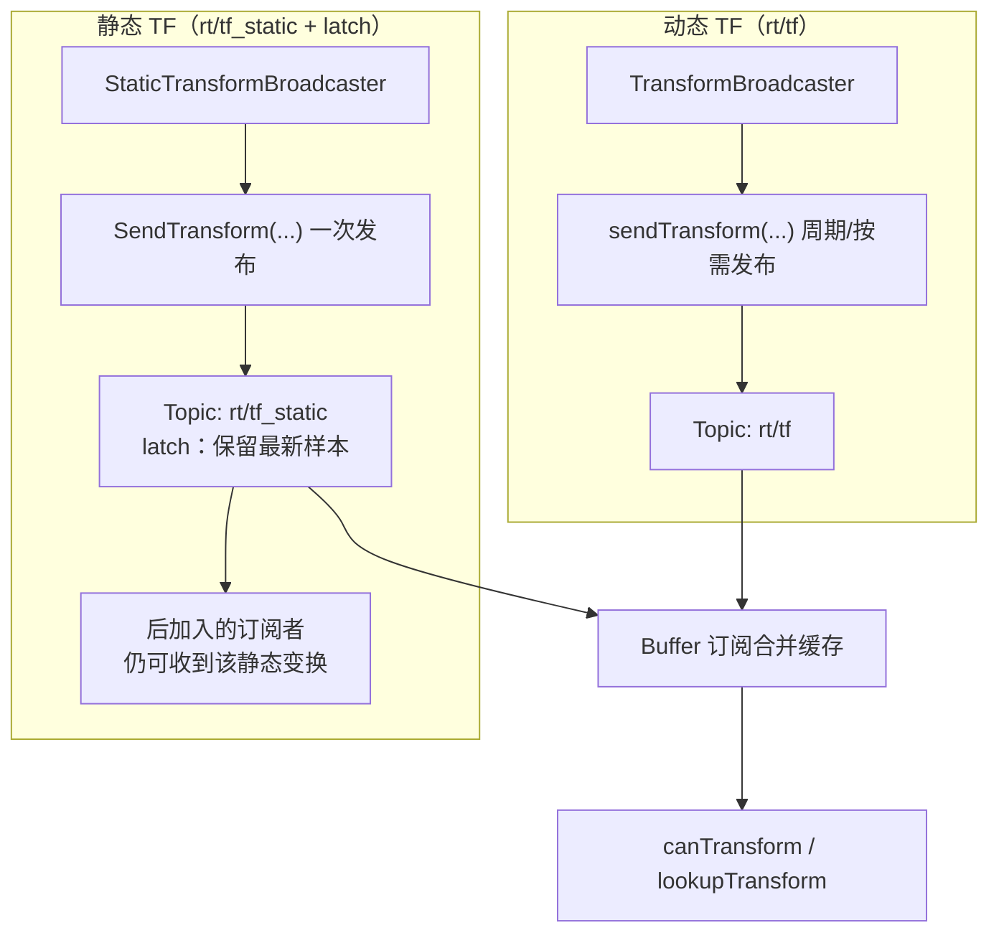
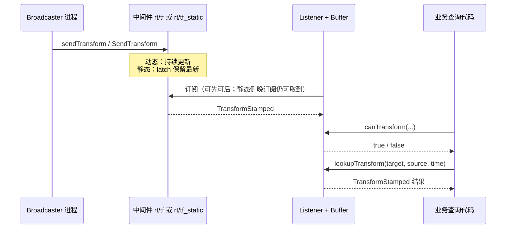

# Segar Transform

> **说明**：本文介绍 `segar-transform` 在本仓库中的使用方式，包含发布与查询坐标变换（TF）的最小流程。
>
> `segar-transform` 提供两类核心能力：
>
> - `TransformBroadcaster`：向 `rt/tf` 发布动态坐标变换（需按业务节拍持续发布，否则查询端只能看到“某一时刻”的最新值）
> - `StaticTransformBroadcaster`：向 `rt/tf_static` 发布静态变换；**当前中间件对 `tf_static` 提供 latch**，`SendTransform(...)` **发布一次即可**，后加入的订阅者也能拿到同一条静态变换，**不需要为了“晚订阅”而周期性重发**
> - `Buffer`：订阅 `rt/tf` 与 `rt/tf_static`，提供 `canTransform` / `lookupTransform` 查询接口
>
> **快速流程**：启动 broadcaster → 启动 listener → 观察 `lookupTransform` 输出。

---

## 1. Overview

### 1.1 数据面：动态 TF vs 静态 TF



### 1.2 典型交互时序（先播后发）




## 2. 依赖与编译

`segar-transform` 作为独立依赖引入，需在依赖清单中包含：

```text
segar-transform 2.5.0
```

在仓库根目录完成编译后，`transform_example` 产物位于：

```text
build_x86/output/transform_example/
build_orin/output/transform_example/
```

---

## 3. 示例说明

示例代码位于 `src/transform_example/`，包含四个可执行程序（动态发布、动态查询、静态发布、静态查询）。

### 3.1 transform_broadcaster

- 路径：`src/transform_example/transform_broadcaster/src/transform_broadcaster.cc`
- 功能：周期发布 `world -> base_link` 的动态变换到 `rt/tf`
- 关键点：
  - 使用 `rti::segar::transform::TransformBroadcaster`
  - 通过 `sendTransform(...)` 发送 `geometry_msgs::msg::TransformStamped`
  - 示例中 `translation.x` 使用正弦变化，便于观察变换更新

### 3.2 transform_listener

- 路径：`src/transform_example/transform_listener/src/transform_listener.cc`
- 功能：监听 TF 并查询 `base_link <- world` 动态变换
- 关键点：
  - 使用 `rti::segar::transform::Buffer`
  - 启动后先 `canTransform(...)`，再 `lookupTransform(...)`
  - 查询失败会打印等待原因，查询成功会打印平移向量

### 3.3 transform_static_broadcaster

- 路径：`src/transform_example/transform_static_broadcaster/src/transform_static_broadcaster.cc`
- 功能：发布 `map -> camera_link` 静态变换到 `rt/tf_static`
- 关键点：
  - 使用 `rti::segar::transform::StaticTransformBroadcaster`
  - **latch 已启用**：示例中在初始化后 **调用一次** `SendTransform(...)` 即可

### 3.4 transform_static_listener

- 路径：`src/transform_example/transform_static_listener/src/transform_static_listener.cc`
- 功能：监听 TF 并查询 `camera_link <- map` 静态变换
- 关键点：
  - 使用 `rti::segar::transform::Buffer`
  - 启动后先 `canTransform(...)`，再 `lookupTransform(...)`
  - 查询失败会打印等待原因，查询成功会打印静态平移向量

### 3.5 代码摘录示例（静态一次发布）

```cpp
#include "geometry_msgs/msg/TransformStamped.hpp"
#include "segar/segar.h"
#include "segar/transform/static_transform_broadcaster.h"

// ... 构造 geometry_msgs::msg::TransformStamped msg ...

rti::segar::transform::StaticTransformBroadcaster broadcaster(node);
broadcaster.SendTransform(msg);  // latch：一次即可，listener 后启动也能查到
AINFO << "Published static transform on "
      << rti::segar::transform::StaticTransformBroadcaster::kDefaultTopic;
```

---

## 4. 运行方式

进入对应 output 目录后分别启动两端（动态 TF 建议先起 broadcaster；静态 TF 在 latch 下 **先后顺序不敏感**，仍建议先起 broadcaster 便于对照日志）：

```bash
cd build_x86/output

# 终端 1（动态 TF）
./transform_example/transform_broadcaster/scripts/launch.sh

# 终端 2（查询动态 TF）
./transform_example/transform_listener/scripts/launch.sh
```

静态 TF 用例：

```bash
cd build_x86/output

# 终端 1（静态 TF）
./transform_example/transform_static_broadcaster/scripts/launch.sh

# 终端 2（查询静态 TF）
./transform_example/transform_static_listener/scripts/launch.sh
```

---

## 5. 常见注意事项

- `Buffer` 默认订阅 `rt/tf` 与 `rt/tf_static`；动态变换使用 `rt/tf`，静态变换使用 `rt/tf_static`。
- 查询方向需与业务一致：`lookupTransform(target, source, time)` 表示获取 `source -> target` 的变换结果。
- 若长期查询不到结果，优先检查：
  - broadcaster 是否正常运行
  - frame 名称是否一致（如 `world` / `base_link`、`map` / `camera_link`）
  - 两端 `SEGAR_DOMAIN_ID` 是否一致
- 终端与落盘日志路径因启动方式而异，见 [Segar_Log.md](Segar_Log.md) 第 3 节。
