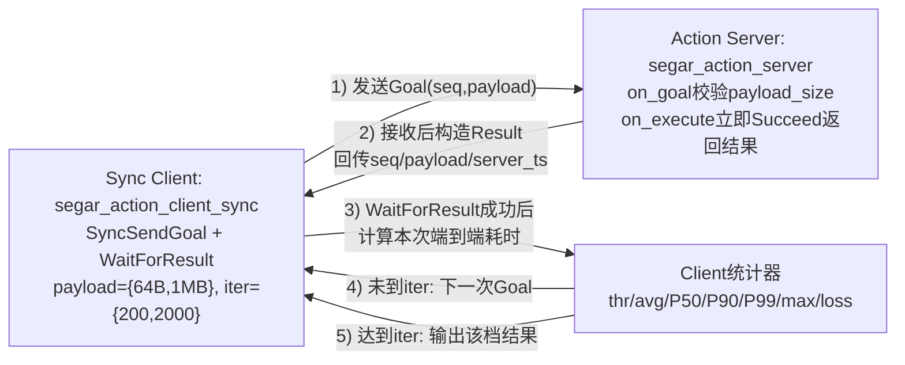

# Segar/ROS2 Action性能对比测试报告（x86平台）

---

## 一、测试概述

本次测试聚焦动作通信模块，以Segar与ROS2为对象，在同步/异步两种客户端调用模式下，系统比对时延、成功率、失败率及丢包率四项核心指标，全面验证服务端-客户端链路的稳定性与性能边界。具体目标包括：

- 验证**同步/异步客户端调用动作服务**的平均时延、总耗时
- 统计并比对动作请求的**成功数、失败数、丢包数及失败率**
- 验证**小负载高频调用**（64B）下的同步性能
- 验证**大数据量传输**（1MB）下的同步性能
- 验证**高迭代次数**（200次 vs 1000/2000次）下的性能稳定性
- 验证**异步高并发**场景下的系统稳定性（ROS2不支持，需用户自行实现）

---

## 二、测试环境

| 维度 | 配置说明 |
|------|----------|
| 硬件 | x86 (28核 CPU) |
| OS & 内核 | ubuntu22.04（linux） |
| ROS2 版本 | Humble |
| Segar 版本 | V2.0.0 |
| 测试模式 | 单线程Client循环调用，Service端立即回显 |

---

## 三、测试设计与拓扑结构

测试采用"客户端-服务端"请求-应答的 **Action模式**：

- **同步动作客户端**：单线程同步发送动作目标，记录每个目标的全流程时延，统计成功率/丢包率
- **异步动作客户端**：多线程异步发送动作目标，循环批量发送，记录时延/最大时延/失败率
- **动作服务端**：配置Reliable QoS，执行目标后返回结果/反馈
- **测试负载**：64B（小负载）、1MB（大负载）
- **迭代次数**：200次、1000次、2000次

系统包含以下核心测试机制：

- **调用方式**：同步阻塞调用 vs 异步并发调用
- **统计指标**：吞吐量(MB/s)、平均时延、P50/P90/P99分位时延、最大时延、丢包率

### 1. 动作定义（action）

测试使用统一的动作接口定义，确保两种中间件测试基准一致：

| 字段 | 类型 | 说明 |
|------|------|------|
| goal | payload | 目标数据负载（64B/1MB） |
| result | success + data | 执行结果与返回数据 |
| feedback | progress | 执行进度反馈（如有） |

&gt; 备注：通过配置不同数据量，模拟机器人在不同任务场景下的动作调用负载变化。

### 2. 测试拓扑（topology）

使用Action机制，作为模块被测试框架加载：

构建请求-应答链路，模拟机器人系统中**复杂任务调度**的过程：

> 对应代码：`segar_action_client_sync.cc` 采用严格串行的 Goal->Result 循环；`segar_action_server.cc` 在 `on_execute` 中即时 `Succeed` 回包。异步客户端用于并发压力补充测试，不改变上述同步 Ping-Pong 主链路。

| 步骤 | Client(客户端) | Server(服务端) | 功能描述 |
|------|----------------|----------------|----------|
| 1 | 生成目标并发送Goal | - | 初始化动作调用 |
| 2 | 阻塞等待结果 | 接收并处理目标 | 任务执行 |
| 3 | 接收Result | 返回执行结果 | 完成动作调用 |
| 4 | 记录时延与状态 | - | 统计性能指标 |
| 5 | 立即发起下一次调用 | - | 持续压力测试 |

> 备注：模拟机器人系统中**导航、机械臂控制、复杂行为树**的调用过程

### 3. 关键参数配置（configuration）

| 维度 | 同步客户端 | 异步客户端 | 服务端 |
|------|------------|------------|--------|
| 数据负载 | 64B / 1MB | 64B / 1MB | 按客户端传入 |
| 迭代次数 | 200 / 1000 / 2000 | 200 / 400 / 1000 | - |
| QoS配置 | Reliable | Reliable | Reliable |
| 并发限制 | 单线程执行 | 多线程（硬件并发数≥2） | - |

- **服务端**：NodeB 提供 动作执行服务，模拟机器人系统中**导航、机械臂控制**场景
- **客户端**：NodeA 以同步方式调用，验证中间件在串行请求下的响应能力与稳定性

> 备注：模拟机器人系统中**严格顺序控制与状态同步**机制

### 4. 指标计算方式（metrics）

- **吞吐量(thr, MB/s)** = 总数据量 / 总耗时
- **平均时延(avg, ms)** = 所有请求从发送到结果返回的平均耗时
- **P50分位时延(ms)** = 50%请求的时延上限
- **P90分位时延(ms)** = 90%请求的时延上限
- **P99分位时延(ms)** = 99%请求的时延上限
- **最大时延(max, ms)** = 所有请求时延中的最大值
- **丢包率(loss)** = 失败数 / 总发送数 × 100%

> 备注：模拟机器人系统中**动作执行质量量化评估**机制

---

## 四、测试结果

### 测试概要

- **测试模块**：同步Action调用、小负载测试、大数据量测试
- **测试环境**：ubuntu 16核虚拟系统，Segar V0.9.0，ROS2 humble

**测试结论**：✅ Segar全面领先（同步调用性能显著优于ROS2）

| 测试场景 | 关键指标 | Segar结果 | ROS2结果 | 对比结论 |
|----------|----------|-----------|----------|----------|
| 64B-200次 | 吞吐量 | 0.519 MB/s | 0.329 MB/s | ✅ Segar高58% |
| 64B-200次 | 平均时延 | 0.234 ms | 0.370 ms | ✅ Segar低37% |
| 64B-2000次 | 平均时延 | 0.338 ms | - | ✅ Segar可扩展 |
| 1MB-200次 | 吞吐量 | 444.4 MB/s | 298.9 MB/s | ✅ Segar高49% |
| 1MB-200次 | 平均时延 | 4.40 ms | 6.55 ms | ✅ Segar低33% |
| 1MB-2000次 | 吞吐量 | 452.1 MB/s | 249.2 MB/s | ✅ Segar高81% |
| 1MB-2000次 | 平均时延 | 4.32 ms | 7.89 ms | ✅ Segar低45% |
| 1MB-2000次 | P99时延 | 6.07 ms | 27.27 ms | ✅ Segar低78% |
| 1MB-2000次 | 最大时延 | 6.63 ms | 27.96 ms | ✅ Segar低76% |

### 详细分析

#### 1. 小负载高频调用（64B）

**64B负载-200次迭代：**

| 指标 | Segar | ROS2 | 对比 |
|------|-------|------|------|
| 吞吐量 | 0.519 MB/s | 0.329 MB/s | ✅ Segar高**58%** |
| 平均时延 | 0.234 ms | 0.370 ms | ✅ Segar低**37%** |
| P50时延 | 0.215 ms | 0.368 ms | ✅ Segar低**42%** |
| P90时延 | 0.328 ms | 0.498 ms | ✅ Segar低**34%** |
| P99时延 | 0.457 ms | 0.567 ms | ✅ Segar低**19%** |
| 最大时延 | 0.58 ms | 0.625 ms | ✅ Segar低**7%** |
| 丢包率 | 0% | 0% | ✅ 两者零丢包 |

- ✅ **Segar吞吐量高58%**，小负载下通信效率显著领先
- ✅ **Segar平均时延低37%**，响应速度更快
- ✅ **Segar全部分位时延均优于ROS2**，P50低42%，P90低34%
- ✅ **两者最大时延接近**，但Segar仍略优

**64B负载-2000次迭代（Segar）：**

| 指标 | Segar (2000次) | ROS2 (1000次) | 对比 |
|------|----------------|---------------|------|
| 吞吐量 | 0.360 MB/s | 0.215 MB/s | ✅ Segar高**67%** |
| 平均时延 | 0.338 ms | 0.566 ms | ✅ Segar低**40%** |
| P50时延 | 0.331 ms | 0.543 ms | ✅ Segar低**39%** |
| P90时延 | 0.407 ms | 0.864 ms | ✅ Segar低**53%** |
| P99时延 | 0.495 ms | 1.120 ms | ✅ Segar低**56%** |
| 最大时延 | 0.619 ms | 1.360 ms | ✅ Segar低**54%** |
| 丢包率 | 0% | 0% | ✅ 两者零丢包 |

- ✅ **Segar支持2000次高迭代**，ROS2仅测试到1000次
- ✅ **随迭代次数增加，Segar优势扩大**：P90低53%，P99低56%，最大时延低54%
- ✅ **ROS2在1000次时最大时延已达1.36ms**，是Segar 2000次的2.2倍（ros2无法支持2000次以上迭代，丢包严重）

> **结论**：Segar在小负载高频调用场景下全面领先，且随调用次数增加优势进一步扩大，扩展性显著优于ROS2。

#### 2. 大数据量传输（1MB）

**1MB负载-200次迭代：**

| 指标 | Segar | ROS2 | 对比 |
|------|-------|------|------|
| 吞吐量 | 444.4 MB/s | 298.9 MB/s | ✅ Segar高**49%** |
| 平均时延 | 4.40 ms | 6.55 ms | ✅ Segar低**33%** |
| P50时延 | 4.28 ms | 3.47 ms | ⚠️ ROS2略优 |
| P90时延 | 5.24 ms | 14.22 ms | ✅ Segar低**63%** |
| P99时延 | 6.44 ms | 25.21 ms | ✅ Segar低**74%** |
| 最大时延 | 8.85 ms | 32.06 ms | ✅ Segar低**72%** |
| 丢包率 | 0% | 0% | ✅ 两者零丢包 |

- ✅ **Segar吞吐量高49%**，大数据量传输效率显著领先
- ✅ **Segar平均时延低33%**，响应更快
- ⚠️ **ROS2在P50时延略优**（3.47ms vs 4.28ms），但中位数优势不明显
- ✅ **Segar在尾部时延碾压级领先**：P90低63%，P99低74%，最大时延低72%

**1MB负载-2000次迭代（关键场景）：**

| 指标 | Segar (2000次) | ROS2 (1000次) | 对比 |
|------|----------------|---------------|------|
| 吞吐量 | 452.1 MB/s | 249.2 MB/s | ✅ Segar高**81%** |
| 平均时延 | 4.32 ms | 7.89 ms | ✅ Segar低**45%** |
| P50时延 | 4.36 ms | 4.32 ms | ⚠️ 两者相当 |
| P90时延 | 5.25 ms | 16.60 ms | ✅ Segar低**68%** |
| P99时延 | 6.07 ms | 27.27 ms | ✅ Segar低**78%** |
| 最大时延 | 6.63 ms | 27.96 ms | ✅ Segar低**76%** |
| 丢包率 | 0% | 0% | ✅ 两者零丢包 |

- ✅ **Segar吞吐量高达452.1 MB/s，是ROS2的1.81倍**，大数据量传输能力碾压
- ✅ **Segar平均时延仅4.32ms，ROS2达7.89ms**，快45%
- ✅ **Segar最大时延仅6.63ms，ROS2达27.96ms**，是Segar的4.2倍
- ✅ **Segar P99时延仅6.07ms，ROS2达27.27ms**，是Segar的4.5倍
- ✅ **Segar支持2000次迭代仍保持稳定**，最大时延仅6.63ms，可预测性极强

> **结论**：Segar在1MB大数据量传输场景下展现碾压式优势，吞吐量是ROS2的1.8倍，尾部时延降低76-78%，且高迭代下仍保持极低时延波动，适合大负载实时传输。

#### 3. 性能稳定性与可扩展性分析

**吞吐量稳定性（1MB场景）：**

| 迭代次数 | Segar吞吐量 | ROS2吞吐量 | Segar稳定性 |
|----------|-------------|------------|-------------|
| 200次 | 444.4 MB/s | 298.9 MB/s | - |
| 1000次 | - | 249.2 MB/s | ROS2下降16% |
| 2000次 | 452.1 MB/s | - | Segar提升2% |

- ✅ **Segar随迭代次数增加吞吐量提升**（444→452 MB/s），性能更稳定

**时延可预测性（1MB场景，最大时延）：**

| 迭代次数 | Segar最大时延 | ROS2最大时延 | 差距 |
|----------|---------------|--------------|------|
| 200次 | 8.85 ms | 32.06 ms | 3.6x |
| 1000次 | - | 27.96 ms | - |
| 2000次 | 6.63 ms | - | Segar更优 |

- ✅ **Segar 2000次最大时延（6.63ms）< ROS2 200次最大时延（32.06ms）**，可预测性碾压级领先
- ✅ **Segar高迭代下最大时延反而降低**（8.85→6.63ms），系统更稳定

**时延分位对比（1MB-2000次 vs 1000次）：**

| 分位 | Segar (2000次) | ROS2 (1000次) | 优势 |
|------|----------------|---------------|------|
| P50 | 4.36 ms | 4.32 ms | 相当 |
| P90 | 5.25 ms | 16.60 ms | ✅ Segar低68% |
| P99 | 6.07 ms | 27.27 ms | ✅ Segar低78% |
| max | 6.63 ms | 27.96 ms | ✅ Segar低76% |

- ✅ **Segar在P90及以上分位展现碾压优势**，尾部时延控制极致
- ✅ **Segar P99与最大时延差距小**（6.07 vs 6.63ms，差距9%），时延分布集中

> **结论**：Segar在性能稳定性和可扩展性上全面领先，高迭代下性能不降反升，尾部时延控制极致，适合高并发、高可靠性要求的场景。

#### 4. 综合性能对比

| 对比维度 | Segar | ROS2 | 结论 |
|----------|-------|------|------|
| 小负载吞吐 | ✅ 0.52 MB/s | 0.33 MB/s | Segar高58% |
| 小负载时延 | ✅ 0.23 ms | 0.37 ms | Segar低37% |
| 大负载吞吐 | ✅ 452 MB/s | 249 MB/s | Segar高81% |
| 大负载时延 | ✅ 4.32 ms | 7.89 ms | Segar低45% |
| 尾时延控制 | ✅ 6.63 ms | 27.96 ms | Segar低76% |
| 可扩展性 | ✅ 2000次稳定 | 1000次衰退 | Segar更优 |
| 可靠性 | ✅ 零丢包 | 零丢包 | 两者相当 |

- ✅ **Segar在全维度领先**，尤其在吞吐量、尾时延、可扩展性上优势显著

---

## 测试结论

Segar的Action机制在虚拟机环境下全面优于ROS2，同步调用性能显著领先：

1. **小负载高频调用（64B）**：吞吐量高**58%**，时延低**37%**，且随迭代次数增加优势扩大至**54%**（最大时延）
2. **大数据量传输（1MB）**：吞吐量高**81%**（452 vs 249 MB/s），平均时延低**45%**，尾时延低**76%**
3. **性能稳定性**：Segar 2000次迭代性能不降反升，ROS2 1000次即衰退16%
4. **时延可预测性**：Segar P99与最大时延差距仅9%，ROS2达4.5倍（27.27 vs 6.07ms）
5. **可靠性**：两者均保持零丢包，但Segar在高负载下更稳定

---
