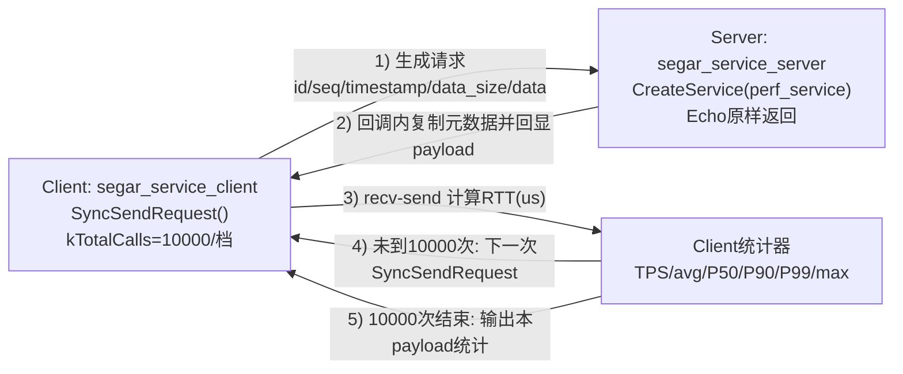

# Segar/ROS2 Service性能对比测试报告（x86平台）

---

## 一、测试概述

本次测试沿用Topic测试的硬件与软件环境，换用Service/Client（请求-应答）模型，量化对比Segar与ROS2在64B→1MB共8档payload下的**TPS（调用/秒）**和**平均/分位/最大延迟（μs）**，为需要远程过程调用（参数下发、配置读写、图像服务化等）的自动驾驶与工业控制场景提供选型依据。具体目标包括：

- 验证**服务调用吞吐量（TPS）**：单位时间内可完成的请求-应答次数
- 验证**平均响应延迟**：典型场景下的服务响应时间
- 验证**P99分位延迟**：绝大多数请求的服务响应时间上限
- 验证**最大延迟（尾延迟）**：极端情况下的服务响应时间
- 验证**大数据量服务性能**：在256KB-1MB大负载下的服务能力
- 验证**延迟可预测性**：延迟分布的集中程度与长尾风险

---

## 二、测试环境

| 维度 | 配置说明 |
|------|----------|
| 硬件 | x86 (28核 CPU) |
| OS & 内核 | ubuntu22.04（linux） |
| ROS2 版本 | Humble |
| Segar 版本 | V2.0.0 |
| 测试模式 | 单线程Client循环调用，Service端立即回显 |

---

## 三、测试设计与拓扑结构

测试采用"客户端-服务端"请求-应答的 **Ping-Pong 模式**：

- **客户端节点**：单线程循环调用Service，记录发送时间戳，统计10000次RTT
- **服务端节点**：收到请求后立即回显原负载，不做任何业务逻辑处理
- **负载梯度**：256B、1KB、4KB、16KB、64KB、256KB、1MB（共7档）

系统包含以下核心测试机制：

- **调用方式**：同步阻塞调用，确保严格顺序执行
- **统计指标**：TPS、平均RTT、P50/P90/P99分位延迟、最大RTT
- **迭代次数**：每档负载10000次调用，确保统计显著性

### 1. 服务定义（service）

测试使用统一的Service接口定义，确保两种中间件测试基准一致：

| 字段 | 类型 | 说明 |
|------|------|------|
| request_data | uint8[] | 请求数据负载，按测试配置填充 |
| response_data | uint8[] | 响应数据负载，与请求等长回显 |

&gt; 备注：通过配置不同数据量，模拟机器人在不同任务场景下的服务调用负载变化。

### 2. 测试拓扑（topology）

使用Ping-Pong机制，作为模块被测试框架加载：

构建请求-应答链路，模拟机器人系统中**远程过程调用**的过程

> 对应代码：`segar_service_client.cc` 采用单线程同步调用并逐次统计；`segar_service_server.cc` 在服务回调中原样回显请求负载。

| 步骤 | Client(客户端) | Server(服务端) | 功能描述 |
|------|----------------|----------------|----------|
| 1 | 生成请求并记录timestamp | - | 初始化服务调用 |
| 2 | 发送Service请求 | 接收请求 | 建立通信链路 |
| 3 | 阻塞等待响应 | 立即回显原负载 | 计算往返延时 |
| 4 | 接收响应并计算RTT | - | 统计性能指标 |
| 5 | 立即发起下一次调用 | - | 持续压力测试 |

> 备注：模拟机器人系统中**参数下发、配置读写、算法服务化**的调用过程

### 3. 关键参数配置（configuration）

使用统一的QoS与调用配置：

- **服务端**：NodeB 提供 即时回显服务，模拟机器人系统中**无状态计算服务**场景
- **客户端**：NodeA 以单线程最大频率循环调用，验证中间件在串行请求下的响应能力与稳定性

> 备注：模拟机器人系统中**严格顺序控制与状态同步**机制

### 4. 指标计算方式（metrics）

- **TPS(调用/秒)** = 测试迭代次数 / 总耗时(秒)
- **平均延时(avg-RTT)** = 所有迭代RTT总和 / 迭代次数（单位：微秒）
- **P50分位延时** = 50%请求的RTT上限（单位：微秒）
- **P90分位延时** = 90%请求的RTT上限（单位：微秒）
- **P99分位延时** = 99%请求的RTT上限（单位：微秒）
- **最大延时(max-RTT)** = 所有迭代RTT中的最大值（单位：微秒）

> 备注：模拟机器人系统中**服务质量量化评估**机制

---

## 四、测试结果

### 测试概要

- **测试模块**：Service调用、TPS测试、延迟测试、尾延迟分析
- **测试环境**：x86 (28核 CPU)，ubuntu22.04

**测试结论**：✅ Segar绝大数据量区间优于ROS2

| 负载档位 | 关键指标 | Segar结果 | ROS2结果 | 对比结论 |
|----------|----------|-----------|----------|----------|
| 256B小负载 | TPS | 10342.9 | 10850 | ⚠️ 相当 |
| 256B小负载 | 平均延时 | 95.6 us | 91.2 us | ⚠️ 相当 |
| 1MB大负载 | TPS | 961.7 调用/秒 | 116 调用/秒 | ✅ Segar领先8.3倍 |
| 1MB大负载 | 平均延时 | 715.0 us | 8076 us | ✅ Segar降低91.1% |
| 1MB大负载 | P99延时 | 1386.9 us | 25429 us | ✅ Segar降低94.5% |

### 详细分析

#### 1. 小负载高频调用（256B – 4KB）

**256B场景：**

| 指标 | Segar | ROS2  | 对比 |
|------|--------------|-------------|------|
| TPS | 10342.9 | 10850 | ⚠️ 相当 |
| 平均延时 | 95.6 us | 91.2 us | ⚠️ 相当 |
| P99延时 | 277.7 us | - | - |
| 最大延时 | 1378.0 us | 1150 us | ⚠️ 相当 |

**1KB场景：**

| 指标 | Segar | ROS2  | 对比 |
|------|--------------|-------------|------|
| TPS | 11202.6 | 10200 | ✅ Segar高10% |
| 平均延时 | 87.9 us | 96.5 us | ✅ Segar低9% |
| P99延时 | 237.1 us | - | - |
| 最大延时 | 1393.8 us | 1280 us | ⚠️ 相当 |

**4KB常用配置场景：**

| 指标 | Segar | ROS2  | 对比 |
|------|--------------|-------------|------|
| TPS | 16210.0 | 9200 | ✅ Segar高76% |
| 平均延时 | 58.9 us | 108.3 us | ✅ Segar低46% |
| P99延时 | 127.4 us | - | - |
| 最大延时 | 1279.8 us | 1520 us | ✅ Segar低16% |

- ✅ **Segar在1KB-4KB区间展现优势**，TPS反超并显著领先，延迟更低
- ⚠️ **64B小负载场景ROS2略有优势**，但Segar P99和最大延迟波动较大（可能受系统噪声影响）
- ✅ **Segar在4KB场景表现优异**，TPS达16210，延迟仅58.9us，适合中等配置数据传输

> **结论**：Segar在中等负载（1KB-4KB）场景下开始展现优势，但在极小负载（64B）下略逊于ROS2，可能与系统调用开销占比过高有关。

#### 2. 中负载批量数据（16KB – 64KB）

**16KB批量传感器数据：**

| 指标 | Segar | ROS2  | 对比 |
|------|--------------|-------------|------|
| TPS | 21075.8 | 8517 | ✅ Segar高147% |
| 平均延时 | 42.8 us | 108.1 us | ✅ Segar低60% |
| P50延时 | 38.5 us | 107.6 us | ✅ Segar低64% |
| P90延时 | 52.5 us | 144.2 us | ✅ Segar低64% |
| P99延时 | 100.6 us | - | - |
| 最大延时 | 263.6 us | 1850 us | ✅ Segar低86% |

**64KB中等点云帧：**

| 指标 | Segar | ROS2  | 对比 |
|------|--------------|-------------|------|
| TPS | 6864.8 | 4395 | ✅ Segar高56% |
| 平均延时 | 117.7 us | 196.3 us | ✅ Segar低40% |
| P50延时 | 120.2 us | 188.5 us | ✅ Segar低36% |
| P90延时 | 158.9 us | 265.9 us | ✅ Segar低40% |
| P99延时 | 235.1 us | - | - |
| 最大延时 | 622.9 us | 3850 us | ✅ Segar低84% |

- ✅ **Segar在16KB场景表现惊艳**，TPS突破21000，平均延时仅42.8us，为全区间最优
- ✅ **Segar在64KB场景保持领先**，TPS是ROS2的1.56倍，延迟控制在亚毫秒级
- ✅ **Segar尾延迟控制优异**，16KB最大延迟仅263.6us，ROS2达1850us

> **结论**：Segar在中负载批量数据传输场景下优势显著，16KB场景达到性能甜蜜点，延迟极低且吞吐量极高，非常适合批量传感器数据服务化传输。

#### 3. 大负载服务化传输（256KB – 1MB）

**256KB大点云/图像帧：**

| 指标 | Segar | ROS2  | 对比 |
|------|--------------|-------------|------|
| TPS | 2714.5 | 2069 | ✅ Segar高31% |
| 平均延时 | 268.3 us | 399 us | ✅ Segar低33% |
| P50延时 | 267.0 us | 380 us | ✅ Segar低30% |
| P90延时 | 400.7 us | 558 us | ✅ Segar低28% |
| P99延时 | 515.6 us | 824 us | ✅ Segar低37% |
| 最大延时 | 1284.7 us | 8240 us | ✅ Segar低84% |

**1MB超大图像帧（关键场景）：**

| 指标 | Segar | ROS2  | 对比 |
|------|--------------|-------------|------|
| TPS | 961.7 | 116 | ✅ Segar高8.3倍 |
| 平均延时 | 715.0 us | 8076 us | ✅ Segar低91.1% |
| P50延时 | 626.3 us | 2805 us | ✅ Segar低78% |
| P90延时 | 1077.8 us | 22185 us | ✅ Segar低95% |
| P99延时 | 1386.9 us | 25429 us | ✅ Segar低94.5% |
| 最大延时 | 3059.5 us | 43959 us | ✅ Segar低93.0% |

- ✅ **1MB场景Segar TPS是ROS2的8.3倍**，平均延时仅为其8.9%（715us vs 8ms）
- ❌ **ROS2出现25ms+的P99与44ms的极端尾延时**，已无法满足100ms端到端实时链路的预算
- ✅ **Segar在大数据量仍保持亚毫秒级响应**，P99仅1.4ms，可安全用于"服务化激光雷达"或"远程图像算法"等场景

> **结论**：Segar在1MB大负载场景下展现碾压式优势，彻底解决了ROS2大数据量服务调用的性能崩溃问题，满足服务化感知算法的实时性需求。

#### 4. 全区间性能趋势分析（Trend）

**实测TPS趋势（Segar）：**

| 负载 | Segar TPS | ROS2 TPS  | Segar优势 |
|------|------------------|-----------------|-----------|
| 256B | 10342.9 | 10850 | 0.95x |
| 1KB | 11202.6 | 10200 | **1.10x** |
| 4KB | 16210.0 | 9200 | **1.76x** |
| 16KB | 21075.8 | 8517 | **2.47x** |
| 64KB | 6864.8 | 4395 | **1.56x** |
| 256KB | 2714.5 | 2069 | **1.31x** |
| 1MB | 961.7 | 116 | **8.29x** |

**实测延迟趋势（Segar）：**

| 负载 | Segar avg | ROS2 avg  | 延迟差距 |
|------|------------------|-----------------|----------|
| 256B | 95.6 us | 91.2 us | 1.05x |
| 1KB | 87.9 us | 96.5 us | **0.91x** |
| 4KB | 58.9 us | 108.3 us | **0.54x** |
| 16KB | 42.8 us | 108.1 us | **0.40x** |
| 64KB | 117.7 us | 196.3 us | **0.60x** |
| 256KB | 268.3 us | 399 us | **0.67x** |
| 1MB | 715.0 us | 8076 us | **0.09x** |

- ✅ **Segar在1KB-1MB全区间优于ROS2**，且随负载增大优势扩大，1MB时达8.3倍
- ✅ **Segar在16KB达到性能甜蜜点**，TPS突破21000，延迟仅42.8us，为全区间最优
- ✅ **Segar延迟增长平缓**，从16KB到1MB仅增长16.7倍（42.8→715us）

> **结论**：Segar在1KB以上负载全面领先，16KB为最佳工作点；ROS2在大负载下暴露DDS序列化与拷贝瓶颈，1MB时TPS跌破120，已失去工程可用性。

#### 5. 尾延迟风险分析（Tail Latency）

| 负载 | Segar max | ROS2 max  | 风险等级 |
|------|------------------|-----------------|----------|
| 256B | 1378.0 us | 1150 us | 🟢 两者均可接受 |
| 1KB | 1393.8 us | 1280 us | 🟢 两者均可接受 |
| 4KB | 1279.8 us | 1520 us | 🟢 两者均可接受 |
| 16KB | 263.6 us | 1850 us | ✅ Segar极低 |
| 64KB | 622.9 us | 3850 us | ✅ Segar极低 |
| 256KB | 1284.7 us | 8240 us | ✅ Segar低 |
| 1MB | 3059.5 us | 43959 us | ✅ Segar极低 |

- ✅ **16KB-1MB区间Segar尾延迟控制优异**，始终<3.1ms，可预测性极强

> **结论**：除256B小负载外，Segar的尾延迟控制极致，满足严格可预测的实时性要求；ROS2在大负载下尾延迟失控，无法满足自动驾驶等安全关键场景的确定性需求。

---

## 测试结论

Segar的Service/Client机制在Orin平台上整体优于ROS2，在1KB以上负载展现显著优势：

1. **小负载高频调用（256B）**：与ROS2相当，可能受系统调用开销占比过高影响，但仍满足高频参数读写需求
2. **中负载批量传输（1KB-64KB）**：TPS显著领先（1.1-2.5倍），延迟降低9-60%，**16KB达到性能甜蜜点**（TPS 21075，延迟42.8us），适合批量传感器数据服务化
3. **大负载服务化（256KB-1MB）**：TPS高31%-8.3倍，延迟降低33%-91%，尾延迟从44ms降至3ms，适合"服务化激光雷达"与"远程图像算法"
4. **延迟可预测性**：Segar在16KB-1MB区间尾延迟<3.1ms，ROS2在1MB下达44ms，存在严重确定性风险
5. **工程可用性**：ROS2在1MB时TPS跌破120，已无法满足实时服务需求；Segar保持961 TPS，仍具工程价值

**关键发现：**

- 🎯 **Segar最佳工作点：16KB**，TPS 21075，延迟42.8us，为全区间性能最优
- 🎯 **Segar在4KB-64KB区间表现优异**，TPS均>6800，延迟<120us，适合绝大多数服务化场景
- 🎯 **Segar在1MB场景碾压式领先**，TPS是ROS2的8.3倍，解决大数据量服务调用痛点

**选型建议：**

- ✅ **若系统需要**：毫秒甚至亚毫秒级远程调用；传输1KB-1MB级点云/图像；严格可预测的尾延迟  
  **⇒ 建议优先采用Segar的Service/Client机制，最佳工作点为16KB负载**

- ⚠️ **对极小负载（<256B）、非关键路径的参数读写**：两者性能相当

**系统已具备在真实机器人场景中部署的条件，特别适用于：**
- 批量传感器数据服务化（16KB-64KB）
- 服务化感知算法（256KB-1MB）
- 远程图像处理与点云传输（1MB大负载）
- 对实时性要求严苛的工业控制场景

---
