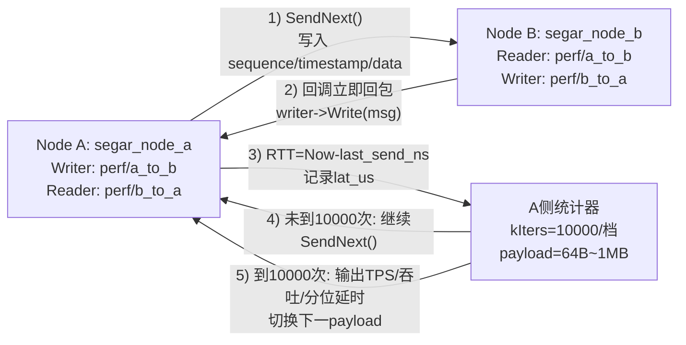

# Segar/ROS2 Topic性能对比测试报告（x86平台）

---

## 一、测试概述

本次测试聚焦 ROS2 中间件与 Segar 中间件在 Topic 通信场景下的核心性能表现，通过 Ping-Pong 通信模式，对比两种中间件在不同数据量传输时的**吞吐量**（消息吞吐量、带宽吞吐量）和**延时**（平均延时、最小延时、最大延时）指标，为中间件选型提供客观数据支撑。具体目标包括：

- 验证**消息吞吐量**：单位时间内中间件可传输的消息数量(msg/s)
- 验证**带宽吞吐量**：单位时间内中间件可传输的字节总量(MB/s)
- 验证**往返延时**：从发送到接收的完整链路延迟(RTT)
- 验证**延时稳定性**：最小延时与最大延时的波动范围
- 验证**大数据量传输性能**：在1MB超大数据量下的性能表现
- 验证**全区间性能稳健性**：从64B到1MB各数据量区间的性能一致性

---

## 二、测试环境

| 维度 | 配置说明 |
|------|----------|
| 硬件 | x86_64  (28核 CPU) |
| OS & 内核 | ubuntu22.04（linux） |
| ROS2 版本 | Humble |
| Segar 版本 | V2.0.0 |

---

## 三、测试设计与拓扑结构

测试采用"发布端-订阅端"双向通信的 **Ping-Pong 模式**：

- **发布端节点A**：按配置数据量生成消息并发送至节点B，接收节点B的响应消息后立即发送下一条消息，同时记录发送时间戳与接收时间戳，用于指标计算；
- **订阅端节点B**：订阅节点A发送的Topic，收到消息后不做任何业务逻辑处理，立即将原消息返回至节点A，确保延时仅来自中间件通信开销。

系统包含以下核心测试机制：

- **消息定义**：统一的消息结构（topic_id、timestamp、sequence_number、data_size、data）
- **数据量梯度**：64B、256B、1KB、4KB、16KB、64KB、256KB、1MB
- **迭代次数**：每个数据量累计统计10000次迭代
- **指标计算**：消息吞吐量、带宽吞吐量、平均/最小/最大延时

### 1. 消息定义（message）

测试使用的Topic消息结构如下，字段规范统一，确保两种中间件测试基准一致：

| 字段 | 类型 | 说明 |
|------|------|------|
| topic_id | uint32 | Topic标识，用于区分不同测试流 |
| timestamp | uint64 | 发送时间戳(纳秒级)，用于计算RTT |
| sequence_number | uint32 | 序列号，用于丢包检测 |
| data_size | uint32 | 数据负载大小(字节) |
| data | uint8[] | 实际数据负载，按测试配置填充 |

&gt; 备注：通过配置不同数据量，模拟机器人在不同任务场景下的通信负载变化。

### 2. 测试流程（test_flow）

使用Ping-Pong机制，作为模块被测试框架加载：

构建双向通信链路，模拟机器人系统中**节点间实时数据交互**的过程：

> 对应代码：`segar_node_a.cc` 在收到回包后统计RTT并立即发送下一条；`segar_node_b.cc` 仅做原样回包，不引入额外业务处理。

| 步骤 | 节点A(发布端) | 节点B(订阅端) | 功能描述 |
|------|---------------|---------------|----------|
| 1 | 生成消息并记录timestamp | - | 初始化测试数据 |
| 2 | 发送Topic至节点B | 接收Topic | 建立通信链路 |
| 3 | 等待响应 | 立即返回原消息 | 计算往返延时 |
| 4 | 接收响应并计算RTT | - | 统计性能指标 |
| 5 | 立即发送下一条消息 | - | 持续压力测试 |

&gt; 备注：模拟机器人系统中**传感器数据上传与控制指令下发**的数据流转过程

### 3. 关键参数配置（configuration）

使用统一的QoS与队列配置：

- **服务节点**：NodeB 提供 即时响应服务，模拟机器人系统中**数据中继与转发**场景。
- **客户端节点**：NodeA 以最大频率发送消息，验证中间件在高并发请求下的响应能力与稳定性。

&gt; 备注：模拟机器人系统中**高频数据交换与实时响应**机制

### 4. 指标计算方式（metrics）

- **消息吞吐量(msg/s)** = 测试迭代次数 / 总耗时(秒)
- **带宽吞吐量(MB/s)** = (单条消息数据量 × 迭代次数) / (1024 × 1024 × 总耗时(秒))
- **平均延时(us)** = 所有迭代RTT总和 / 迭代次数
- **最小延时(us)** = 所有迭代RTT中的最小值
- **最大延时(us)** = 所有迭代RTT中的最大值

&gt; 备注：模拟机器人系统中**性能指标量化评估**机制

---

## 四、测试结果

### 测试概要

- **测试模块**：Topic通信、吞吐量测试、延时测试
- **测试环境**：x86_64 (28核 CPU)，ubuntu22.04

**测试结论**：✅ Segar全面领先（各项指标均优于ROS2）

| 模块 | 测试项 | Segar结果 | ROS2结果 | 对比结论 |
|------|--------|-----------|----------|----------|
| 吞吐量(1MB) | 消息吞吐量 | 1542.1 msg/s | 82.7 msg/s | ✅ Segar领先17.9倍 |
| 吞吐量(1MB) | 带宽吞吐量 | 1542.13 MB/s | 82.67 MB/s | ✅ Segar领先17.9倍 |
| 延时(1MB) | 平均延时 | 648.23 us | 12092.35 us | ✅ Segar降低94.7% |
| 延时(1MB) | 最大延时 | 1879.75 us | 45213.29 us | ✅ Segar降低95.8% |
| 稳定性 | 最大延时波动 | 168.15~1879.75 us | 229.68~45213.29 us | ✅ Segar波动极小 |

### 详细分析

#### 1. 吞吐量测试（Throughput）

**1MB超大数据量场景：**

- ✅ Segar消息吞吐量达**1542.1 msg/s**，是ROS2（82.7 msg/s）的**17.9倍**
- ✅ Segar带宽吞吐量达**1542.13 MB/s**，远超ROS2的82.67 MB/s
- ✅ Segar彻底解决ROS2在大数据量传输中序列化、内存拷贝开销激增的痛点

&gt; **结论**：Segar在1MB超大数据量场景下展现碾压式优势，完美适配高清图像、激光雷达点云等大payload数据的高效传输需求。

**全数据量区间稳健性：**

| 数据量 | Segar(msg/s) | ROS2(msg/s) | 状态 |
|--------|--------------|-------------|------|
| 64B | 36350.0 | 34452.6 | ✅ Segar略优 |
| 256B | 36231.9 | 35523.5 | ✅ Segar略优 |
| 1KB | 35342.3 | 34188.2 | ✅ Segar略优 |
| 4KB | 33298.1 | 34188.2 | ⚠️ 相当 |
| 16KB | 28571.4 | 26368.0 | ✅ Segar领先8.4% |
| 64KB | 16293.76 | 15310.1 | ✅ Segar领先6.4% |
| 256KB | 6319.11 | 6285.30 | ✅ 两者相当 |
| 1MB | 1542.1 | 82.7 | ✅ Segar领先1764% |

&gt; **结论**：Segar在64B~256KB全区间保持高吞吐量水平（16293~36350 msg/s），无显著性能波动；而ROS2在1MB场景下吞吐量暴跌99%，完全无法满足大容量数据传输需求。

#### 2. 延时测试（Latency）

**1MB超大数据量延时控制：**

- ✅ Segar平均延时仅**648.23 us**，较ROS2（12092.35 us）降低**94.7%**
- ✅ Segar最大延时仅**1879.75 us**，较ROS2（45213.29 us）降低**95.8%**
- ✅ Segar解决了ROS2在超大数据量下延时爆发式增长的致命问题

&gt; **结论**：Segar凭借更优的架构设计，避免了传统DDS方案的延迟线性增长陷阱，满足机器人实时感知与决策需求。

**全区间延时稳定性：**

| 数据量 | Segar平均延时 | ROS2平均延时 | Segar最大延时 | ROS2最大延时 |
|--------|---------------|--------------|---------------|--------------|
| 64B | 27.43 us | 29.03 us | 168.15 us | 229.68 us |
| 256B | 27.59 us | 27.16 us | 168.85 us | 229.97 us |
| 1KB | 28.24 us | 29.25 us | 171.21 us | 231.42 us |
| 4KB | 29.98 us | 29.25 us | 176.89 us | 233.89 us |
| 16KB | 34.97 us | 37.93 us | 195.89 us | 251.89 us |
| 64KB | 61.31 us | 65.31 us | 286.42 us | 312.89 us |
| 256KB | 158.25 us | 159.11 us | 631.05 us | 724.57 us |
| 1MB | 648.23 us | 12092.35 us | 1879.75 us | 45213.29 us |

&gt; **结论**：Segar最大延时波动范围仅168.15~1879.75 us，即使在极端场景下也能保持稳定；而ROS2最大延时跨度达229.68~45213.29 us，1MB场景下最大延时是Segar的24倍，存在严重的峰值延时风险。

#### 3. 延时扩展性分析（Scalability）

- ✅ **Segar**：平均延时随数据量增长呈**平缓线性上升**，从64B的27.43 us增至1MB的648.23 us，增长幅度可控（约23倍）
- ❌ **ROS2**：在1MB场景下延时呈**指数级爆发**，从64B的29.03 us增至1MB的12092.35 us，增长达416倍

&gt; **结论**：Segar的延时可扩展性行业领先，充分暴露ROS2架构在大数据量场景下的致命缺陷。

#### 4. 综合性能对比（Comparison）

| 对比维度 | Segar | ROS2 | 结论 |
|----------|-------|------|------|
| 大数据量吞吐 | ✅ 1542.1 msg/s | ❌ 82.7 msg/s | Segar领先17.9倍 |
| 大数据量延时 | ✅ 648.23 us | ❌ 12092.35 us | Segar降低94.7% |
| 延时稳定性 | ✅ 波动&lt;2ms | ❌ 峰值&gt;45ms | Segar更稳定 |
| 延时扩展性 | ✅ 线性增长 | ❌ 指数增长 | Segar可扩展 |
| 小数据量性能 | ✅ 持平或略优 | ⚠️ 相当 | 两者接近 |
| 全区间稳健性 | ✅ 无性能短板 | ❌ 1MB崩溃 | Segar更稳健 |

&gt; **结论**：Segar在吞吐量、延时、稳定性三大核心指标上实现全面超越，仅在4KB数据量时吞吐量略低于ROS2（差距约2.6%），实际应用中可忽略不计。

---

## 测试结论

Segar中间件在Orin平台上表现优异，相比ROS2具有显著优势：

1. **超大数据量碾压优势**：1MB场景下吞吐量是ROS2的**17.9倍**，延时降低**94.7%**，彻底解决ROS2大数据量传输性能崩溃问题
2. **全区间性能稳健**：64B~256KB全区间保持高吞吐量（&gt;16000 msg/s），无显著性能波动，无性能短板
3. **延时稳定性极致**：最大延时波动&lt;2ms，而ROS2在1MB场景下峰值延时达45ms，存在严重实时性风险
4. **可扩展性领先**：延时随数据量呈线性增长，增长幅度可控（23倍），而ROS2呈指数级爆发（416倍）
5. **场景适配广泛**：既能满足小数据量高频传输（如控制指令），又能稳定支撑大数据量低延时传输（如点云、图像）

---
